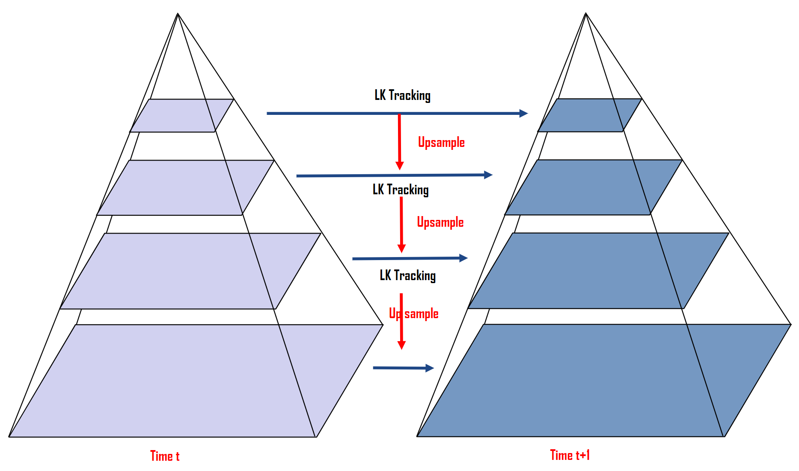
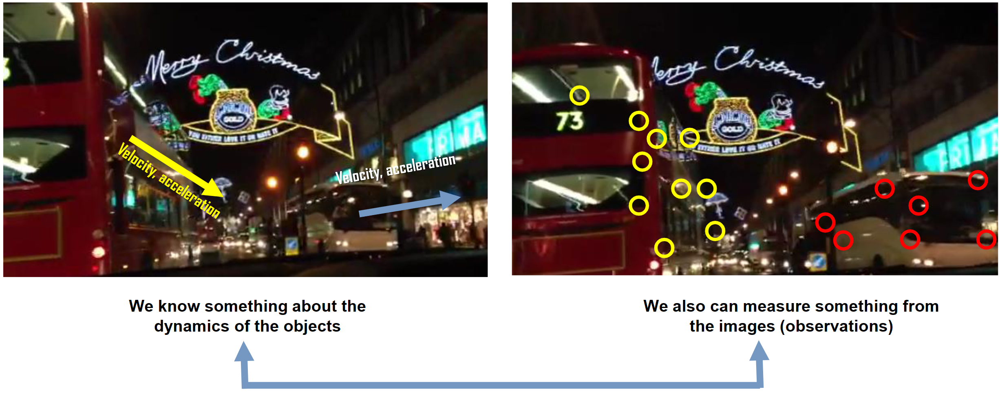
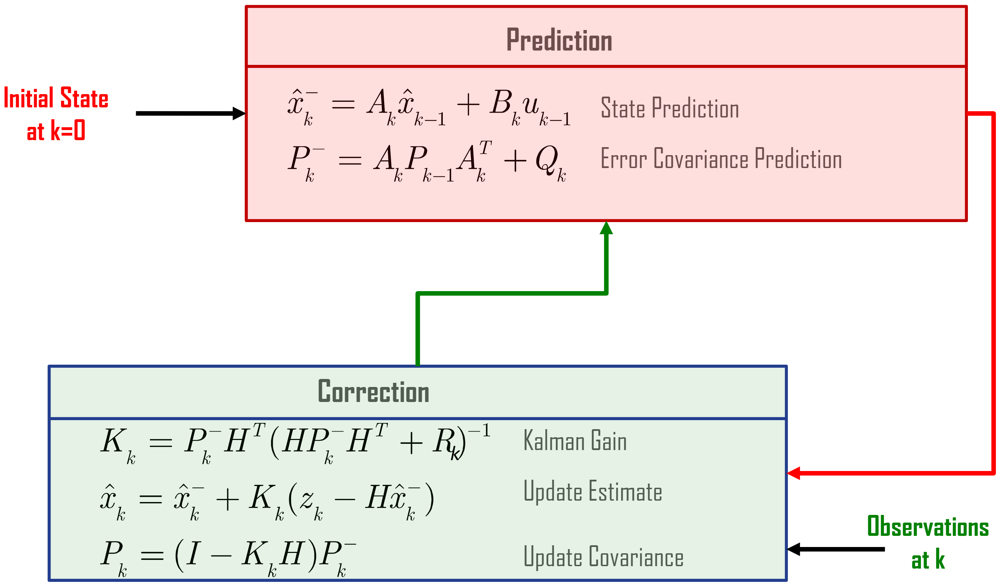
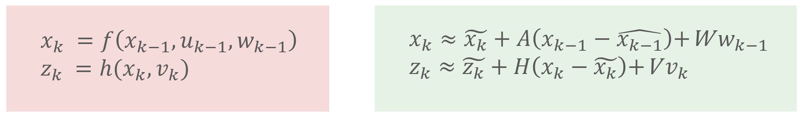
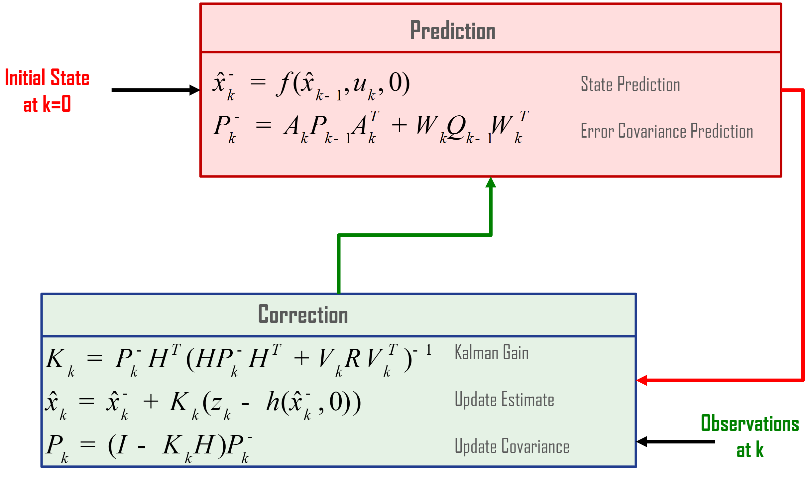
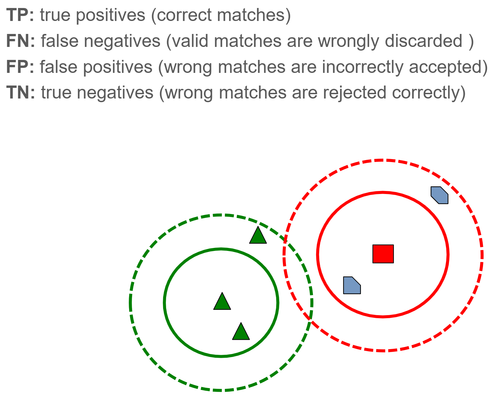
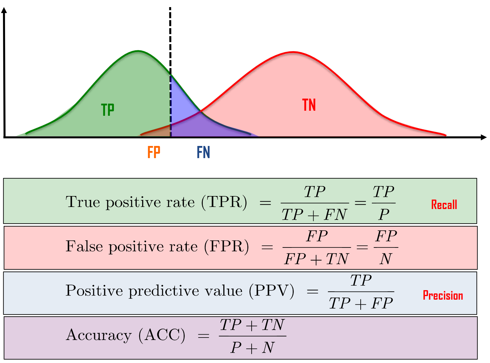
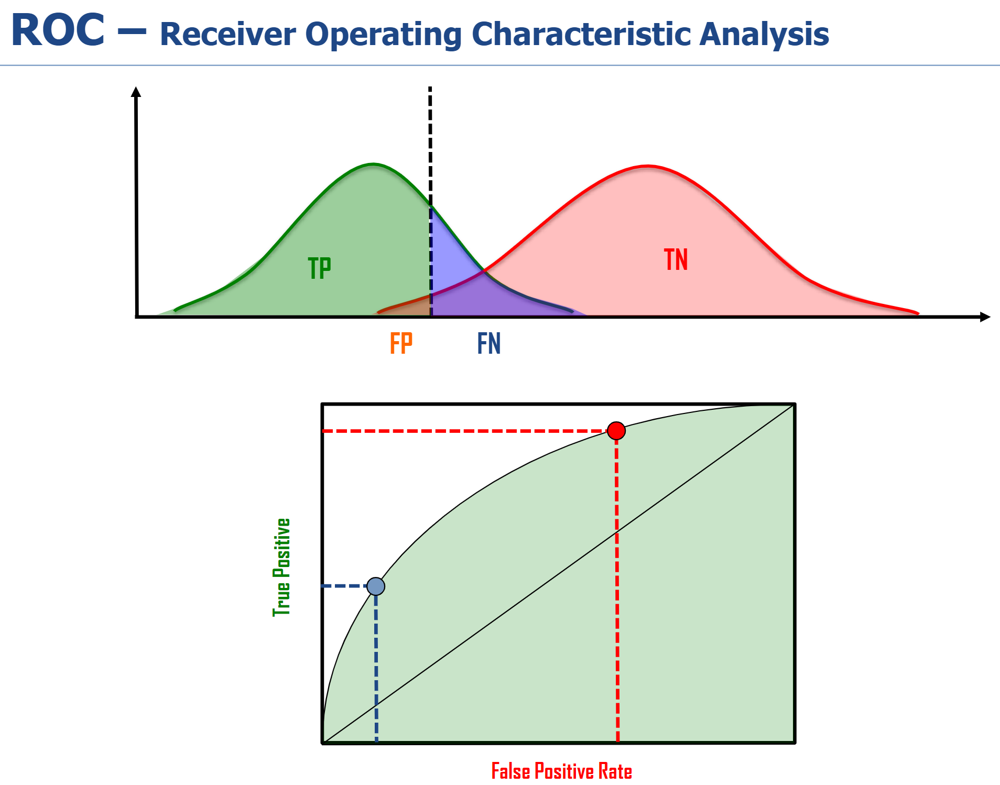

# Lecture 10: Feature Tracking

[TOC]

## Tracking in Image Sequences

对于图片序列，我们可以认为有三个轴 $(x, y, t)$。​我们有如下有下面三个基本假设：

1. **亮度恒定（Brightness Constancy）**：一个物体点在不同帧之间的亮度保持不变

2. **时间持续性（Temporal Persistence）**：特征在连续帧之间的运动较小,且相机位置变化缓慢

3. **空间相干性（Spatial Coherence）**：相邻的特征属于同一物理表面，具有相似的运动

恒定性可以表示为:
$$
I(x+\underbrace{\Delta x}_u, y + \underbrace{\Delta y}_v, t + \underbrace{\Delta t}_{\approx 1}) = I(x, y, t)
$$
我们可以简化 $\Delta t = 1$​

基于亮度恒常性，我们可以使用泰勒级数展开来建立沿 x、y、t 轴的强度梯度之间的关系：
$$
\begin{align*}
I(x+u, y+v, t+1) &= I(x, y, t)\\
\because I(x+u, y+v, t+1) &\approx I(x, y, t) +\left[
\frac{\part I}{\part x}u +
\frac{\part I}{\part y}v +
\frac{\part I}{\part t} +
\right] +\cdots\\ 
\therefore I(x+u, y+v, t+1) - I(x, y, t) &=
\frac{\part I}{\part x}u +
\frac{\part I}{\part y}v +
\frac{\part I}{\part t} = 0 \\
\frac{\part I}{\part x}u +
\frac{\part I}{\part y}v +
\frac{\part I}{\part t} &= 0 \\
I_x u + I_y v + I_t &= 0 \\
I_x u + I_y v &= -I_t \\
\begin{bmatrix}I_x & I_y\end{bmatrix}
\begin{bmatrix}u \\ v\end{bmatrix} &= -I_t
\end{align*}
$$

> 相邻图像帧之间需要恢复的位移 ($t$​)；一个方程有两个未知数，因此不可能解出。但是，如果我们知道有几个点一起移动，我们可以用最小二乘法来解决这个问题。

$$
\begin{align*}
\underbrace{
\begin{bmatrix}
I_x(p_1) & I_y(p_1)\\
I_x(p_2) & I_y(p_2)\\
\vdots   & \vdots \\
I_x(p_N) & I_y(p_N)\\
\end{bmatrix}
}_{\mathbf{A}}

\underbrace{
\begin{bmatrix}u \\ v\end{bmatrix}
}_{\mathbf{d}}
&= -

\underbrace{
\begin{bmatrix}
I_t (p_1) \\
I_t (p_2) \\
\vdots \\
I_t (p_N)
\end{bmatrix}
}_{\mathbf{B}}
\end{align*}
$$

如果我们对大小为 N×N 的 patch 应用 spatial coherence constraint，我们会得到 N*N 个方程

该系统的方程数比未知数多，通常是超定的（over-determined）。位移可以估算为：
$$
\min ||\mathbf{Ad-B} ||^2
$$

## Lucas-Kannade Algorithm

Lucas-Kanade方法通过求解最小二乘问题来估计点位移的最优解：
$$
\begin{align}
\mathbf{A}^T \mathbf{Ad} &= \mathbf{A}^T\mathbf{B}

\\

\begin{bmatrix}
I_{x} \\ I_y
\end{bmatrix}
\begin{bmatrix}
I_{x} & I_y
\end{bmatrix}
\begin{bmatrix}u \\ v \end{bmatrix}
&= -
\begin{bmatrix}I_{x} \\ I_y\end{bmatrix}
\begin{bmatrix}I_t \\ I_t\end{bmatrix}

\\

\begin{bmatrix}
I_xI_x & I_x I_y \\
I_yI_x   & I_y I_y
\end{bmatrix}
\begin{bmatrix}u \\ v \end{bmatrix}
&= -
\begin{bmatrix}I_{x}I_t \\ I_yI_t\end{bmatrix}
\\

\begin{bmatrix}
\sum I_x^2  & \sum I_x I_y \\
\sum I_yI_x & \sum I_y^2
\end{bmatrix}
\begin{bmatrix}u \\ v \end{bmatrix}
&= -
\begin{bmatrix}\sum I_{x}I_t \\ \sum  I_yI_t\end{bmatrix}
\end{align}
$$

* 求和是针对 $N\times N$ 窗口中所有像素的，其中假设 spatial coherence
* Lucas-Kanade 方法通过解决上述最小二乘问题来估计点位移的最优解。
  它不使用 Harris 角点检测器，而是使用 Shi-Tomasi 实现，因此我们将其称为 Lucas-Kanade-Tomasi 跟踪器 (LKT)。

### Solvability

这个系统要可解则需要：

- $\mathbf{A}^T \mathbf{A}$ is invertible

- $\mathbf{A}^T \mathbf{A}$ 不能太小，因为可能是噪音

- $\mathbf{A}^T \mathbf{A}$ 需要 well-conditioned
  well-conditioned: 矩阵的条件数（condition number）较小的状态
  $$
  \text{Condition Number} = \frac{\lambda_\text{max}}{\lambda_\text{min}}
  $$
  条件数接近于 1 时，矩阵被称为 well-conditioned

  条件数较小意味着矩阵求解时数值稳定性好

  即使输入数据有微小变化，解的变化也不会很大

- $\mathbf{A}^T \mathbf{A}$ 的 $\min(\lambda_1, \lambda_2) > a$ （预先定义的 Threshold）

- LK 跟踪器假设位移很小，因此只适用于小运动
- 对于大运动，可以使用基于图像金字塔的多分辨率

### LK Tracking with Image Pyramid

构建图像金字塔，将 LK 跟踪器应用于低分辨率图像，将结果传播到更高分辨率图像，应用 LK 跟踪器

## Incorporate Temporal Information 融入时序信息

- Reliable tracking：尤其是对于长图像序列来说，实际上是很困难的
- 由于噪声、光照、形变和姿态变化造成的外观变化都可能导致跟踪失败
- Occlusion（遮挡）、物体之间的相互作用和杂乱（cluttered ）的背景也可能导致跟踪失败
- 如果我们对运动物体的动态特性有一些**kowledge 认知（模型）**，就可以预测它们在下一帧图像中的位置，这可以与图像**Observation 细节（观测）**相结合，以提高跟踪结果的鲁棒性和准确性

## (Multivariate) Normal Distribution

离散线性拟合的递归解决方案，在这方面特别有用。
$$
\mathcal{N}(\mu, \sigma) = \frac{1}{\sigma \sqrt{2\pi}} e ^{- \frac{(x-\mu)^2}{2\sigma^2}}
$$
对于多个高斯进行合并可以证明：
$$
\mathcal{N}(\mu_1, \sigma_1)
\mathcal{N}(\mu_2, \sigma_2) = \mathcal{N}(\mu, \sigma)
\\
\frac{1}{\sigma^2} = \frac{1}{\sigma^2_1} + \frac{1}{\sigma^2_2}
\\
\mu = \left( \frac{\mu_1}{\sigma^2_1} + \frac{\mu_2}{\sigma^2_2} \right)\sigma^2
$$
通过 rearrangement，可以获得
$$
\begin{align}
k   &=\frac{\sigma^2_1}{\sigma^2_1 + \sigma^2_2}
\\
\mu &= \mu_1 + k(\mu_2 - \mu_1)
\\
\sigma^2 &=\sigma^2_1-k\sigma^2_1
\end{align}
$$

对于多元情况，可以改写为
$$
\begin{align}
\mathbf{K}&=\Sigma_1(\Sigma_1 + \Sigma_2)^{-1}
\\
\vec{\mu} &= \vec{\mu_1} + \mathbf{K}(\vec{\mu_2} - \vec{\mu_1})
\\
\Sigma &=\Sigma_1-\mathbf{K}\Sigma_1
\end{align}
$$

> 实践中，这意味着对于同一个变量，如果我们可以采取两种不同的估算方法，每种方法都有其不确定性，合并后的结果虽然仍有不确定性，但会提高准确性 

> $$
> \begin{align*}
> \frac{1}{\sigma^2} &= \frac{1}{\sigma^2_1} + \frac{1}{\sigma^2_2}
> \\
> {\sigma^2} &= \frac{1}{\frac{1}{\sigma^2_1} + \frac{1}{\sigma^2_2}}
> \\
> &= \frac{\sigma^2_1\sigma^2_2}{\sigma^2_1 + \sigma^2_2}
> \\
> &= \frac{\sigma^2_2}{\sigma^2_1 + \sigma^2_2}\sigma_1^2
> \\
> &= \frac{(\sigma^2_1 + \sigma^2_2) - \sigma^2_1}{\sigma^2_1 + \sigma^2_2}\sigma_1^2
> \\
> &= (1-k)\sigma_1^2
> \\
> &= \sigma_1^2 - k\sigma_1^2
> \end{align*}
> $$
>
> $$
> \begin{align*}
> \mu
> &= \left( \frac{\mu_1}{\sigma^2_1} + \frac{\mu_2}{\sigma^2_2} \right)\sigma^2
> \\
> &=\left( \frac{\mu_1}{\sigma^2_1} + \frac{\mu_2}{\sigma^2_2} \right)\frac{\sigma^2_1\sigma^2_2}{\sigma^2_1 + \sigma^2_2}
> \\
> &=
> \frac{\mu_1\sigma^2_2+\mu_2\sigma^2_1}{\sigma^2_1 \sigma^2_2}
> \frac{\sigma^2_1\sigma^2_2}{\sigma^2_1 + \sigma^2_2}
> \\
> &=
> \frac{\mu_1\sigma^2_2+\mu_2\sigma^2_1}{\sigma^2_1 + \sigma^2_2}
> \\
> &=\mu_1\frac{\sigma^2_2}{\sigma^2_1 + \sigma^2_2}
> + \mu_2\frac{\sigma^2_1}{\sigma^2_1 + \sigma^2_2}
> \\
> &= \mu_1(1-k)+\mu_2k
> \\
> &= \mu_1 + k(\mu_2 - \mu_1)
> \end{align*}
> $$

## Kalman Filter

这是一种递归算法，为带有白色高斯噪声的 linear dynamic systems 提供最优估计方法。

它通过 **system dynamics (state) model（系统动力学(状态)模型）**和**measurement (observation) model （测量(观测)模型）**来描述系统。

### System Dynamics (state) Model

转换向量 $X_{k-1}$ 由多个变量组成，这些变量与协方差矩阵 $P_{k-1}$​ 相关联。

我们的目标是使用当前状态来预测下一个状态 $X_k$。

定义 Translation Matrix $A$ 令：
$$
X_k = A_k X_{k-1}
$$
Covariance matrix:
$$
P_k = A_k P_{k-1} A^T_k
$$

> $P_{k-1}$ 表示上一时刻状态估计的不确定性
> 它是一个协方差矩阵，描述了状态变量之间的相关性和各自的方差
> 当我们对状态进行这种线性变换时，不确定性也会相应发生变化

我们可以通过在状态方程 $\mathbf{X}_k=\mathbf{A}_k\mathbf{X}_{k-1}+\mathbf{B}_k\mathbf{u}_{k-1}$ 和协方差矩阵 $P_k=A_kP_{k-1}A^T_k+Q_k$ 中各添加一项来模拟与外部力相关的不确定性。

- $B_k$：控制输入矩阵，它描述了控制输入如何影响状态
- $U_{k-1}$​：控制输入向量 (control input)
- $Q_k$​ ：过程噪声（process noise）的协方差矩阵，它表示系统模型本身的不确定性

> **样例**
>
> 假设我们在追踪一辆汽车
>
> 1. 状态方程 $X_k=A_kX_{k-1}+B_ku_{k-1}$
>    - $X_{k-1}$ 是上一时刻的位置和速度
>    - $A_k$ 预测自然运动（匀速运动）
>    - $$B_ku_{k-1}$$ 表示加速或刹车的影响
> 2. 协方差更新 $P_k=A_kP_{k-1}A^T_k+Q_k$:
>    - $A_kP_{k-1}A^T_k$ 是原有不确定性的传播
>    - $Q_k$ 加入了新的不确定性，比如：
>      - 路面状况的影响
>      - 风阻的随机变化
>      - 其他无法精确建模的因素

### Measurement (Observation) Model

我们可能有多个sensor 告知目前的状态

我们预期看到的传感器读数分布 $H_kX_k$ 以及其协方差 $H_kP_kH_k^T$

- $H_k$: 观测矩阵
- $X_k$: 状态
- $P_k$​：状态协方差

从传感器实际观测到的读数 $Z_k$ 具有协方差 $R_k$

- $Z_k$ 是实际的测量值
- $R_k$​ 表示测量噪声的协方差

要把这两个估计结合起来，我们只需要将这些分布相乘。

这个分布的均值就是使得 **both estimates are  most likely(两个估计都最可能出现)**的配置，因此它是基于我们所有信息的 **best guess 最佳猜测**。

因此可以获得如下方程：

**System Dynamic Mode**
$$
\mathbf{x}_k = \mathbf{A}\mathbf{x}_{k-1} + \mathbf{B}\mathbf{u}_{k-1} + \underbrace{\mathcal{N}(0, Q_{k-1})}_\text{Noise}
$$
$$\mathbf{x}_i$$：包含物体关注状态的 State Vector（如位置、速度、朝向、加速度等）
$$\mathbf{u}_i$$ ：包含 Control Inputs的向量（如转向、制动等）
$$\mathbf{A}$$ ：State Transition Matrix，用于确定 $t-1$ 时刻的每个system state parameter 对 $t$ 时刻 system state parameter 的影响（例如速度和加速度将如何影响图像帧之间的位置变化）
$$\mathbf{B}$$ ：Control Input Matrix （例如外部力如何影响物体的运动）

**Measurement Mode**
$$
\mathbf{z}_k = \mathbf{H}\mathbf{x}_k + \underbrace{\mathcal{N} (0, R_k)}_\text{Noise}
$$
$$\mathbf{z}_i$$ ：从图像中获得的 Measurements
$$\mathbf{H}$$ ：将 State Vector 映射到 Measurement Space 的 Transition Matrix（例如将物体特征投影到图像空间）

Kalman filter 通过以下两个步骤 iteratively  估计状态向量：

- **Prediction**
  在时刻 $t_k$ 时，基于直到 $t_{k-1}$ 时刻的输入测量值来预测状态估计和误差协方差矩阵

- **Correction**
  使用观测模型更新状态估计和误差协方差矩阵

### Example

对于位于视频序列中的特征点 $(x, y)$，假设feature在图像中以恒定的速度移动（constant velocity）。

**SSM** 可以被写为
$$
\mathbf{x}_k = \mathbf{A}\mathbf{x}_{k-1}  + \mathcal{N}(0, Q_{k-1})
\\
\begin{bmatrix}
x_k \\ y_k \\ \dot{x}_k \\\dot{y}_k 
\end{bmatrix}
=
\begin{bmatrix}
1 & 0 & \Delta_t & 0 \\
0 & 1 & 0 & \Delta_t \\
0 & 0 & 1 & 0  \\
0 & 0 & 0 & 1  \\
\end{bmatrix}
\begin{bmatrix}
x_{k-1} \\ y_{k-1} \\ \dot{x}_{k-1} \\\dot{y}_{k-1}
\end{bmatrix}
+ \mathcal{N}(0, Q_{k-1})
$$
**MM**:
$$
\mathbf{z}_k = \mathbf{H}\mathbf{x}_{k-1}  + \mathcal{N}(0, R_{k})
\\
\begin{bmatrix}
\tilde{x}_k \\ \tilde{y}_k
\end{bmatrix}
=
\begin{bmatrix}
1 & 0 & 0 & 0 \\
0 & 1 & 0 & 0 \\
\end{bmatrix}
\begin{bmatrix}
x_k \\ y_k \\ \dot{x}_k \\\dot{y}_k 
\end{bmatrix}
+ \mathcal{N}(0, R_{k})
$$
在每一帧中，对 Predicted 和 Corrected 的特征位置进行估算。估算出的误差协方差矩阵可为我们提供有关状态估算准确度的信息（例如，图像平面中点的跟踪位置的不确定性）。

## Extened Kalman Filters (EKF)

原始 Kalman Filter 的非线性扩展，EKF通常用于视觉任务，特别是在复杂场景中(例如:手术机器人导航)。

System dynamics 的非线性行为通过在最新状态估计值附近的局部线性化来近似

EKF的每次迭代包含以下步骤:

- 最新的滤波状态估计
- 在最新状态估计值附近对系统动力学进行线性化
- 对线性化后得到的系统动力学应用卡尔曼滤波器预测
- 在预测值附近对观测模型进行线性化
- 对线性化后的观测模型应用 KF 的滤波或更新部分

- A 是 f 对 x 的偏导数矩阵(雅可比矩阵)
- W 是 f 对 w 的偏导数矩阵(雅可比矩阵)
- H 是 h 对 x 的偏导数矩阵(雅可比矩阵)
- V 是 h 对 v 的偏导数矩阵(雅可比矩阵)

## Tracking Error

