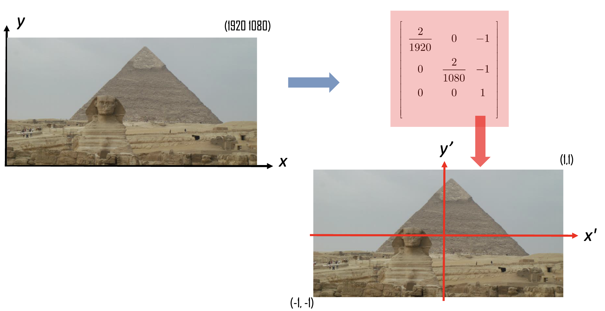
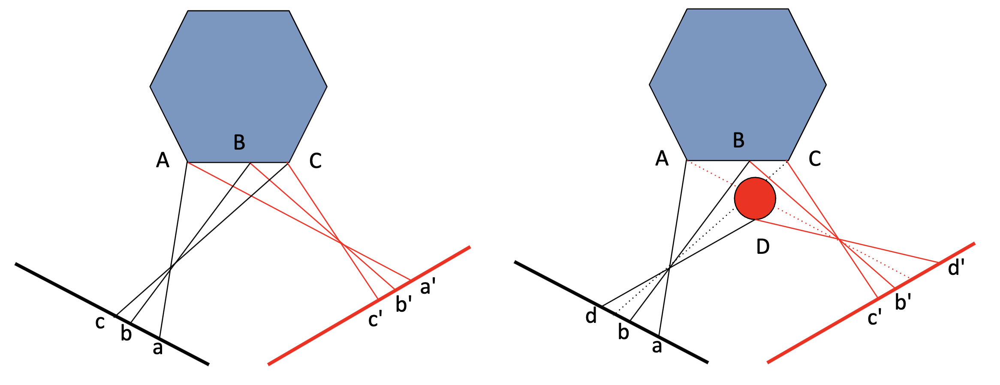
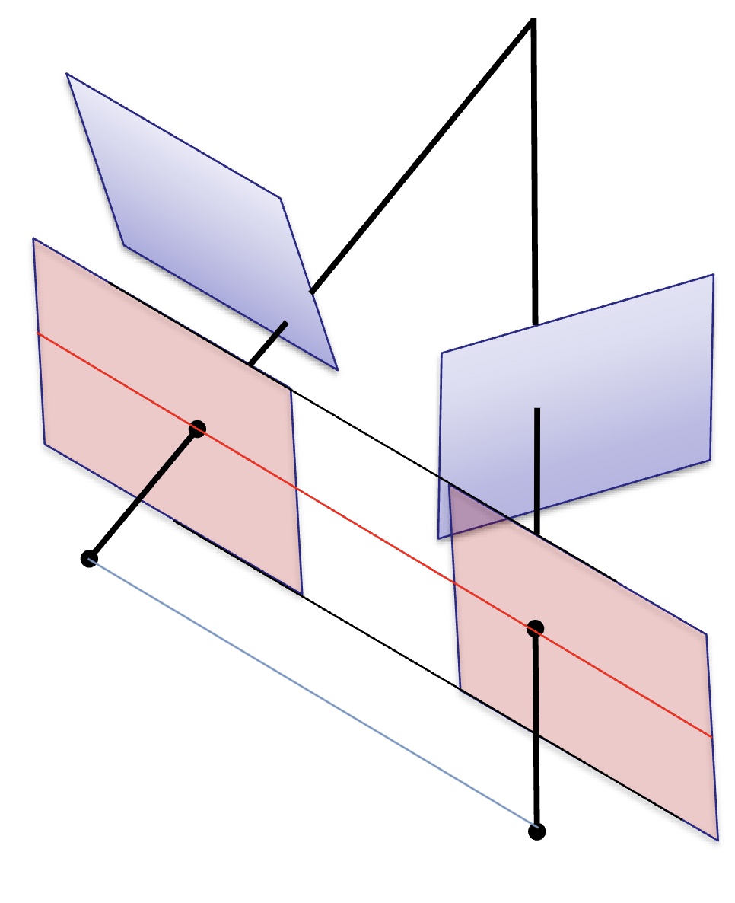
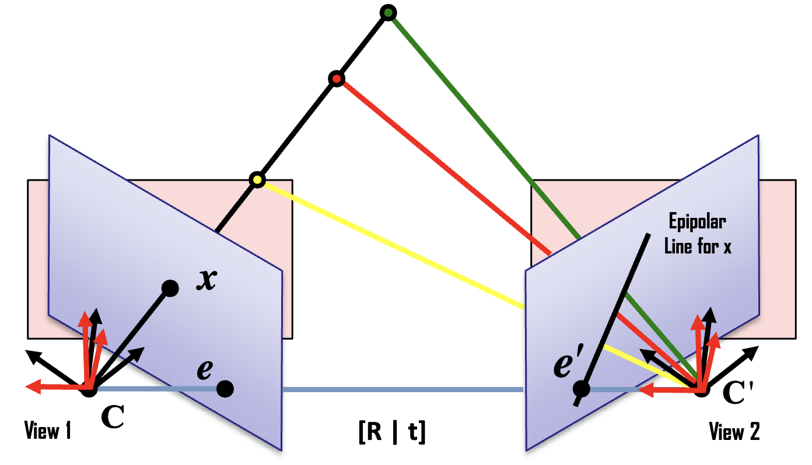

# Lecture 13: Computational Stereo II

## Estimate F

考虑 F 矩阵
$$
x'^T Fx = 0\\
\begin{bmatrix}
x'\\y'\\1
\end{bmatrix}^T
\begin{bmatrix}
f_{11} & f_{12} & f_{13} \\
f_{21} & f_{22} & f_{23} \\
f_{31} & f_{32} & f_{33} \\
\end{bmatrix}
\begin{bmatrix}
x'\\y'\\1
\end{bmatrix} = 0
\\
x'xf_{11}+ x'yf_{12}+x'f_{13} +
y'xf_{21}+ y'yf_{22}+y'f_{23} + 
xf_{31}  +  yf_{31} +  f_{33} = 0
$$
考虑方程原理，我们需要 $N$ 个不等价方程才能解决 $N$ 个未知数，而有 9 个未知数（8 un-recoverable scale, so we need at least 8 point-pairs to recover F）
$$
\underbrace {
\begin{bmatrix}
x_{1}x_{1}' & y_1x_{1}' & x_{1}' & x_{1}y_{1}' & y_{1}'y_{1}' & y_{1}'& x_1 & y_1 & 1 \\
x_{2}x_{2}' & y_1x_{2}' & x_{2}' & x_{2}y_{2}' & y_{2}'y_{2}' & y_{2}'& x_2 & y_2 & 1 \\
x_{3}x_{3}' & y_1x_{3}' & x_{3}' & x_{3}y_{3}' & y_{3}'y_{3}' & y_{3}'& x_3 & y_3 & 1 \\
\vdots & \vdots & \vdots & \vdots & \vdots & \vdots & \vdots & \vdots & \vdots \\
x_{n}x_{n}' & y_1x_{n}' & x_{n}' & x_{n}y_{n}' & y_{n}'y_{n}' & y_{n}'& x_n & y_n & 1 \\
\end{bmatrix}
}_{\mathbf{A}}
\underbrace{
\begin{bmatrix}
f_{11} \\ f_{12} \\ f_{13} \\
f_{21} \\ f_{22} \\ f_{23} \\
f_{31} \\ f_{32} \\ f_{33} \\
\end{bmatrix}
}_\Psi
= 0\\
\mathbf{A}\Psi = 0
$$


求解通常使用最小二乘法（Least Square Method）。最小二乘解F是通过奇异值分解（SVD）得到的矩阵A的最小奇异值所对应的奇异向量（即 $A = UDV^T$ 中V的最后一列）。

### Normalisation

我们会发现其中有些值会很大（因为是两个数字相乘，例如$x_1x_2'$，红色箭头），而有些会相对小，因此我们应该考虑使用 Normalisation，否则 Least Square 无法获得良好的结果。


图像坐标系统可以通过映射转换到 $[-1,1]$ 的范围内。以1080p视频帧(1920x1080像素)为例



> **仿射变换**（Affine transformation），是指在[几何](https://zh.wikipedia.org/wiki/几何)中，对一个[向量空间](https://zh.wikipedia.org/wiki/向量空间)进行一次[线性变换](https://zh.wikipedia.org/wiki/线性变换)并接上一个[平移](https://zh.wikipedia.org/wiki/平移)，变换为另一个向量空间。即 $[T \mid t]$
>
> 图中左上角的 $\begin{bmatrix} \frac{2}{1920} & 0 \\ 0 & \frac{2}{1080} \end{bmatrix}$ 是将图片映射到 [0, 2] 的区间，而后边跟着的 $\begin{bmatrix} -1\\ -1 \end{bmatrix}$ 则是将图片中心 $(1, 1)$ 平移到 $(0, 0)$。而最后一项则为齐次坐标的组成部分。

将不同分辨率的图像统一到相同的坐标范围内

提高数值计算的稳定性

可以得到更好的最小二乘法拟合结果

#### Constraint

通过直接最小二乘法得到的矩阵F可能不满足基础矩阵的约束条件，对于基础矩阵 $F$ 满足如下特性：
$$
F^Te'= 0 \qquad Fe = 0\qquad \det F = 0
$$

- $$F^Te' = 0$$ 表示对极约束
- $$Fe = 0$$ 表示基础矩阵与对极点的关系
- $$\det F = 0$$ 表示F的行列式为0（这是秩为2的必要条件）

可以使用奇异值分解(SVD)方法来推导出秩为2的矩阵F
$$
F = U\begin{bmatrix} \sigma_1 & & \\ & \sigma_2 & \\ & & \sigma_3 \end{bmatrix}V^T = U_1\sigma_1V_1^T + U_2\sigma_2V_2^T + U_3\sigma_3V_3^T
$$

- 将$$\sigma_3$$设为0（Set to Zero）
- 最后一项$$U_3\sigma_3V_3^T$$被舍弃（Discard）
- 这样做确保了F的秩为2

这个过程实际上是为了找到一个近似的F'，它既要尽可能接近原始恢复的F，同时还要满足上述的奇异性约束条件。

### Computational Steps

**特征提取**：确保提取的特征点具有显著性和稳定性
**计算潜在匹配**：初始阶段需要至少8对匹配点

**迭代执行（Do）以下步骤**：

- 选择匹配的特征点对
- 使用SVD（奇异值分解）通过 $AF=0$ 计算 $F$ 的初始估计值
- 使用估计的 $F$ 矩阵重投影特征点
- 确定重投影误差较大的点的数量
- 移除这些离群点(outliers)并寻找额外的匹配点

**终止条件（Until）**：当离群点数量低于预设阈值百分比时停止迭代

**最终优化**：基于所有正确的匹配对F进行精细化（Refine）


采用RANSAC（随机采样一致性）的思想，通过迭代的方式逐步筛选出可靠的匹配点，使用SVD进行F矩阵的计算，这是一个数值稳定的方法，通过重投影误差来评估匹配点的质量，最终得到的F矩阵是基于所有高质量匹配点的优化结果。


**基本问题**：

- 即使在成功估计基础矩阵并使用对极约束后，基于特征匹配的立体重建仍可能出现错误
- 这个问题主要出现在缺乏可靠特征点的情况下，或者在存在大量重复结构的场景中，这使得稳健的特征匹配变得困难

**三个关键约束**：

1. **唯一性约束** (Uniqueness Constraint)
   一张图像中的任意点在另一张图像中最多只能有一个匹配点
   这是确保匹配合理性的基本要求
   **唯一性约束在半透明物体的情况下可能不成立**

2. **平滑性约束** (Smoothness Constraint)
   视差值（disparity）在图像的大部分区域应该缓慢变化
   这基于现实世界中物体表面通常是连续的这一假设
   **平滑性约束在物体边缘处可能不适用**

   ```
   深度图（数字表示到相机的距离）:
   
   2 2 2 2 2    <- 背景
   2 2 8 8 8    <- 立方体顶部边缘
   2 2 8 8 8
   2 2 8 8 8    <- 立方体
   ```

   

3. **顺序约束** (Ordering Constraint)
   投影后，对应点在两个视图中应保持相同的顺序
   这有助于排除一些不合理的匹配
   **顺序约束在有遮挡的情况下可能失效**



## Stero Image Rectification 立体图像矫正



沿极线计算搜索代价较高，因为大多数极线都是倾斜的，数值误差也会带来问题。

立体图像校正是将图像平面重新投影到一个平行于连接相机中心基线的共同平面上的过程

校正后，所有极线都会变成水平线，这使得搜索算法变得特别简单

校正实际上是一个简单的图像变形过程，可以由显卡特别是现代GPU轻松完成

问题：校正后图像平面的基础矩阵是什么？

> 立体图像校正是立体视觉中的一个重要预处理步骤。它通过将两个相机的图像平面调整到一个共同的平面上，使得后续的立体匹配变得更加简单和高效。当极线变为水平时，对应点的搜索就被限制在同一水平线上，这大大减少了搜索空间和计算复杂度。现代GPU的发展使得这个图像变形过程可以非常高效地完成。




1. 旋转左相机，使其图像平面与系统基线平行（即极点沿x轴延伸至无穷远处）
   - 新的 $x$ 轴方向设为基线方向(即 $(C-C')/||C-C'||$)，保持投影中心C不变($r1=(C-C')/||C-C'||$)
   
   - 新的 $y$ 轴需要垂直于新的 $x$ 轴和旧的 $z$ 轴（ $z$ 轴沿原光轴方向）（使用叉积，$r2=z \times r1$）
   
     > 旧的z轴是沿着相机的光轴方向
     > 这个方向代表了相机的主要观察方向
     > 保持这个参考可以最小化相机旋转带来的图像畸变
   
   - 新的z轴需要垂直于基线和新的y轴（再次使用叉积，$r3=r2 \times r1$）
   
   - 这些步骤定义了左相机的旋转矩阵 $R_\text{rect}$
   
2. 右相机的旋转也需要保持其投影中心不变使其平行，其投影矩阵简单表示为 $R_\text{rect}R^T$

这个过程的目的是：
- 通过旋转两个相机，使它们的图像平面彼此平行，并且都与基线平行
- 这种校正可以简化立体匹配过程，因为对应点会出现在两幅图像的同一行上
- 校正后的图像对可以更容易地进行深度计算和3D重建

这是计算机视觉中的一个重要预处理步骤，可以大大简化后续的立体匹配和3D重建过程。通过这种校正，我们可以确保两个相机图像平面平行，这样对应点搜索就可以限制在同一水平线上，而不是在整个图像平面中搜索。

如考虑原坐标为
$$
x = K[I \mid 0]\begin{bmatrix}X\\1\end{bmatrix} = KX\\
$$
考虑 $x -R\to x'$
$$
\begin{align}
x' = K[R \mid 0]\begin{bmatrix}X\\1\end{bmatrix} &= KRX\\
&= (KRK^{-1})x

\end{align}
$$
对于 Homography，如果相机只旋转，但是不评议，只需要进行简单的映射即可。换句话说做图像 Rectification 齐次系统只需要应用一个矩阵变换即可。

## Basic Stereo Matching

对于第一幅图像中的每个检测到的特征点 $x$：

1. 在另一幅图像中找到对应的极线(epipolar scanline)

2. 检查极线上的所有像素，找到最佳匹配点x'

3. 计算 disparity $(x-x')$并设置x点的深度为：
   $$
   d = \frac{tf}{x-x'}
   $$
   $t$: 两个相机之间的 baseline 距离
   $f$: focal length

立体匹配相关问题：

- 显著特征稀少、表面均匀
- 遮挡和重复 - 纹理有助于匹配，但重复纹理可能造成问题
- 镜面高光(视角依赖)

对于针孔相机，其 3D 点对 image 平面的投影为
$$
\begin{bmatrix}u\\v\\w\end{bmatrix} =
\begin{bmatrix}f&0&x_0\\0&f&y_0\\0 & 0 & 1\end{bmatrix}
\begin{bmatrix}1 & 0 & 0 & 0\\0 & 1 & 0 & 0\\0 & 0 & 1 & 0\end{bmatrix}
\begin{bmatrix}X\\Y\\Z\\1\end{bmatrix}
$$

> $$
> \begin{bmatrix}
> \alpha_x & s & x_0 & 0\\
> 0 & \alpha_y & y_0 & 0\\
> 0 & 0 & 1 & 0
> \end{bmatrix}
> =
> \underbrace{
> \begin{bmatrix}
> \alpha_x & s & x_0\\
> 0 & \alpha_y & y_0\\
> 0 & 0 & 1
> \end{bmatrix}
> }_{\mathbf{K}}
> \underbrace{
> \begin{bmatrix}
> 1 & 0 & 0 & 0\\
> 0 & 1 & 0 & 0\\
> 0 & 0 & 1 & 0
> \end{bmatrix}
> }_{[\mathbf{I} \mid \mathbf{0} ]}
> = \mathbf{K}[\mathbf{I} \mid \mathbf{0} ]
> $$

考虑 $x = u/w, y= v/w$

有
$$
\begin{cases}
u=fX+Zx_0\\
v=fY+Zy_0\\
w = Z
\end{cases}
\longrightarrow
\begin{cases}
x =\frac{fX + x_0Z}{Z}\\
y =\frac{fZ + y_0Z}{Z}
\end{cases}
\longrightarrow
\begin{cases}
X = (x-x_0)\frac{Z}{f}\\
Y = (y-y_0)\frac{Z}{f}
\end{cases}
\longrightarrow
\begin{cases}
X = (x-x_0)\frac{t}{disp}\\
Y = (y-y_0)\frac{t}{disp}
\end{cases}
$$
t 依然是前面提到的两个相机之间的基线距离(baseline)
disp 是视差(disparity)，也就是同一点在两幅图像中的位置差
