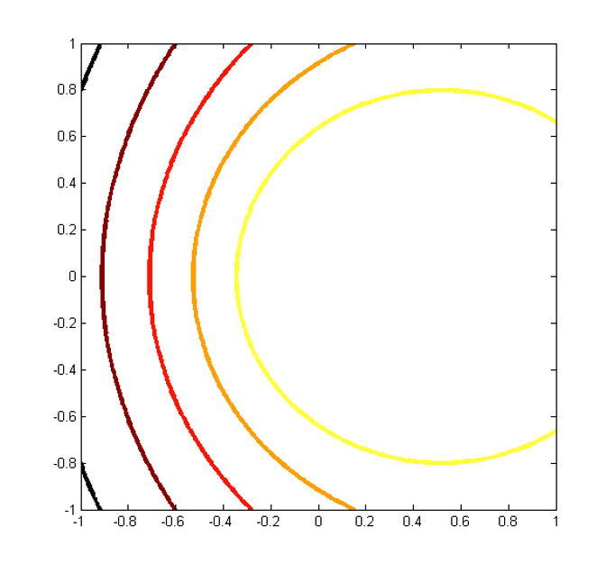

# Lecture 14: Photometric Stereo 光度立体

> 参阅 https://www.cnblogs.com/linzzz98/articles/13622026.html  
> 参阅 https://www.zywvvd.com/notes/study/image-processing/photometric-stereo/basic/  
> 参阅 http://www.macs.hw.ac.uk/texturelab/files/publications/phds_mscs/JW/chapter4.pdf

光度立体是一种使用多个光源方向估计表面几何形状的方法

这种方法的用途是可以重建出物体表面的法向量，以及物体不同表面点的反射率，最关键的是它不像传统的几何重建（例如立体匹配）方法那样需要去考虑图像的匹配问题，因为所需要做的只是采集三张以上，由不同方向的光照射物体的图像。这个过程中，物体和相机都不动，因此图像天然就是对齐的，这使得整个过程非常的简洁。

光度立体捕获反射率数据以进行2D匹配

| 传统几何重建法                             | 光度立体法                                                   |
| ------------------------------------------ | ------------------------------------------------------------ |
| 准确获取深度                               | 获取表面梯度                                                 |
| 粗糙表面，梯度方向不同时效果好             | 连续、光滑的表面效果最好                                     |
| 带有纹理的表面，具有不同反射的表面效果较好 | 均匀一致的表面效果最好                                       |
| 需要图像对齐、困难                         | 不需要图像对齐                                               |
| 不能获取表面反射比例                       | 可以获取表面反射比例                                         |
|                                            | 许多情况下，根据表面方向描述对象行形状比根据参考屏幕上方的范围或高度描述更可取 |

## 基础方法

假设：

1. 没有投影/自阴影或高光
2. 灰度/线性成像
3. 入射光由远处的单一点光源发出，这样照射到物体表面每一点的光的方向一致，强度一致
4. 相机的投影是正交投影，图像上的点的坐标可以直接反映三维物体的表面坐标
5. 表面静止不动
6. 物体表面具有Lambertian反射特性，即它对入射光产生漫反射，在每个方向上反射的光强都是一致的

$$
I \propto \cos \theta = N\cdot L
$$
当光线垂直照射表面时(θ = 0°)：因为光线能量最集中，此时光照强度最大

当光线斜射时(0° < θ < 90°)：相同量的光能要分散到更大的面积上
实际面积 = 垂直照射面积 / cos θ
因此单位面积上的能量强度就变成了原来的cos θ倍

表面亮度不取决于观察角度。

假设平面方程为 $Ax + By + Cz +D = 0$ 即 $[A, B, C, D]^T[x, y , z, 1] = 0$，法线可以被定义为
$$
N = \begin{bmatrix}
A & B & C
\end{bmatrix}
^T \longrightarrow n = \begin{bmatrix}
\frac{A}{C} & \frac{B}{C} & 1
\end{bmatrix}^T
$$
Normalised Norm $n = \frac{N}{C}$

考虑
$$
z = - \frac{Ax + By + D}{C}\\
\frac{\part z}{\part x} = - \frac{A}{C} \qquad
\frac{\part z}{\part y} = - \frac{B}{C}\\

n = \begin{bmatrix}
\frac{A}{C} & \frac{B}{C} & 1
\end{bmatrix}^T

\longrightarrow
n = 
\begin{bmatrix}
-\frac{\part z}{\part x} & -\frac{\part z}{\part y} & 1
\end{bmatrix}^T
$$
我们也有可能用 outward normal：$n = 
\begin{bmatrix}
\frac{\part z}{\part x} & \frac{\part z}{\part y} & -1
\end{bmatrix}^T$

> 向量叉乘
>
> 考虑法向量可以表达为平面 $S$  $x, y$ 方向剃度的垂线，即
> $$
> n = \frac{d S}{d X} \times\frac{d S}{d Y}\\
> \frac{d S}{d x} = \begin{bmatrix} 1 & 0 &  \frac{\part Z}{\part X}\end{bmatrix}
> \qquad
> \frac{d S}{d y} = \begin{bmatrix} 0 & 1 &  \frac{\part Z}{\part Y}\end{bmatrix}
> \\
> p = - \frac{\part Z}{\part X} \qquad q=-\frac{\part Z}{\part Y}
> $$
> 因此我们可以重写
> $$
> n = 
> \begin{bmatrix} 1 & 0 &  -p\end{bmatrix}^T
> \times
> \begin{bmatrix} 0 & 1 &  -q\end{bmatrix}^T
> \\
> n = \frac{1}{\sqrt{q^2 + p^2 + 1}}[p, q, 1]^T
> $$
> 

如考虑 normalised norm $n$ 和 normalised 光出射角 $s$：
$$
R(p, q) = \rho \frac{n\cdot s}{|n| \cdot |s|} = \rho \mathbf{n}L\cos\theta
$$

- $R$：散射
- $\rho$：反射率 Reflectance Factor / Albedo
- $L$:光照强度（可忽略）（注意区分这里的L与上面表示光源向量的L表示的不同含义）

$$
\begin{align}
R(p, q) &= \rho L \frac{n\cdot s}{|n| \cdot |s|} \\
&= \rho L\frac{| n | \cdot |s| \cos \theta}{| n | \cdot |s| }
\\
&= \rho L \frac{pq_s + qq_s + 1}{\sqrt{p^2 + q^2 + 1}\sqrt{p_s^2 + q_s^2 + 1}}

\end{align}
$$
如果反射率被重新定义且相机响应是线性的，即 $\rho' = \rho L$，则有：
$$
\begin{align}
R(p, q) &= \rho' \frac{n\cdot s}{|n| \cdot |s|} \\
&= \rho'\frac{| n | \cdot |s| \cos \theta}{| n | \cdot |s| }
\\
&= \rho' \frac{pq_s + qq_s + 1}{\sqrt{p^2 + q^2 + 1}\sqrt{p_s^2 + q_s^2 + 1}}

\end{align}
$$
已知 $p_s, q_s, I$ 求解 $p, q, \rho$，需要3 个方程。

$$
R(p, q) = \rho\frac{\mathbf{n} \cdot \mathbf{s}}{|\mathbf{n}|\cdot |\mathbf{s}|}
= \rho\frac{ps_x + qs_y + s_z}{\sqrt{p ^ 2 + q^2 + 1}}
$$
上式被称为 Reflection Equation。

为了使函数 R 可视化，可以将其绘制为一系列  $R(p, q) = constant$ 的等值线。

## Visualization of R(p, q)

## 正交投影

#### 入射光由远处的单一点光源发出

- 光线照到物体表面每一点的光的方向一致，强度一致

假设三个光源 $\mathbf{L} = \{ L_1, L_2, L_3\}, \mathbf{t}_i = \{ t_{i1}, t_{t2}, t_{t3} \}$，即对于特定光源 $L$
$$
\begin{align}
t_i = \rho_i(N_i \cdot L) \cdot l
\end{align}
$$

$$
\rho_i = \frac{\mathbf{t}_i}{l N_i\cdot L} = |L^{-1} \mathbf{t}_i |
\\
N_i = \frac{\mathbf{t}_i}{\rho_i L l} = \frac{1}{\rho_i}L^{-1}\mathbf{t}_i
$$

## Visualization of R(p, q)

$$
\begin{align}
R(p, q) &= \rho \frac{n\cdot s}{|n| \cdot |s|} \\
&= \rho\frac{| n | \cdot |s| \cos \theta}{| n | \cdot |s| }
\\
&= \rho \frac{pq_s + qq_s + 1}{\sqrt{p^2 + q^2 + 1}\sqrt{p_s^2 + q_s^2 + 1}}
\\
\frac{I}{\rho} &=\frac{n\cdot s}{|n| \cdot |s|} = \cos \theta
\end{align}
$$

### 可视化光线方向与观察方向

如果我们可视化光线方向与观察方向一致，也就是 $s = [0, 0, 1]^T$
$$
R(p, q) = \rho\frac{ps_x + qs_y + s_z}{\sqrt{p ^ 2 + q^2 + 1}} = \rho\frac{1}{\sqrt{p ^ 2 + q^2 + 1}} = c
$$
可以求出
$$
\begin{align}
\rho\frac{1}{\sqrt{p ^ 2 + q^2 + 1}} &= c \\
\sqrt{p ^ 2 + q^2 + 1} & = \frac{\rho }{c} \\
p ^ 2 + q^2 &= \left( \frac{\rho }{c} \right)^2 -1
\end{align}
$$

$p_s = q_s = 0$，光线垂直照射

### 不与视角方向 Coincident

$p_s = q_s = 0.5$ 相当于斜着照射

对于 R(p,q) 的恒定等值线，方程为一般的二阶圆锥曲线截面（conic section）。最大值在 $(p, q) = (s_x / s_z, s_y / s_z)$ （求导）
$$
R(p, q) = \rho\frac{ps_x + qs_y + s_z}{\sqrt{p ^ 2 + q^2 + 1}}
$$

|  |  |
| :------------------------------------------: | :------------------------------------------: |
|              $s =[0,0.3,0.95]$               |            $s =[-0.29,0.19,0.94]$            |

|  |  |
| :----------------------------------------------------------: | :----------------------------------------------------------: |
|                           圆锥曲线                           |                            单位元                            |

## 求解 $p, q$

### Local Method

如果这些方程是线性的、独立的，并且我们知道反照率，那么 p 和 q 就会有一个唯一的解，因此，给定两幅在不同光照条件下拍摄的注册图像，就可以得到每一点表面方位的唯一解。

遗憾的是，所提供的方程通常是非线性的。我们可能没有解，也可以有多个解。事实上，可以证明根据 R1 和 R2 的特定值，可以有两个解、一个解或没有解。

> 请注意，photometric stereo 与 computational stereo 不同，我们只使用一台相机。在拍摄不同图像时，我们只改变光源的位置，而不改变摄像头的位置。

使用多个光源和固定的摄像机设置（摄像机的内在和外在参数（姿势）都是固定的）
对于每种光照条件，我们都会得到一张 Reflection Map.
假设物体是 Lambertian(朗伯体)，也是固定的，在不同光照条件下不会移动（或改变形状），我们就能从反射率图中得出每个像素的 p 值和 q 值。
然后，通过沿物体表面对 p 和 q 值进行积分，就可以得出三维物体的相对深度。

问题在于，每个 reflectance map  都是非线性的，通常物体的 albedo 也是未知的
通过**三个独立的照明条件**，我们不仅可以恢复 $p$、$q$，还可以避免计算 $\rho$

现在我们可以拥有：
$$
\begin{align}
\frac{R_1(p, q)}{R_2(p, q)} &= \frac{s_{x1}p+s_{y1}q + s_{z1}}{s_{x2}p+s_{y2}q + s_{z2}}
\\
\frac{R_3(p, q)}{R_2(p, q)} &= \frac{s_{x2}p+s_{y2}q + s_{z2}}{s_{x3}p+s_{y3}q + s_{z3}}
\end{align}
$$
通过求解该线性方程可得 $p, q$

#### Limitation: Noise

考虑情况

|  |  |  |
| :----------------------------------------------------------: | :----------------------------------------------------------: | :----------------------------------------------------------: |
|                            $R_1$                             |                            $R_2$                             |                            $R_3$                             |

其 Solution Space 为这三个环。而解为角点。

但是 Noise 会让交点失踪

现在我们知道了每个像素的 p 值和 q 值，我们需要从 p、q 中找到深度信息。
这可以通过进行二维积分来实现，即
$$
p = -\frac{\part Z}{\part X} \qquad q = -\frac{\part Z}{\part Y}
$$

> 有 $\frac{\part Z}{\part X} = -p, \frac{\part Z}{\part Y} = -q$
>
> 在 $X$ 方向进行积分：
> $$
> \begin{align*}
> Z(X, Y) &= \int\frac{\part Z}{\part X} dX + f(Y)\\
> &= -\int p(X, Y) dX + f(Y)\\
> -q &= \frac{\part Z}{\part Y} \\
> &=\frac{\part}{\part Y}\left [ -\int p(X, Y) dX + f(Y)\right]\\
> &=-\int \frac{\part p(X, Y)}{\part Y} dX + f'(Y)\\
> f(Y) &=-\int q(X_0,Y)dY + C\\
> Z(X,Y) &= -\int p(X,Y)dX - \int q(X_0,Y)dY + C
> \end{align*}
> $$

然而，这在实际应用中可能会出现问题，因为图像噪声会给 p 和 q 带来误差，而这种误差会沿着积分路径传播。

### Global Method

前面介绍的方法被定义为局部方法，因为它是独立计算每个像素的。
还有一种不同的方法被称为全局法，它只使用一个光源，但在相邻像素之间建立了一种关系。
在计算机视觉中，我们称之为 “从阴影看形状”。**shape-from-shading**
通常假定物体是光滑的，这一**smoothness condition**在估计 (p, q) 的松弛过程中被提出来

该方法从一个像素点 $(x, y)$ 开始，假定已经对该像素点的表面梯度 $(p, q)$ 进行了估计。
现在，该像素点的测量强度 $I(x, y)$ 与反射图 $R(p, q)$ 的估计强度之间一般会存在误差。
因此，我们希望找到一个最小化 $(I(x, y) - R(p,q))^2$ 的过程。
根据反射图的定义，我们知道这个最小化问题没有唯一的解，因此我们需要增加一个约束条件（这就是平滑度的作用所在）
我们可以通过求 p 和 q 的导数来衡量平滑度。
为了补偿不同的符号，平滑度函数取为
$$
S(p_x, p_y, q_x, q_y) = \left( \frac{\part p}{\part x}\right)^2 +
\left( \frac{\part p}{\part y}\right)^2 +
\left( \frac{\part q}{\part x}\right)^2 +
\left( \frac{\part q}{\part y}\right)^2
$$
因此误差函数可以被写为
$$
E(p, q, p_x, p_y, q_x, q_y) = (I(x, y) - R(p, q))^2 + \lambda S(p, q, x, y)\\
E = \int\int E(p, q, x, y) dx dy
$$
#### Limiation

光源必须 uniform，或至少与物体保持较大距离（这是我们在推导反射方程时做出的固有假设）

上述公式还假设了正交投影，但对于特写视图或深度变化较大的物体，这一假设并不成立

另一个限制条件是表面应为朗伯面。实际上，所有表面都有镜面反射，这会使方程复杂化

在计算机视觉中还可以利用近距离点光源进行其他计算。

### Shape from Shading 从阴影看形状

早在视觉界开始研究其在三维深度重建中的应用之前，它就已在天体物理学中得到了应用
在计算机视觉领域的早期贡献归功于 Horn 的工作（从一个视角观察光滑不透明物体的形状，1970 年，朗伯反射率，正投影，恒定反照率，光滑表面，已知光源）
最近的工作考虑了透视投影、带有方向统计的信念传播，以及放宽朗伯约束以解决从阴影看形状的问题
与一般照明下的计算立体相结合

## 光源方向标定

先第一步，是进行光源方向的标定，一种可行的方法是在场景中放入一个光滑的球并在不同光源下成像，这样球的表面高亮处就会反映光源的方向

考虑球面法向量 $N$ 反射方向 $R$，光源方向 $L$，有
$$

$$
