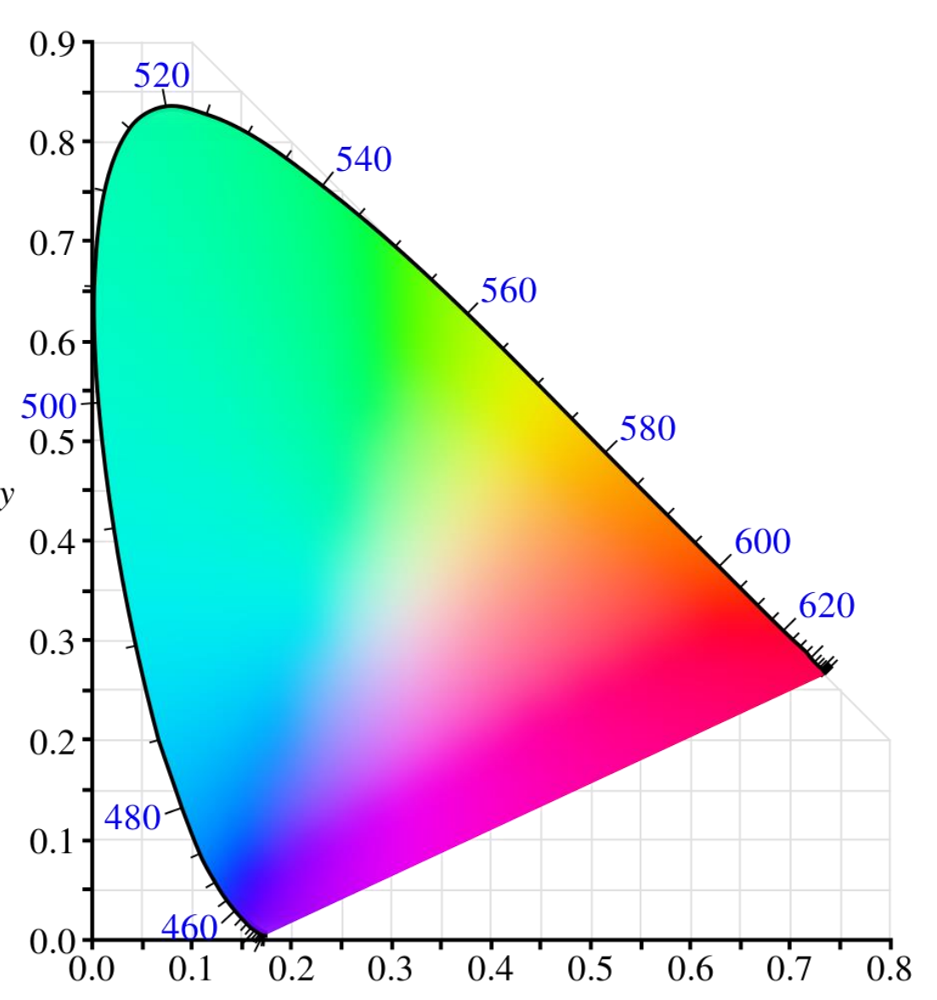

# Lecture 2: Image Formation

## Photometric Image Formation

光是 Electromagnetic Spectrum (电磁波谱) 中某一特定部分的 Electromagnetic Radiation (电磁辐射)。

- Point Light Source / 点光源
  - 从空间中一个单独（single）的位置 originate（起源）
  - e.g. 一个小灯泡或远处的太阳
  - 位置、强度和频谱
- Area Light Source / 区域光源
  - 更复杂
  - e.g. 教室里的天花板灯
  - 对于区域上的每个点，需要对发射光的 Intensity (强度) 和 Direction (方向) 进行建模

## Reflectance

我们使用 BRDF (Bidirectional Reflectance Distribution Function) 计算反射量。

> *描述到达入射方向的每个波长的光有多少在反射方向上发射的四维函数*
> *A four dimensional function that describes how much of each wavelength of light arriving at an incident direction is emitted in a reflected direction*

每个方向都是根据 Surface Normal（表面法线）定义的，并由 Azimuth Angle $\phi$（方位角）和 Zenith Angle $\theta$（天顶角）Parameterised（参数化）

|  |  |
| :---: | :---: |

$$
BRDF:
 f_r (
    \theta_i, \phi_i,
	\theta_r, \phi_r,
    \lambda
) =
\frac{d L_r}{d E_i}
\\\\
f_r (
    \underbrace{\theta_i, \phi_i}_\text{Incident Direction},
	\overbrace{\theta_r, \phi_r}^\text{Reflected Direction},
    \underbrace{\lambda}_\text{Wavelength}
) =
\frac
{d \overbrace{L_r}^\text{Output Power}}
{d \underbrace{E_i}_\text{Input Power}}
$$

### Reflection Model

#### Diffuse Reflection Model / 漫反射模型 / 扩散反射模型

- 光线Scattered Uniformly (均匀地散射) 到各个方向 (in all directions)。

- 这是我们通常与 Shading (阴影) 联系在一起的 phenomenon (现象)。

- 光量取决于  Incident Light Direction (入射光方向) 和 Surface Normal (表面法线) 之间的角度。

- BRDF 是常数：
  $$
  f_r(\Phi, \Theta, \lambda)=f_r(\lambda)\\
  \text{where } \Theta=\{\theta_i, \theta_r\}, \Phi=\{\phi_i, \phi_r\}
  $$

#### Specular Reflection Model / 镜面反射模型

- 反射使用类似于镜子的方式
- 反射强依赖于入射和出射方向（Direction of incident & outgoing light）
- 入射和反射方向相对于 Surface Normal 对称（Symmetric）

#### Phong Shading / 冯氏着色

对于绝大多数情况，我们看见的事物是多种反射的组合。Phong shading 模拟了物体表面与光源之间的互动，通过计算三种不同类型（Ambient, Diffuse Reflection, Specular Reflection）的光照反射来生成逼真的光照效果。

Ambient Illumination（环境照明）考虑了 General Illumination（一般照明），这种照明可能很难建模，例如

* 房间内墙壁之间的相互反射（Inter-reflection）
* 远处的光源，例如蓝天、阳光明媚的室外

## Human Vision

人眼的光纤通过 *晶状体（Lens）*到达 *视网膜（Retina）*。视网膜是一种多层 Membrane（膜），包含 Millions 的 Light-sensitive cells。将图像转化为一系列 Electrical Signals。

有 2 种不同的神经元是 *Photoreceptor Cells（感光细胞）*：

- **Rod cell / 视杆细胞**
  - 提供黑白视觉
  - 检测动量（motion）
  - 在暗光（dim light）环境工作
  - 是夜间视觉的主要来源
- **Cone cell / 视锥细胞**
  - 提供彩色视觉
  - 在亮光（bright light）环境工作
  - 3 种 cones sensitive to 3 different spectra（光谱）
    因此有 Trichromatic Colour Vision（三色视觉）

### Cone Cell

*光谱峰值波长(wavelengths of the peaks of spectral)* 敏感度的顺序对视锥细胞进行标记：短视锥细胞（S）、中视锥细胞（M）和长视锥细胞（L）。

大脑会将多种 Receptor（受体）信息结合，从而产生不同感知。RGB模型是表示颜色的便捷表达，但是不是基于 cone types。

> **人眼对绿光更敏感是由几个因素决定的：**
>
> 1. **视锥细胞的分布**： 人眼视网膜上有三种视锥细胞，分别对红、绿、蓝光敏感。其中，对绿光敏感的M型视锥细胞数量最多，约占总视锥细胞的 60-65%。
> 2. **进化适应**： 绿光（约 555 纳米波长）在太阳光谱中的能量最强。人类祖先生活在森林环境中，对绿色的敏感性有助于在绿色植被中识别食物、捕食者和其他重要信息。
> 3. **光谱敏感度**： 人眼的总体光谱敏感度曲线在绿光区域达到峰值。这意味着在相同强度下，我们感知绿光比其他颜色更亮。
> 4. **视黄醇的特性**： 视锥细胞中的视黄醇（一种感光色素）对绿光wavelength范围最敏感。

## Camera Sensors

有两种常用传感器：

- **CCD**：用于专业、医学、科学应用。需要高质量图像数据。
- **CMOS**：用在智能手机。

光照射到相机传感器被一个被称为的 **Pixels** 的*小孔矩阵（matrix of small walls）*收集。

像素可能是**光电二极管（photodiodes）**或光电电容器（photocapacitors），它们产生与入射光量成比例的**电荷（charge）**，并在空间上限制和存储它。

来自这些感光点的信息被收集、组织并传输到**显示器（monitor）**进行显示。

传感器**分辨率（Resolution）**定义为每毫米的像素数。

像素的大小会影响**分辨率（Resolution）**、**对比度（Contrast）**和**信噪比（Signal-to-Noise Ratio, SNR）**。

|  |  |
| :---: | :--- |
| 相机传感器 | 通过 Filter 获得不同颜色的光信号 |

大多数相机使用 Colour Filter Array (CFA)，其中交替的传感器被不同颜色的滤光片覆盖。

### Bayers Pattern

最常用的 Pattern 是 **Bayer Pattern**，它将绿色滤光片放置在一半的传感器上，将红色和蓝色滤光片放置在剩余的传感器上：

* 50％绿色，25％红色，25％蓝色。

不同的颜色比例是因为亮度信号主要由绿色值决定，而视觉系统对亮度（luminance）中的高频细节（high frequency）比色度（chrominance）中的高频细节敏感得多。

- Luminance 代表图像的明暗程度: 人眼对绿光最敏感，所以绿色在决定亮度时起主导作用
- 亮度的高频细节更敏感: "高频细节"指的是图像中的精细结构和边缘。人眼对亮度变化(明暗对比)比对色彩变化更敏感。

- 每个像素只有一种颜色可用。
- 其他两种颜色可以从相邻像素插值。
- 通过 Interpolation（插值），我们可以在每个像素获得 (R,G,B) 值。
- 插入缺失的颜色值以便我们为所有像素获得有效的 RGB 值的过程称为去**马赛克（Demosaicing）**

## Colour Model

**Additive Colour Model**: 从**黑色**开始，**R**ed, **G**reen, **B**lue

**Subtractive Colour Model**: 从**白色**开始，**C**yan, **M**agenta, **Y**ellow

### RGB

#### CIE RGB Colour Space

##### Colour matching experiment 色彩匹配实验

|  |  |
| :---: | :---: |

- 观察者需要调整*三原色光（three primary lights）*（红光：700nm；绿光：546.1nm；蓝光：435.8nm）的值，直到它们产生与目标光无法区分的颜色。

- 对于某些*纯光谱（Pure Spectra）*，必须添加负量的红光。
  这意味着使用 CIE RGB *Emissive Displays（发射显示器）*无法显示某些*感知颜色（perceptual colors）*。 

$$
\begin{align}
\text{Any Colour} =
&\color{red}r\times \text{R (700nm)} + \\
&\color{green}g\times \text{G (546.1nm)} + \\
&\color{blue}b\times \text{B (435.8nm)}
\end{align}
$$

#### CIE 1931 XYZ Colour Space

|  |  |
| :---: | :---: |
|XYZ 色彩匹配函数| CIE 1931 Color Space Chromaticity Diagram CIE 1931 色彩空间色度图 |

为了避免这些负的 RGB 值，并有一个描述感知亮度的分量，制定了“假想”原色 (X、Y、Z) 和相应的颜色匹配（colour-matching）函数。

$Y$ 参数是颜色亮度 Luminance（感知相对亮度/Perceived Relative Brightness）的量度。

$x$ 和 $y$ 参数是*色度坐标（Chromaticity Coordinates）*，是所有*三刺激值（tristimulus value）* (XYZ) 的函数。

$$
\begin{align}
  x &= \frac{X}{X+Y+Z}\\
  y &= \frac{Y}{X+Y+Z}\\
  z &= \frac{Z}{X+Y+Z} = 1-x-y
\end{align}
$$

### L\*a*b\*

人类视觉系统的响应大致呈对数形式，我们可以感知到约 1% 的相对亮度差异。

虽然 XYZ 色彩空间能够将 *Luminance（亮度）*与 *Chrominance（色度）*分开，但它实际上并不能预测人类对颜色或亮度差异的感知程度。

CIE L\*a\*b\* 色彩空间是 XYZ 空间的*非线性重新映射（non-linear re-mapping）*，其中亮度或色度的差异在感知上更加均匀（Perceptually Uniform）。

- **L\***: Black (0) ~ White (100)
- **a\***: Green (-) ~ Red (+)
- **b\***: Blue (-) ~ Yellow (+)

### HSV

> HSV 是 RGB 颜色立方体在*非线性色度角（non-linear chroma angle）*、*径向饱和度（radial saturation）百分比*和*亮度启发（luminanceinspired ）值*上的投影（projection）。
> HSV which is a projection of the RGB colour cube onto a non-linear chroma angle, a radial saturation percentage, and a luminanceinspired value.

- **Hue**: $\in [0, 1]$，颜色
- **Saturation**: Unsaturated（不饱和）到 Fully Saturated（完全饱和）（无白色成分）
- **Value**: $\in[0, 1]$​，亮度

### CMYK 

用于打印

- **Cyan**
- **Magenta**
- **Yellow**
- **Key** (black)

## Colour Representation

### RGB or RGBA

- **Red**
- **Green**
- **Blue**
- **Alpha**: Transparency

### Grey

Greyscale Intensity (R=G=B)

- 8 bits, i.e. 0~255 （最常见）

- 16 bits （相机原文件）

### Histogram / 直方图

- 直方图将 Intensity Range（强度范围）划分为多个区间，并显示每个区间中的像素数或频率数。
- 这是一种直观的显示 Intensity Distribution（强度分布）的方式
