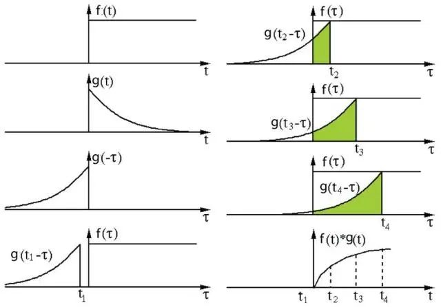
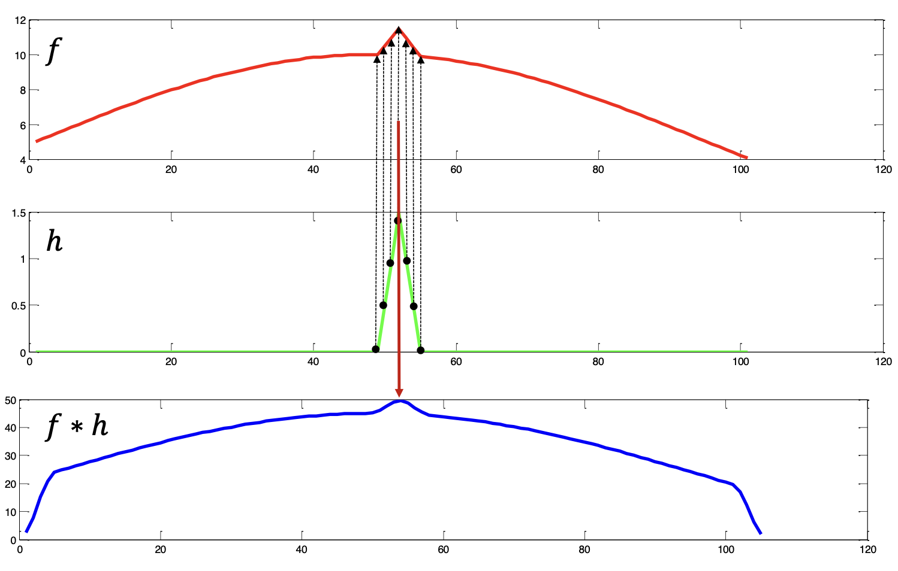
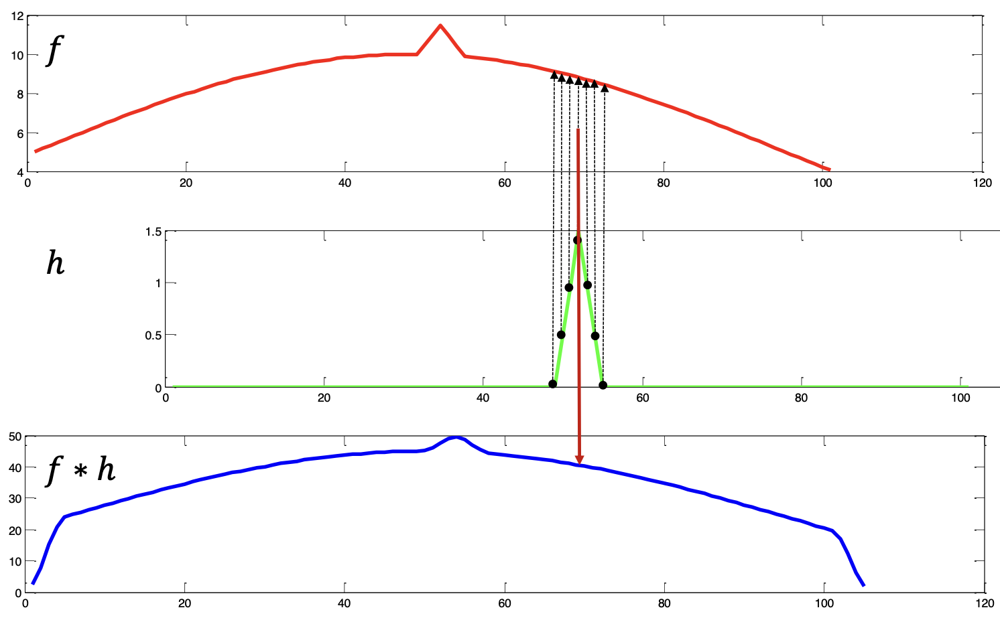
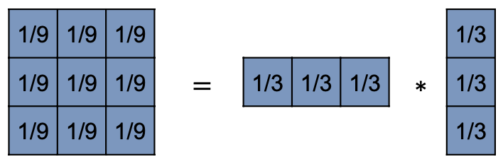
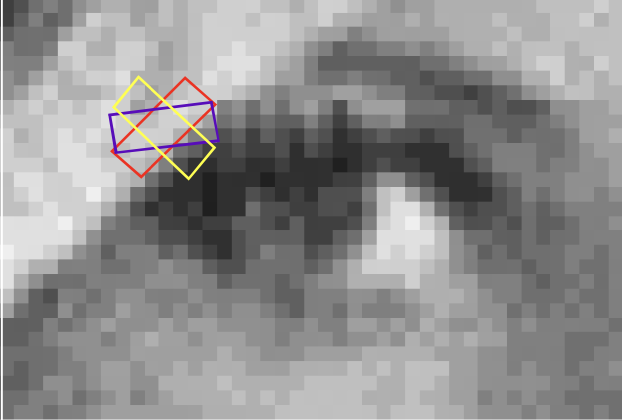

# Lecture 3: Image Filter

## Elementary Noise Reduction Filter

如另 $\Omega_{i,j}$ 为对于位置 $(i, j)$ 的 Neighbour，则可以求其信号中位数 $Median_{(m, n) \in \Omega_{ij}} f(m,n)$ 和 均值 $Mean_{(m, n) \in \Omega_{ij}} f(m,n)$

可有noise reduction 算法：

**Mean (Local Averaging) Filter**
$$
g(i, j) = Mean_{(m, n) \in \Omega_{ij}} f(m,n)\\
\updownarrow\\
g(i, j) = {\underbrace{\frac{1}{w}}_\text{Normalisation Factor}}\sum_{(m, n) \in \Omega_{ij}} f(m,n)\\
\updownarrow\\
g(i, j) = \frac{1}{|\Omega_{ij}|}\sum_{(m, n) \in \Omega_{ij}} f(m,n)\\
$$

Local Averaging 会降低 resolution，我们可以进行改进，即如果出现均值与原始值超过一个 Threshold，则进行 filter
$$
\text{Let }g(i, j) = \frac{1}{w}\sum_{(m, n) \in \Omega_{ij}}f(m,n)\\
\left\{
\begin{matrix}
g'(i, j) = g(i, j), &\text{ if } |f(i, j) - g(i, j)| > T; \\
g'(i, j) = f(i, j), &\text{ Otherwise }
\end{matrix}
\right.
$$

**Median Filter**
$$
g(i, j) = Median_{(m, n) \in \Omega_{ij}} f(m,n)
$$

## Convolution

对于 1D 信号，有
$$
\underbrace{f'(x)}_{\text{New Signal}} = \int_{-\infty}^{\infty}\underbrace{f(\tau)}_{\text{Original Signal}}\underbrace{\kappa(x-\tau)}_{\text{Kernel}} d\tau
$$
即 Kernel 会被**左右翻转**。

如果演进到 2D 信号，则：
$$
\underbrace{f'(x_1, x_2)}_{\text{New Signal}} = \int_{-\infty}^{\infty}\underbrace{f(\tau_1, \tau_2)}_{\text{Original Signal}}\underbrace{\kappa(x_1-\tau_1, x_2-\tau_2)}_{\text{Kernel}} d\tau_1 d \tau_2
$$
即 Kernel 会被**左右翻转**，**上下翻转**。

对于离散情况：
$$
g(x) = \int_{-\infty}^{\infty}{f(u)}{\kappa(x-u)} du\\
\updownarrow\\
g(x) = \sum_{u\in\Omega_x}{\kappa(x-u)} du\\
$$

$$
f'(x_1, x_2) = \int_{-\infty}^{\infty}{f(\tau_1, \tau_2)}{\kappa(x_1-\tau_1, x_2-\tau_2)} d\tau_1 d \tau_2 \\
\updownarrow\\
g(i, j) = \sum_{m\in \Omega_{ij}}\sum_{n\in \Omega_{ij}}f(m, n){\kappa(i-m, j-n)}
$$

## Seprable Filter

### Property of Convolution

Communication: $f*h = h *f$

Associativity: $f*(g *h) = (f*g) *h$

Distributivity: $f*(g +h) = (f*g) + (f*h)$

Differentiation: $\frac{f}{dx} (f * g) = \frac{df}{dx} *g = f *\frac{dg}{dx}$

### Computation Complexity

对于 $(N\times N)$ 的图片、$(K\times K)$ 的 Kernel，其计算复杂度为：

- 每一个 Pixel，进行 $O(K^2)$ 个乘运算，和 $O(K^2-1)$ 个 summation
- 有 $N^2$ 个 Pixel
- 即运算复杂度为 $N^2\cdot O(K^2) + N^2\cdot O(K^2-1) = O(N^2K^2)$

### Separable Filter

为降低 Computation complexity，我们可以根据 property 拆分 filter。

对于 $(N\times N)$ 的图片、有$(1\times K)$ 和  $(K\times 1)$  的 Kernel，其计算复杂度为：

- 每个 Pixel，进行 $O(K)$ 个乘运算，和 $O(K-1)$ 个 summation
- 有 $N^2$ 个 Pixel，每个需要进行 $2$ 次（$2$ 个 Kernel）
- 即运算复杂度为 $2N^2\cdot O(K) + 2N^2\cdot O(K-1) = O(N^2K)$

### Gaussian Filter

对于标准高斯核，其定义为：
$$
h(i, j) = \frac{1}{2\pi \sigma^2}\exp(-\frac{i^2+j^2}{2\sigma^2})
$$
我们根据 Associativity，可以定义
$$
h(i, j) = h(i) * h(j)\\
h(x)=\frac{1}{\sqrt{2\pi}\sigma}\exp{(-\frac{x^2}{2\sigma^2})}
$$

## Structure Adaptive Filter

大多数 Smoothing 方法对于整张图片仅使用固定的 filter，而不考虑局部的结构变化（local structure changes）

### Averaging according to Inverse Gradient

我们可以根据反梯度（Inverse Gradient）进行 Averging。

> 如定义梯度为 $\nabla$，则有反梯度 $\nabla^{-1}$，即 $\frac{1}{\nabla}$

其基于一个假设：同一区域（region）内的亮度变化通常小于相邻区域（neighbour region）之间的变化。

对于点$(m,n)$相对于点$(i,j)$的 Inverse Gradient 定义如下: 

$$
\delta(i,j,m,n) =
\begin{cases}
  \frac{1}{|f(m,n) - f(i,j)|}, & \text{if } f(m,n) \neq f(i,j) \\
  2, & \text{otherwise.} 
\end{cases} 
$$

其中 $f(m,n)$ 表示点 $(m,n)$ 的像素值。

$\text{Inverse Gradient} \in (0,2]$。Inverse Gradient 值有如下特性：

- 在边缘处（on the edge），值较小。
  边缘接处，梯度差异大：$|f(m, n) - f(i, j)| \uparrow$
- 在均匀区域内部（interior of a homogeneous region），值较大。
  边缘接处，梯度差异小：$f(m, n) \sim f(i, j)$

我们可以对其进行 Normalised (归一化)，获得 Convolution Mask 的权重（Weight coefficientes in the convolution mask）$h$：
$$
h(i,j,m,n) = \frac{\delta(i,j,m,n)}{2\sum_{(m,n)\in\Omega_{ij}}\delta(i,j,m,n)}
$$
其中 $\Omega_{ij}$ 表示以 $(i,j)$ 为中心的邻域（Neighbour Region）。

其定义Central Pixel为 $h(i, j) = 0.5$，这种方法在去噪过程中假设图像边缘是锐利的。

> **注解：分母上的 $2$**
>
> 在标准的 Normalisation过程，原定义为：
> $$
> h(i,j,m,n) = \frac{\delta(i,j,m,n)}{\sum_{(m,n)\in\Omega_{ij}}\delta(i,j,m,n)}
> $$
> 如若假设 Centrol Pixel $(i, j)$ 的 $h(i, j)=0.5$，则假设周围 Inverse Gradient 为 0。可得最终定义。

### Averaging with Rotatin Masks

> 这是一种避免edge blurring（边缘模糊）的方法。
>
> 通过搜索当前像素邻域中的 homogeneous part（同质部分），从而产生一个sharpened output image（锐化的输出图像）。

考虑上述图像，不同角度的边缘检测有不同效果。

**计算 Dispersion（离散度）**： 这个过程首先计算 mask 在给定像素周围所有可能旋转位置的 dispension。计算使用以下公式： 
$$
\sigma^2 = \frac{1}{n}
\left\{
  \sum_{(m,n)\in\Omega_{ij}} \left(f(m,n)-\frac{1}{n}
  \sum_{(k,l)\in\Omega_{ij}} f(k,l)\right)^2
\right\}
\\
\updownarrow
\\
\sigma^2 = \frac{1}{n}
\left\{
  \sum_{(m,n)\in\Omega_{ij}} \left(f(m,n)-\overline{f(k,l)\Bigg |_{(k, l)\in\Omega_{ij}}}\right)^2
\right\}
$$
其中：

- $\sigma^2$ 是 Dispension
- $n$  是 Mask 中像素的数量
- $f(m,n)$ 和 $f(k,l)$ 是 Mask 内像素值
  - $f(m, n)$ 原始像素
  - $f(k, l)$ 领域像素
- $\Omega_{ij}$ 表示当前像素 $(i,j)$ 的邻域

**选择最小离散度的掩模**： 计算完所有可能旋转位置的 Dispension 后，选择 Minimum Dispersion 的 Mask 来执行 Averaging Process。
