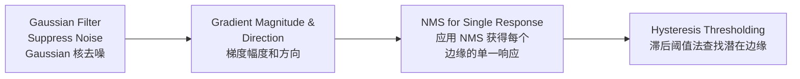
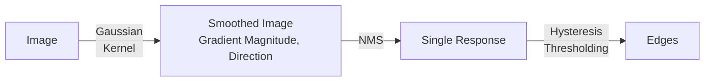
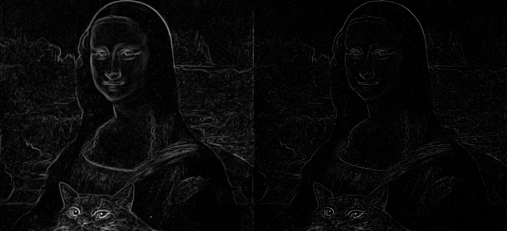
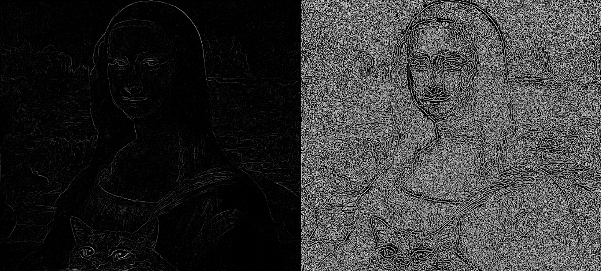
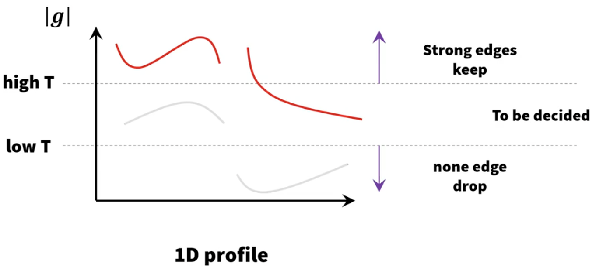
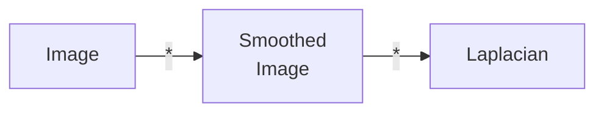

# Lecture 4: Edge Detection

[TOC]

## Characteristic of Edge

当出现边缘时候，Image Intensity Function（i.e. 信号值）会快速更改。

其在 Intensity 上的一阶导便会有起伏。

问题是我们怎么找到一阶导。

## First Order Derivative Filters

一阶核的目的是通过 $h * f$，可以获得图片 $f$ 的一阶导。

### Operators

#### Roberts Operator

$$
h_1=\begin{bmatrix}
1 & 0\\
0 & -1
\end{bmatrix}
\quad
h_2=\begin{bmatrix}
 0 & 1\\
-1 & 0
\end{bmatrix}
$$

#### Prewitt Operator

$$
h_1=\begin{bmatrix}
1 & 1 & 1\\
0 & 0 & 0\\
-1 & -1 & -1
\end{bmatrix}
\quad
h_2=\begin{bmatrix}
 0 & 1 & 1\\
-1 & 0 & 1\\
-1 & -1 & 0
\end{bmatrix}
\quad
h_3=\begin{bmatrix}
 -1 & 0 & 1\\
-1 & 0 & 1\\
-1 & 0 & 1
\end{bmatrix}
$$

我们可以把 Prewitt 核看作一个 Smooth + Grad 的操作。

> **Mathematics behind Prewitt Operator**
>
> 考虑离散差分倒数：
> $$
> f'(x)\approx \frac{f(x+h) - f(x-h)}{2h}
> $$
> 上述为中心差分公式，即近似中心的导数，如果使用单侧差分，例如 $f(x)-(x-h)$，精度会变差。
>
> 如令步长为 $h=1$，则有：
> $$
> f'(x)\approx \frac{f(x+1) - f(x-1)}{2}
> $$
> 即
> $$
> f'(x)\approx \frac{f(x+1) +0f(x) - f(x-1)}{2}
> $$
> 用向量表示则为：
> $$
> f'(x) = \frac{1}{2}\begin{bmatrix} 1\\0\\-1\end{bmatrix}^T\begin{bmatrix} f(x+1)\\f(x)\\f(x-1)\end{bmatrix}
> $$

#### Sobel Operator

$$
h_1=\begin{bmatrix}
1 & 2 & 1\\
0 & 0 & 0\\
-1 & -2 & -1
\end{bmatrix}
\quad
h_2=\begin{bmatrix}
 0 & 1 & 2\\
-1 & 0 & 1\\
-2 & -1 & 0
\end{bmatrix}
\quad
h_3=\begin{bmatrix}
 -1 & 0 & 1\\
-2 & 0 & 2\\
-1 & 0 & 1
\end{bmatrix}
$$

Sobel 相比于 Prewitt 加强了中心线的权重。

#### Robinson Operator

$$
h_1=\begin{bmatrix}
1 & 1 & 1\\
1 & -2 & 1\\
-1 & -1 & -1
\end{bmatrix}
\quad
h_2=\begin{bmatrix}
 1 & 1 & 1\\
-1 & -2 & 1\\
-1 & -1 & 1
\end{bmatrix}
\quad
h_3=\begin{bmatrix}
 -1 & 1 & 1\\
-1 & -2 & 1\\
-1 & 1 & 1
\end{bmatrix}
$$

#### Kirsch Operator

$$
h_1=\begin{bmatrix}
3 & 3 & 3\\
3 & 0 & 3\\
-5 & -5 & -5
\end{bmatrix}
\quad
h_2=\begin{bmatrix}
3 & 3 & 3\\
-5 & 0 & 3\\
-5 & -5 & 3
\end{bmatrix}
\quad
h_3=\begin{bmatrix}
-5 & 3 & 3\\
-5 & 0 & 3\\
-5 & 3 & 3
\end{bmatrix}
$$

### Magnitude

如考虑 $x$ 和 $y$ 轴分别拥有一阶过滤器 $h_x, h_y$则可以获得 Gradient Magnitude（梯度幅度）：
$$
g(x) =\sqrt{g_x^2+g_y^2}
\\\text{where }
g_x = h_x* f , g_y=h_y * f
$$
Magnitude 越高越可能为边缘，vice verse。

> **Consider as Gradient Vector**
>
> 如果将图片梯度看作向量，则有：
> $$
> \nabla f = \begin{bmatrix} \frac{\part f}{\part x} \\ \frac{\part f}{\part y} \end{bmatrix}
> = \begin{bmatrix} g_x\\g_y \end{bmatrix}
> $$
> 则有其 Norm/Module 为
> $$
> || \nabla f|| = \sqrt{g_x^2 + g_y^2}
> $$
> 即 Magnitude

 ### Gradient Direction

考虑 $h_x$ 为 $x$ 轴的梯度，$h_y$ 为 $y$ 轴的梯度，我们可以获得梯度方向：
$$
\tan^{-1}\frac{g_y}{g_x}
$$

> $$
> \tan \theta = 对边/ 邻边
> $$

Edge Gradient 垂直于（perpendicular to）Edge Direction。

## Canny Filter

> 参阅 https://www.bilibili.com/video/BV1168weEEhb

### Criteria

Canny 定义了如下 criteria：

- **Good Detection**
  应当具有较低的概率会遗漏真实边缘点
  同时也应具有较低的概率错误地将非边缘点标记为边缘。
- **Good Localization**
  算子标记的边缘点应当尽可能接近真实边缘的中心。
- **Single Response**
  对单个边缘只产生一个响应。

### Process

在最早我们使用如下流程去做边缘检测，其中 EstGrad 是应用之前定义的核。

Canny 提供了一个新的边缘检测算法：

用状态描述则为：

### Gaussian Filter to Magnitude & Direction

高斯核被用于平滑图像和压制噪声。在高斯平滑后求其梯度。梯度可以可以用 Sobel 求得。

考虑卷积核性质：
$$
\frac{d}{dx} (f * g) = \frac{df}{dx} * g = f * \frac{dg}{dx}
$$
可以考虑将平滑和求梯度核心先计算获得更好的计算性能。

对于 2 个可以 decompose 的核心 $(h_{x},h_y), (i_x, i_y)$ 可以合并成 $h_x * i_x, h_y * i_y$。

### NMS / Non-Maximum Suppression 非极大值抑制

#### Edges' Special Cases

对于 **Strong Edge**，其 Magnitude 可能会有很多都很强（如图），从而导致在直接 Thresholding 中获得较粗的 Edge。
而我们只需要获取最强的 response 就行。

而对于**屋顶状边缘（Near Roof Edge）**，我们会发现会得到反方向 Response。而这些 Response 是属于一个边缘的。

#### Demo

|  |  |
| :--------------------------: | :----------------------------: |
|             图像             |              NMS               |

如图中的 Kernel。如果我们考虑正在分析 Horizontal 方向的 Gradient。

考虑我们只需要保留一个最大梯度 response 的。因此考虑只在如下情况保留：
$$
|g_5| > |g_4| \text{ and } |g_5| > |g_6|
$$
如果不满足对应情况，则 $g_5 \leftarrow 0$

即对于 Horizontal，中心点 $g_c$ 需要对比 $g_\leftarrow$ 和 $g_\rightarrow$。换句话说就是在取 Local Maxima。

#### Different Gradient Directions

考虑上述情况发生在特定方向，而梯度可能有不同方向

我们可以将 Gradient Direction round 到 8 个角：$0\degree, 45\degree, 90\degree, 135\degree, 180 \degree, 225 \degree, 270\degree, 315 \degree$。
即 4 个轴：Hotizontal, Vertical, Diagonal & Anti-Diagonal。
$$
\begin{matrix}
\text{Hotizontal}: g_\leftarrow, g_\rightarrow &
\text{Diagonal}: g_\nwarrow, g_\searrow \\
\text{Vertical}: g_\uparrow, g_\downarrow &
\text{Anti-Diagonal}: g_\nearrow, g_\swarrow
\end{matrix}
$$
而 Suppression 的陈述被描述为选取局部最大值（Local Maxima）
$$
M(x, y) = \left.
  \begin{cases}
    M(x, y) & \text{local maxima}\\
    0 & \text{otherwise}
  \end{cases}
  \right.
$$

### Hysteriesis Thresholding

左图为使用 Sobel 算子直接算。右图为通过 Sobel 算子 + NMS。

考虑直接进行 $\text{Threshold}>0$ 会得到右图。发现随机波动会有很多影响。因此直接 NMS 不能直接获得边缘。

考虑低 Magnitude 可能因为：

- 不是边缘：只是扰动（fluctuation）
- 是边缘：但是因为视角或光线原因 less visible。

考虑标准 Thresholding 类似于一刀切，即
$$
g(x, y) = \begin{cases}
1 & \text{if } f(x, y) \geq t \\
0 & \text{otherwise}
\end{cases}
$$
而我们需要过滤第一种。因此我们设立两种 Threshold 指标 $t_\text{high}, t_\text{low}$，为方便书写，本节使用 $t_H, t_L$ 进行标记。

- 如果 $\text{Magnitide}> t_\text{high}$，则该像素被接受为边缘。
- 如果 $\text{Magnitide}<t_\text{low}$，则该像素被拒绝。
- 如果 $\text{Magnitide}\in[t_\text{low}, t_\text{high}]$，则该像素可能是边缘。
  这时需要考虑其相邻像素，如果它与一个 Edge Pixel 相连，则被接受为边缘。

$$
g(x, y) = \begin{cases}
1 & \text{if } f(x, y) > t_H \\
\text{Decision}
& \begin{cases}
1 & \text{if connected to an edge}\\
0 & \text{otherwise}
\end{cases}
\\
0 & \text{if } f(x, y) < t_L
\end{cases}
$$

## Second Order Detection

> 参阅 https://www.bilibili.com/video/BV1168weEEwu

可以用二阶导过零点（Zero-crossing）定位边缘.

### Laplacian

拉普拉斯核是由 横向的二阶导 + 纵向的二阶导得来
$$
\begin{bmatrix}
0 & 1 & 0\\
0 & -2 & 0\\
0 & 1 & 0
\end{bmatrix} +
\begin{bmatrix}
0 & 0 & 0\\
1 & -2 & 1\\
0 & 0 & 0
\end{bmatrix}
=
\begin{bmatrix}
0 & 1 & 0\\
1 & -4 & 1\\
0 & 1 & 0
\end{bmatrix}
$$
另一种拉普拉斯核为
$$
\begin{bmatrix}
1 & 1 & 1\\
1 & -8 & 1\\
1 & 1 & 1
\end{bmatrix}
$$
其考虑更多邻居。

> **Mathematics behind Laplacian Kernal**
>
> 拉普拉斯算子的定义为：
> $$
> \Delta f = \nabla^2f = \nabla\cdot \nabla f
> $$
> 即二阶导。其再笛卡尔坐标系 $x_i$ 被定义为：
> $$
> \Delta f =\sum^n_{i=1}\frac{\part^2 f}{\part x_i^2}
> $$
> 即在二维情况下定义为
> $$
> \Delta f = \frac{\part^2f}{\part x^2} + \frac{\part^2 f}{\part y^2}
> $$
> 考虑图像是离散，因此需考虑其差分式：
>
> 一阶导的离散近似（Forward Difference）：
> $$
> f'(x)\approx \frac{f(x+h) - f(x)}{h}
> $$
> 其中 $h$ 为步长
>
> 二阶导为一阶导的导数，则有：
> $$
> \begin{align}
> f''(x)&=\frac{f'(x+b) - f'(x)}{h}\\
> &= \frac{\frac{f(x+2h)-f(x+h)}{h} - \frac{f(x+h)-f(x)}{h}}{h}\\
> &= \frac{f(x+2h)-f(x+h) - f(x+h)+f(x)}{h^2}\\
> &= \frac{f(x+2h)-2f(x+h)+f(x)}{h^2}\\
> \end{align}
> $$
> 令 $h=1$，则有：
> $$
> \begin{align}
> f''(x)
> &= f(x) - 2f(x+1) + f(x+2)\\
> &= \begin{bmatrix}1 \\ -2 \\1 \end{bmatrix} ^T
> \begin{bmatrix}f(x) \\ f(x+1) \\f(x+2)\end{bmatrix}
> 
> \end{align}
> $$

### Marr-Hildreth Edge-Detection

$$
\text{Marr-Hildreth} = \text{Gaussian Filter} + \text{Laplacian}
$$

考虑拉普拉斯对噪音非常敏感，因此使用高斯核先进行 smoothing，在使用 Laplacian 作为 criterion。

1. $n\times n$ 的高斯 Lowpass 核 进行 smoothing
2. 计算图片的 Laplacian
3. 寻找 Zero crossing
4. (extra) Thresholding ($V > T$)

对于高斯核，其参数 $\sigma$ 决定其受邻居影响有多大。越大的 $\sigma$ 越 smooth，也就意味着更强壮的边缘才能被检测。

### LoG: Laplacian of Gaussian

考虑上述 MH 的流程，考虑卷积的 Associative，即：
$$
f * G * L = f * (G * L)
$$
其中 $G * L$  即为 Laplacian of Gaussian。

> **Mathematics behind LoG**
> $$
> \begin{align}
> G(x, y) &= e ^{-\frac{x^2+y^2}{2\sigma^2}}
> \\
> \nabla^2 G(x, y)&=
> \frac{\part^2 G(x, y)}{\part x^2} +
> \frac{\part^2 G(x, y)}{\part y^2}
> \\
> &=
> \frac{\part}{\part x} \left(\frac{-x}{\sigma^2}e^{-\frac{x^2+y^2}{2\sigma^2}} \right)+
> \frac{\part}{\part y} \left(\frac{-y}{\sigma^2}e^{-\frac{x^2+y^2}{2\sigma^2}} \right)
> \\
> &= \left(\frac{x^2}{\sigma^4} - \frac{1}{\sigma^2}  \right)e^{-\frac{x^2+y^2}{2\sigma^2}} +
> \left(\frac{y^2}{\sigma^4} - \frac{1}{\sigma^2}  \right)e^{-\frac{x^2+y^2}{2\sigma^2}}
> \\
> &= 
> \left(\frac{x^2 + y^2 - 2\sigma^2}{\sigma^4}  \right)e^{-\frac{x^2+y^2}{2\sigma^2}}
> \end{align}
> $$

LoG 不是一个 Decomposable 的核，其 Computation Cost 会很高。

### DoG: Difference of Gaussian

我们可以用两个高斯核去近似一个 LoG：
$$
D_G(x, y) = \frac{1}{2\pi\sigma_1^2}e ^{-\frac{x^2+y^2}{2\sigma_1^2}}
- \frac{1}{2\pi\sigma_2^2}e ^{-\frac{x^2+y^2}{2\sigma_2^2}}
\\\\
\approx
\\\\
\nabla^2G(x, y) = \left(\frac{x^2 + y^2 - 2\sigma^2}{\sigma^4}  \right)e^{-\frac{x^2+y^2}{2\sigma^2}}
\\
\text{where } \sigma^2 = \frac{\sigma^2_1\sigma^2_2}{\sigma^2_1 - \sigma_2^2}\ln \frac{\sigma^2_1}{\sigma^2_2}
$$

上图展示了近似效果。橙线为 LoG，蓝线为 DoG。形状相似，但是尺度不一致。可以 Scale 或者 标准化 一下。

而使用 DoG 可以将两个 Gaussian Kernel 进行 decomposition。

## Group Edges / Link Edges

> 参阅 https://www.bilibili.com/video/BV1168weEEKZ

边缘检测告诉我们对于边缘 Pixel-based 的表示。其不是对于物体 Boundary 的 Geometrical Representation。（即，没有连成图形）

最简单有效的方法是使用 Heuristic Search（启发性搜索）。算法从一个边缘像素开始，尝试添加其周围像素（基于周围像素的边缘强度和方向）

### Local Method

$$
\begin{align}
| M(x_i, y_j) - M(x_j, y_j) | &\leq \theta_M\\
|\phi(x_i, y_j) -\phi(x_j, y_j)\mid &\leq \theta_\phi
\end{align}
$$
链接的两个 Edge 必须有相近的角度 $\phi$。需要注意是这里的 $\phi \in (-\pi, \pi)$。

