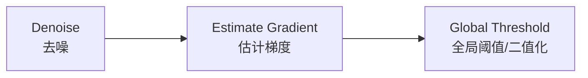
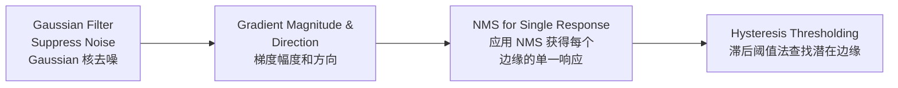

# Lecture 4: Edge Detection

## Characteristic of Edge

当出现边缘时候，Image Intensity Function（i.e. 信号值）会快速更改。

```
___     ___
   _____
   ^^^^^
   Edge
```

其在 Intensity 上的一阶导便会有起伏。

问题是我们怎么找到一阶导。

### Filter for 1st Derivative

#### Roberts Operator

$$
h_1=\begin{bmatrix}
1 & 0\\
0 & -1
\end{bmatrix}
\quad
h_2=\begin{bmatrix}
 0 & 1\\
-1 & 0
\end{bmatrix}
$$

#### Prewitt Operator

$$
h_1=\begin{bmatrix}
1 & 1 & 1\\
0 & 0 & 0\\
-1 & -1 & -1
\end{bmatrix}
\quad
h_2=\begin{bmatrix}
 0 & 1 & 1\\
-1 & 0 & 1\\
-1 & -1 & 0
\end{bmatrix}
\quad
h_3=\begin{bmatrix}
 -1 & 0 & 1\\
-1 & 0 & 1\\
-1 & 0 & 1
\end{bmatrix}
$$

#### Sobel Operator

$$
h_1=\begin{bmatrix}
1 & 2 & 1\\
0 & 0 & 0\\
-1 & -2 & -1
\end{bmatrix}
\quad
h_2=\begin{bmatrix}
 0 & 1 & 2\\
-1 & 0 & 1\\
-2 & -1 & 0
\end{bmatrix}
\quad
h_3=\begin{bmatrix}
 -1 & 0 & 1\\
-2 & 0 & 2\\
-1 & 0 & 1
\end{bmatrix}
$$

#### Robinson Operator

$$
h_1=\begin{bmatrix}
1 & 1 & 1\\
1 & -2 & 1\\
-1 & -1 & -1
\end{bmatrix}
\quad
h_2=\begin{bmatrix}
 1 & 1 & 1\\
-1 & -2 & 1\\
-1 & -1 & 1
\end{bmatrix}
\quad
h_3=\begin{bmatrix}
 -1 & 1 & 1\\
-1 & -2 & 1\\
-1 & 1 & 1
\end{bmatrix}
$$

#### Kirsch Operator

$$
h_1=\begin{bmatrix}
3 & 3 & 3\\
3 & 0 & 3\\
-5 & -5 & -5
\end{bmatrix}
\quad
h_2=\begin{bmatrix}
3 & 3 & 3\\
-5 & 0 & 3\\
-5 & -5 & 3
\end{bmatrix}
\quad
h_3=\begin{bmatrix}
-5 & 3 & 3\\
-5 & 0 & 3\\
-5 & 3 & 3
\end{bmatrix}
$$

### Magtitude

如果我们应用 filter $h$ 可得 $g = h*f$。

如考虑 $x$ 和 $y$ 轴分别拥有过滤器 $h_x, h_y$则可以获得 Gradient Magnitude（梯度幅度）：
$$
g(x) =\sqrt{g_x^2+g_y^2}
\\\text{where }
g_x = h_x* f , g_y=h_y * f
$$
Magnitude 越高越可能为边缘。

 ### Direction

考虑 $h_x$ 为 $x$ 轴的梯度，$h_y$ 为 $y$ 轴的梯度，我们可以获得梯度方向：
$$
\tan^{-1}\frac{g_y}{g_x}
$$

> $$
> \tan \theta = 对边/ 邻边
> $$

Edge Gradient 垂直于（perpendicular to）Edge Direction。

## Canny Filter

### Criteria

Canny 定义了如下 criteria：

- **Good Detection**
  应当具有较低的概率会遗漏真实边缘点
  同时也应具有较低的概率错误地将非边缘点标记为边缘。
- **Good Localization**
  算子标记的边缘点应当尽可能接近真实边缘的中心。
- **Single Response**
  对单个边缘只产生一个响应。

### Process

在最早我们使用如下流程去做边缘检测，其中 EstGrad 是应用之前的核



Canny 提供了一个新的边缘检测算法：



