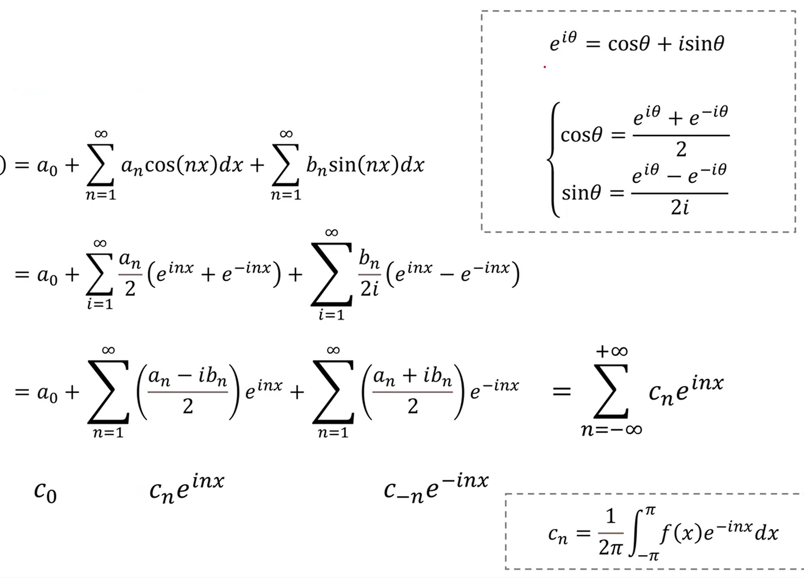
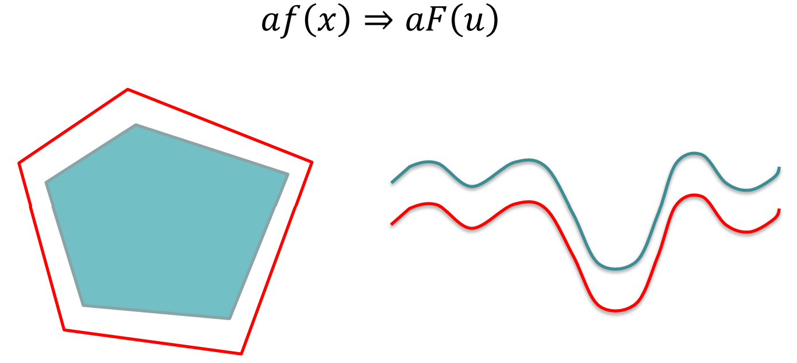

# Lecture 5: Fourier Methods / 傅里叶方法

[TOC]

> 参阅 https://www.bilibili.com/video/BV1ut8FeSEET

我们是否能够使用物体特征进行分类对象在 Frequency Domain 而不是 Spatial Domain？

## Fourier Series

### Definition

对于一个函数 $f(t)$ 其关于一个连续变量 $t$，且有一个周期 $T$，其可以被分解（expressed as）为一些Sines & Cosines 的加权叠加（Multiplied by Appropriate Coefficient）。其和为
$$
f(t) = \sum_{n=-\infty}^\infty c_n e^{j \frac{2\pi n}{T}t}\\
\text{where } c_t =\frac{1}{T}\int_{-T/2}^{T/2} f(t) e^{j \frac{2\pi n}{T}t} dt
\quad n=0, \pm 1, \pm2, \cdots
$$

### From Vector Space

从一个 3 维欧氏空间来思考，考虑向量 $\mathbf{v} = [3, 4, 5]$，可以理解其为
$$
\mathbf{v} = \underbrace{
\begin{bmatrix}3\\4\\5
\end{bmatrix}^T
}_{\text{Coefficient}}

\underbrace{
\begin{bmatrix}
1 & 0 & 0\\
0 & 1 & 0\\
0 & 0 & 1
\end{bmatrix}
}_{\text{Basis}}
=
3\begin{bmatrix}
1\\
0\\
0
\end{bmatrix}
+4\begin{bmatrix}
0\\
1\\
0
\end{bmatrix}
+5\begin{bmatrix}
0\\
0\\
1
\end{bmatrix}
$$
对于标准正交基（Orthogonal + Normal），在其 span 成的空间中的任意向量，都可以表示为标准正交基的线性组合。

我们可以将思维拓展至信号处理。

假设函数
$$
f(t) = a \times \cos\left( 2\pi(2t) + \frac{\pi}{3} \right) +
b \times \sin\left( 2\pi(4t) \right) +
c \times \sin\left( 2\pi(5t) \right)
$$
我们期望将其拆分成如下3个信号。我们可以将这几个信号理解为一组基。

因此对于基投影（projection）的运算，可以被推广为信号的运算：
$$
\mathbf{v}=\mathbf{w}\cdot \mathbf{b}
\longrightarrow
a = \int_{-T/2}^{T/2} f(x)\underbrace{\overline{g(x)}}_{Conjugate 共轭} dx
$$
得出来的信号如图右上角。其说明 $f(t) = g_1(t) + 2 g_2(t) + 0.5 g_3(t)$

继续复用更早的公式，我们也可以发现这些信号为标准正交的。内积的结果为 1。

> 一个周期信号可以被拆解为几个正弦基信号（Sinusoidal Basis）。
> Coordinate/Coefficient 可以通过对基的 Inner Product (+Integral) 的得到。

### General Case

#### Are b, cos, sin Orthognal Basis?

也可以用积化和差进行证明

通过上述函数，可以证明 b, cos, sin 为一个有效的正交基

#### Back to Fourier Series

对于一个复数的级数，可以表述为

### Space Comparison

### Frequency & Time

## Forier Descriptor 傅里叶描述子

- Boundary Start Point 可以被唯一定义。在如上是过中心的 Horizontal Line 与 Boundary 的交点定义。
  因此可以绘制 Boundary Point 到 Centre 的 Radial Distance（径向距离）来描述边界。
- 沿边界幅度变化为一个 Periodic Function。
  如果边缘总长为 $L$，则可以将长度乘以 $2\pi /L$ 将 Period Normalise 到 $2\pi$。
- 如果我们能找到这个**周期函数的 Frequency Components（频率分量）**，那么这些分量就可以用于识别算法中对物体进行分类。

> **傅里叶变换**
>
> 任意一个 Univariate Function 可以被 rewrite 成不同频率的 sines 和 cosines 的加权和。
> $$
> \sum^\infty_{n=1}(a_n\cos(nt)+b_n\sin(nt))
> $$
> 
>
> **Spectrum（频谱）**表示各个 Frequency Component（频率分量）的 **Amplitude (Abbr. Amp, 幅度)**

### Mathematical Description

对于周期函数 $f(x + N) = f(x)$ （周期为 $N$），可以被表示为：
$$
f(x) = a_0 +a_1\cos\theta + b_1\sin\theta + a_2\cos2\theta +b_2\sin2\theta +\cdots\\
\text{where }\theta=\frac{2\pi x}{N}
$$
这里可以看作 Length 为 $N$，则 Normalise Factor 为 $2\pi / N$。$2\pi / N$​ 也被称呼为 Foundamental Frequency。

如果我们把式 $\theta$ 前的数字记作 $h$​ 则有：
$$
\begin{align}
f(x) 
&= \sum^\infty_{h=0}\left[
a_h \cos\left(h \theta\right) +
b_h \cos\left(h \theta\right)
\right]
\\
\\
&= \sum^\infty_{h=0}\left[
a_h \cos\left(h \frac{2\pi x}{N}\right) +
b_h \cos\left(h \frac{2\pi x}{N}\right)
\right]
\\
&=  \sum^\infty_{h=0}\left[
a_h \cos\left(2\pi h \frac{x}{N}\right) +
b_h \cos\left(2\pi h \frac{x}{N}\right)
\right]

\end{align}
$$
即
$$
f(x) = \sum^\infty_{h=0}\left[
a_h \cos\left(2\pi h \frac{x}{N}\right) +
b_h \cos\left(2\pi h \frac{x}{N}\right)
\right]
$$
傅里叶变换（Fourier Transformer）式为了寻找一个方法快速寻找 $a_0, a_1, b_1, a_2, b_2, \cdots$。

### Cosine/Sine Transform

> DCT, DST 都是 DFT 的特殊形式。DFT 使用复指数函数作为基函数，DCT只是用 cos，DST则只是用 sin。

考虑信号：
$$
f(x) = \sum^\infty_{h=0}\left[
a_h \cos\left(2\pi h \frac{x}{N}\right) +
b_h \sin\left(2\pi h \frac{x}{N}\right)
\right]
$$
我们可以将离散余弦变换（DCT）表示为：
$$
F_c(u) = \frac{1}{N}\sum_{x=0}^{N-1}f(x)\cos(2\pi u \frac{x}{N})
$$
有
$$
F_c(u) = \frac{1}{2}a_u
$$

相似的，我们也可以定义 Sine Transform
$$
F_s(u) = \frac{1}{N}\sum_{x=0}^{N-1}f(x)\sin(2\pi u \frac{x}{N})
\\
F_s(u)=\frac{1}{2}b_n
$$

### Orthognal Function

如果 $p\neq q$
$$
\int_0^{2\pi} \sin(p\theta)\sin(q\theta)d\theta = 0
$$

>$$
>\begin{align}
>\int_0^{2\pi} \sin(p\theta)\sin(q\theta)d\theta
>  &= \frac{1}{2}\int_0^{2\pi} \sin((p-q)\theta)-\cos((p+q)\theta)d\theta
>\\&= \frac{1}{2}\left(\frac{1}{p-q}\sin(p-q)\theta\big|_0^{2\pi} - \frac{1}{p+q}\sin(p+q)\theta\big|_0^{2\pi}\right)
>\\&= 0
>, \text{ if } p \neq q
>\end{align}
>$$
>
>> 运算规则：
>> $$
>> \sin(m)\big|_j^{i} = \sin(i) - \sin(j)
>> $$
>
>有：
>$$
>\frac{1}{p-q}\sin(p-q)\theta\big|_0^{2\pi} = \frac{1}{p-q}[\sin(2\pi(p-q)) - \sin(0)] = 0\\
>\frac{1}{p+q}\sin(p+q)\theta\big|_0^{2\pi} = \frac{1}{p+q}[\sin(2\pi(p+q)) - \sin(0)] = 0
>$$

If $p\neq q$
$$
\int_0^{2\pi} \sin(p\theta)\sin(q\theta)d\theta = 0\\
\int_0^{2\pi} \cos(p\theta)\cos(q\theta)d\theta = 0
$$
对于所有情况：
$$
\int_0^{2\pi} \cos(p\theta)\sin(q\theta)d\theta = 0
$$

> 相似的，对于 $p=q$
> $$
> \int_0^{2\pi} \sin(p\theta)\sin(p\theta)d\theta = \int_0^{2\pi} \sin^2(p\theta)d\theta\\
> $$
>
> 考虑
> $$
> \sin^2(x) = \frac{1 - \cos(2x)}{2}
> $$
> 有
> $$
>\begin{align}
>\int_0^{2\pi} \sin^2(p\theta)d\theta
>  &= \int_0^{2\pi} \frac{1 - \cos(2p\theta)}{2}d\theta
>\\&= \int_0^{2\pi} \frac{1}{2}d\theta - \int_0^{2\pi} \frac{\cos(2p\theta)}{2}d\theta
>\\&= \left[\frac{\theta}{2}\right]_0^{2\pi} - \left[\frac{\sin(2p\theta)}{4p}\right]_0^{2\pi}
>\\&=\pi
>\end{align}
>$$

对于离散形式
$$
\int_0^{2\pi} \sin(p\theta)\sin(q\theta)d\theta = 0, \text{if } p \neq q
\\\Updownarrow\\
\sum_{x=0}^{N-1} \sin(2\pi p \frac{x}{N}) \sin(2\pi q \frac{x}{N}) = 0, \text{ if } p \neq q
$$
类似的结果也适用于 sin-cos, cos-sin

当 $p=q$，和会变成 $N/2$
$$
\int_0^N \sin^2\left(2\pi p \frac{x}{N}\right)dx = \int_0^N \cos^2\left(2\pi p \frac{x}{N}\right)dx = \frac{N}{2}, \text{if } p=q
$$

### Summary

傅里叶变化还有很多形式

傅立叶变换是一种将**函数转换为另一种表示方式的工具**。

"傅立叶变换"这个术语既指频域表示，也指将时间函数与频域表示相关联的数学运算。

函数的傅立叶变换是一个复值（Complex-Valued）频率函数，其 **Magnitude（幅度）**表示原函数中该频率成分的大小，其 **Phrase（辐角）**表示该频率基本正弦波的相位偏移。

在一个域（时域或频域）中执行的线性运算在另一个域中都有对应的运算，有时这些运算会更容易执行。例如，**时域中的卷积运算**对应于**频域中的乘法运算**。这意味着可以在频域中进行运算，然后将结果转换回时域。

## DFT in Complex Form

如果我们将 FT 看作将时域映射到频域的算法，那么其逆运算 IFT 则执行相反的东西。
$$
\text{FT}: \text{Time Domain} \to \text{Frequency Domain}\\
\text{IFT}: \text{Frequency Domain} \to \text{Time Domain}
$$

IFT 被定义为：

由于正弦和余弦函数的 Symmetry，$u$ 为负值时 Spectrum is well defined

> 考虑 $\cos$ 为偶函数，$\sin$ 为奇函数。在傅里叶变换中,当我们把一个实函数 f(t) 变换到频域 F(u) 时:
>
> - $F(u)$ 可以表示为实部(余弦项)和虚部(正弦项)的组合
> - $F(u) = R(u) + jI(u)$
>
> 由于上述三角函数的对称性，对于实信号:
>
> - 实部 $R(u)$ 是偶函数: $R(-u) = R(u)$
> - 虚部 $I(u)$ 是奇函数: $I(-u) = -I(u)$
>
> 这就导致了频谱的对称性:
>
> - $|F(-u)| = |F(u)|$ ：Amplitude Spectrum 是偶函数
> - $\angle F(-u) = -\angle F(u)$：Phase Spectrum 是奇函数

## Basic Properties

> 对于卷积核 $f * h$，其在频域可以被转化为乘法：
> 
> $$
> \begin{align}
> g &= f * h
> \\
> G(u) 
>   &= \int_{-\infty}^{\infty} g(x)e^{-i2\pi ux}dx
> \\&= \int_{-\infty}^{\infty}\int_{-\infty}^{\infty} f(\tau)h(x-\tau)e^{-i2\pi ux}d\tau dx
> 
> \\&= \int_{-\infty}^{\infty}\int_{-\infty}^{\infty} \left[f(\tau)e^{-i2\pi u\tau}d\tau\right]\left[h(x-\tau)e^{-i2\pi u(x-\tau)}dx\right]
> 
> \\&= \int_{-\infty}^{\infty}\left[f(\tau)e^{-i2\pi u\tau}d\tau\right]\int_{-\infty}^{\infty}\left[h(x')e^{-i2\pi ux'}dx'\right]
> 
> \\&= F(u)H(u)
> 
> \end{align}
> $$

### Transformer

#### Rotation

旋转物体会导致发生 Phase Change（相变），并且所有组件都会发生相同的相变

#### Scaling

缩放对象会以相同的 Factor 改变所有 Component 的 Magnitude
如果 Spectrum  的 Magnitude 被 Normalised，使得其最大值等于1，则该归一化频谱与对象大小无关。

### Noise

- 同时考虑 noise（噪声）和 quantisation errors（量化误差）对边界的影响。这会导致高频的局部变化，但不会改变低频部分。

- 如果忽略频谱中的 High Frequency Components，其余频谱部分将不受噪声的影响。
- 因此，对于 Object Recognition来说，Fourier Descriptor 比 Template Matching方法具有许多优势，且计算速度更快。

## 2D Fourier Transforms

$$
\text{DFT}: F(u,v) = \frac{1}{MN} \sum_{x=0}^{M-1} \sum_{y=0}^{N-1} f(x,y)\exp(-2\pi ju\frac{x}{M})\exp(-2\pi jv\frac{y}{N})
\\
\text{IFT}: f(x,y) = \frac{1}{MN} \sum_{x=0}^{M-1} \sum_{y=0}^{N-1} F(u,v)\exp(2\pi ju\frac{x}{M})\exp(2\pi jv\frac{y}{N})
$$

| Spatial Domain                                               | Frequency Domain                                             |
| ------------------------------------------------------------ | ------------------------------------------------------------ |
| 原点在左上角 $(0,0)$ x轴向右延伸到M y轴向下延伸到N 表示的是空间域中的图像f(x,y) | 原点 $(0,0)$ 被移到了中心位置 水平方向范围是 $[-M/2, M/2]$ 垂直方向范围是 $[-N/2, N/2]$ 表示的是频率域中的幅度谱 |

将低频分量移到频谱中心 $(0,0)$ 位置，高频分量分布在周边，使频谱显示更符合人们的直觉理解（低频在中心，高频在外围）

> **快速傅里叶变换 FFT**
>
> 同样，在 $N$ 和 $M$ 都是 2 的幂的情况下，有一种快速算法（Fast Fourier Transform - FFT）可用于计算这种变换。实际上，二维变换可以分解为一系列一维变换。换句话说，我们首先对图像的每一条水平线单独进行变换，得到一个中间形态，其中水平轴表示频率 $u$，垂直轴表示空间 $y$。然后我们再对这个中间图像的每一条垂直线进行单独变换，从而得到变换后图像的每一条垂直线。因此，对于一个 $n \times n$ 的图像进行二维变换，实际上包含了 $2n$ 次一维变换。

### Phrase vs Magnitude in Visual

自然图像的频率幅度特征非常相似：

- 低频分量强
- 高频分量逐渐衰减

图像中的大部分信息是由 Phrase 承载的，而不是 Magnitude，原因尚不清楚。

**Low Pass Filtering:** 让低频率通过 并消除高频率。
它生成具有整体阴影效果的图像， 但细节不多。

**High Pass Filtering:** 让高频通过（细节）并 消除低频（整体形状）。
这起到边缘增强的作用。
