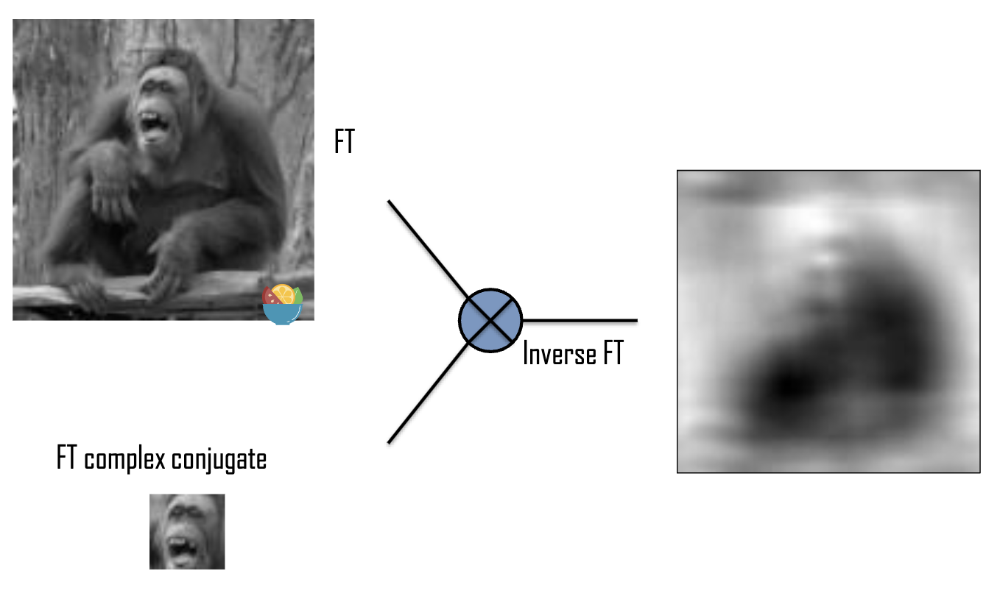
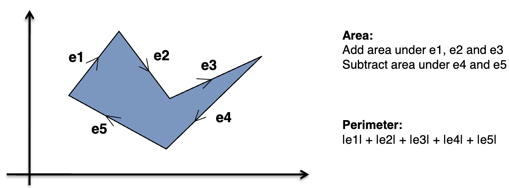
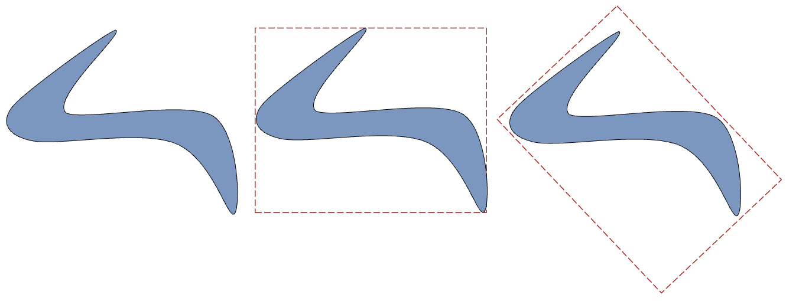
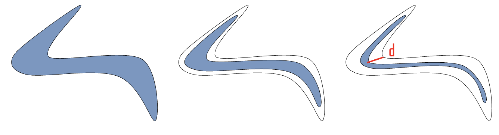
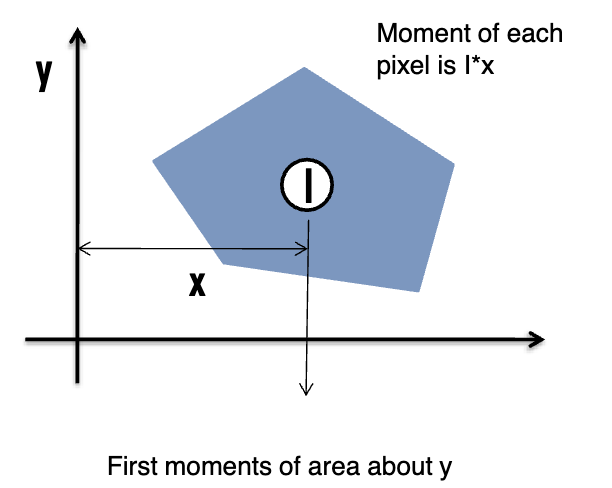
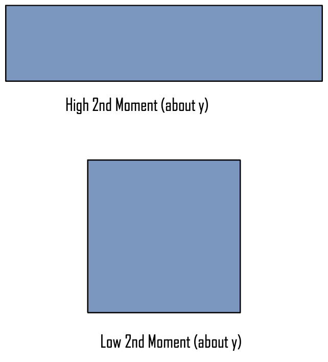
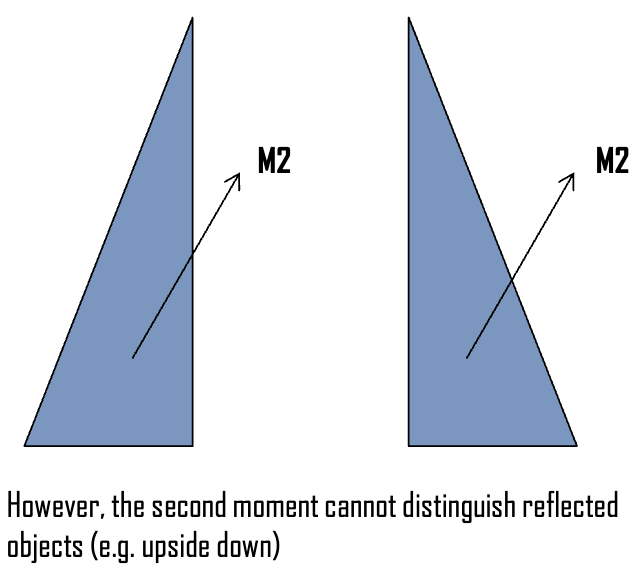
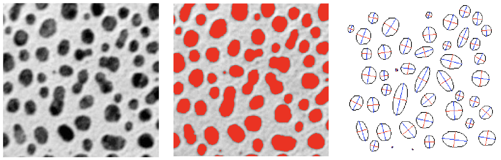
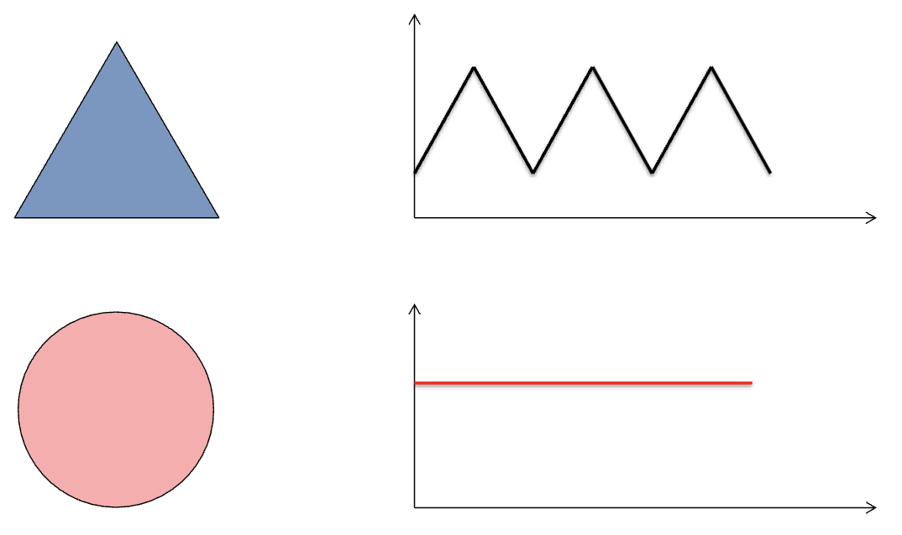

# Lecture 6: Shape Representation & Matching

[TOC]

## Template Matching

> 参阅 https://www.bilibili.com/video/BV1Jg4y1X7n1/

### Cross-Correlation 交叉相关

CC 被定义为
$$
C(x, y) = \int^\infty_{-\infty}\int^\infty_{-\infty} f(p, q)h(p +x, q+y) dpdq
$$
在离散状态，则为：
$$
C(x, y) = \sum^{x_{res}}_{p=1}\sum^{y_{res}}_{q=1} f(p, q)h(p +x, q+y) 
$$
其中 $f(x, y)$ 是图像，而 $h(u, v$) 则为 Template Function。

$$
\begin{align}
\text{Conv} : g[n]=f[n]*h[n]
&= \sum^\infty_{m=-\infty} f[m]h[n-m]\\
&=\sum^\infty_{m=-\infty} h[n-m]f[m]\\
&= \sum^\infty_{m=-\infty} f[n+m]h[-m]\\

\\
\text{CC} : g[n] = f[n]\star h[n]
&= \sum_{m=-\infty}^\infty f[m]h[n+m]\\
h[n]\star f[n] &= \sum_{m=-\infty}^\infty h[m]f[n+m]\\
&= \sum_{m=-\infty}^\infty f[n+m]h[m]
\end{align}
$$
做卷积时，需要 flip，而 CC 不需要。因此如果 $h$ 是 Symmetric $h[i, j] = h[-i, -j]$，则 CC 和卷积一致
$$
\begin{align}
f[m, n]*h[m, n]
&= \sum^\infty_{i=-\infty}\sum^\infty_{j=-\infty} f[i, j]h[m-i, m-j]\\
&= \sum^\infty_{i=-\infty}\sum^\infty_{j=-\infty} f[m+i, m+j]h[-i, -j]\\
&= \sum^\infty_{i=-\infty}\sum^\infty_{j=-\infty} f[m+i, m+j]h[i, j] \\
&= f[m, n]\star h[m, n]
\end{align}
$$
和卷积类似，我们也可以在频域进行操作：
$$
\text{FT of Conv of f, g}: F(u)G(u)\\
\text{FT of Crorrelation of f, g}: F(u)G(u)^*\\
G^*(u) \text{ is the complex conjugate of } G(u)
$$
如果我们能够快速计算FT，那么就可以通过简单地对频谱进行逐点相乘，然后做 IFT 来实现 Template Matching

局限性：这种技术实际上很少使用，因为这个方法在连续空间中的结果难以很好地推广到离散空间

1. 对原始大图像进行傅里叶变换
2. 对 Template 图像进行傅里叶变换并取其复共轭
3. 将两个变换结果进行点乘（相乘）
4. 对乘积结果进行 IFT

结果越白，则说明越高 Correlation。

## Shape Discriminants

使用 CC 是 Time Consuming。我们可以根据不同物体的 Shape Discriminants 加速（hasten）区分我们想要识别或分类的不同对象的过程。例如面积、周长（Perimeter）、伸长率（Elongatedness）、矩相关量（Moments）、方向、能量、熵

> 虽然 TM 可以为物体与坐标轴对齐的情况提供解决方案，但检查 Template 的所有可能位置和方向以找到最佳匹配显然非常耗时。
> 因此，一种方法是定义一组 Discriminants，用于区分我们想要识别或分类的不同对象。**Discriminants 是可以从图像中计算出的任何简单物体属性**，但它们必须具有一个重要特性，即**它们独立于物体位置**。较简单的判别器仅依赖于物体的 boundary，但更复杂的判别器可以涉及灰度级别和边界形状。

### Area & Perimeter

> 假设图像是 bi level（二值的），且图像中只有一个物体，我们当然可以通过对摄像机图像中的**所有像素求和来计算面积**。然而，这种方法效率低下，因为需要处理图像中的每个像素。早期系统在像素级别追踪边界(Trace Boundary)，但这种方法相当不准确，容易产生锯齿效应(Alias Effects)，特别是在试图确定 Perimeters时。

在使用 Hough Transformer 确定了 Pice wise Boundary (分段边界) 的情况下，可以通过按顺序处理多边形的边缘向量来测量面积。向右移动时加上边缘向量下的面积，向左移动时减去面积。在这种情况下，可以从顶点坐标准确计算周长。

### Elongatedness 伸长率

Elongatedness 是Region Bounding Rectangle（区域边界矩形）的Ratio between length & width.

Bounding Rectangle 以 Discrete Steps 旋转，并找到 Minimum。所考虑的矩形是面积最小的那个。

这个标准不适用于 Curved Region，对于曲线区域，Elongatedness 的评估必须基于区域的最大 Thickness。

- 对于有曲线的区域（比如弧形或不规则形状），用最小面积的边界矩形来计算细长度的方法是不准确的，因为曲线形状可能会导致边界矩形无法很好地贴合实际形状

- 对于曲线区域，应该改用"最大厚度"这个概念

  "最大厚度"指的是区域中最宽的部分的测量值，这种方法能更准确地反映曲线形状的真实细长程度

#### Maxium Region Thickness

Elongatedness 可以通过区域面积与其厚度平方的比值来评估：
$$
\text{Elongatedness} = \frac{\text{Area}}{2d^2}
$$

区域的最大厚度可以通过 **Mathematical Erosion Steps（数学腐蚀）**步骤的次数来确定，即在区域完全消失之前可以应用的腐蚀操作次数。

Elongatedness 不受线性变换的影响 - 包括 Translation (平移), Rotation & Scaling

### Moments

#### First Moments

- 为了更好的识别，经常使用 Moments of Area
- Moments 的定义等同于 Mechanical Moments，将像素的灰度值视为等效的权重，到支点的距离看作力臂

> **Connection beween Physics**
>
> 想象一个跷跷板，物体的重量 $w$ 和位置 $l$ 会影响平衡：
> $$
> \underbrace{w_\leftarrow l_\leftarrow}_{\text{左力矩}} =
> \underbrace{w_\to l_\to}_{\text{右力矩}}
> $$
> 对于一阶力矩，我们可以定义：
> $$
> m=wl
> $$
> 如不考虑力方向，将其延伸到二维，则为
> $$
> m = w_1l_1 + w_2l_2
> $$
> 在图像处理中，我们把像素的灰度值看作"重量"，像素的位置相当于到支点的距离。

形式上，Central Moments 被定义为对物体的积分
$$
m_{pq} = \int^\infty_{-\infty}\int^\infty_{-\infty} x^p y^p f(x, y) dxdy
$$
对于数字照片
$$
m_{pq} = \sum^{x_{res}}_{i=1}\sum^{y_{res}}_{j=1} i^p j^p f(i, j)
$$

#### Translation Invariance First Moments

如果想对 **Translation 无关（Invariance）**，则可以用中心替代最早的像素距离：
$$
\mu_{pq} = \int^\infty_{-\infty}\int^\infty_{-\infty} (x-x_c)^p (y-y_c)^p f(x, y) dxdy
$$
中心点 $(x_c, y_c)$ 通常是指整个图形/物体的重心（gravity/centroid）或质心（Centre of Mass），而不是像素的中心点。

可以使用 First Moment 进行计算：

$$
x_c=\frac{m_{10}}{\underbrace{m_{00}}_{Area}} \qquad y_c =x_c=\frac{m_{10}}{m_{00}}
$$

#### Second Moments 二阶矩

> 一阶矩（First Moment）：通常是关于某个点的距离 × 质量/重量，比如力矩就是一阶矩的例子
>
> 二阶矩（Second Moment）：是关于某个点的距离的平方 × 质量/重量
>
> 描述物体或分布的"展开"程度
>
> 衡量物体质量/数据点相对于中心点的分散程度

二阶矩给我们一个用来衡量物体分布 Spread（散布/展开）程度的度量

我们可以从两个分量来看待这个问题：$x$ 方向的二阶矩（$p=2,q=0$）和 $y$ 方向的二阶矩（$p=0,q=2$）
$$
\mu_\text{x direction}=\mu_{20} = \int^\infty_{-\infty}\int^\infty_{-\infty} (x-x_c)^2 f(x, y)dxdy
\\
\mu_\text{y direction}=\mu_{02} = \int^\infty_{-\infty}\int^\infty_{-\infty} (y-y_c)^2 f(x, y)dxdy
$$

y 较高的二阶矩会比较低的更宽。

**二阶矩给我们一个衡量物体分布（Spread out）程度的度量**。如果我们考虑由两个分量组成的向量：
$$
\mu_2=\begin{bmatrix} \mu_{20}\\\mu_{02} \end{bmatrix}
$$
其 Magnitude 是位置无关的，因此可以用作 discriminant，而它的方向可以用来测量物体的朝向。这个特性对机器人抓取器的控制很有用。需要注意的是，**2nd Moment 始终为正值，因此 2nd Moment 无法检测 Reflected 的物体**（见下图）。然而，这个特性也意味着 $\mu_{20}+\mu_{01}$ 可以替代通常的欧式距离作为 Magnitude Discriminant。但是，更高阶的矩很少能提供比二阶矩更多的区分能力。

图示说明：

1. 左侧显示了两个相同但上下翻转的三角形，标注了M2向量
2. 图示下方文字：二阶矩无法区分反射物体（例如上下颠倒的物体）

右侧数学公式： 协方差矩阵 Cov[f(x,y)] = [μ₂₀  μ₁₁] [μ₁₁  μ₀₂]

> $$
> \text{Cov}[f(x, y)] = \begin{bmatrix}
> \mu_{20} & \mu_{11} \\
> \mu_{11} & \mu_{02}
> \end{bmatrix}
> $$
>
> 协方差矩阵的特征向量对应于物体的主轴和次轴。
> The eigenvectors of the covariance matrix correspond to the major and minor axes of the object. 

### Direction

方向这个属性只对细长形状（elongated shapes）有意义：
如果区域是细长的，方向就是最小外接矩形较长边的方向

如果已知 Shape Moment，方向角 $\theta$ 可以通过以下公式计算：
$$
\theta = \frac{1}{2}\tan^{-1}\left( \frac{2\mu_{11}}{\mu_{20} - \mu_{02}} \right)
$$

### Energy & Entropy

1. 能量和熵可以应用于具有特定 Shadow 或 Texture 的目标物体。
2. 在计算 Discriminants 之前，需要对图像 intensities 进行 normalised，以应对不同的光照条件。

$$
\text{Energy} = \sum_{K} P^2_{k}\\
\text{Entropy} = -\sum_{K} P_k \log(P_k)\\
\text{where } P_k = \text{Prob}(\text{Grey=}k)
$$

这些公式用于图像分析中的纹理特征提取，其中：

- 能量反映图像灰度分布的均匀性
- 熵反映图像中灰度分布的随机性或复杂程度

这些计算方法在医学图像处理中特别有用，可以帮助识别和分析图像中的特定结构或异常。

### Signature

签名使用从形状边界点 derive 出的 1D 函数来表示形状
存在许多签名：上面显示的是质心距离

## Discriminants Based on Geometric Features

- 面积、周长、矩、能量和熵不依赖于被识别对象的任何特定特征，这使它们在对象的**分类（Sorting）**和**定向（Orienting）**方面具有广泛的适用性。
- 然而，当对象数量很大时，这些特征可能不足以区分所有可能性。在这些情况下，就需要**提取特征**，而这些特征是**特定于对象的（object specific）**。
- 对于具有多边形轮廓的对象，可用于判别的特征包括：
  - 顶点数量
  - 每个顶点到重心的距离
  - 顶点在重心处所张的角度（Angle Subtended）