# Lecture 8: SIFT

[TOC]

## Future Descriptor

要获得良好的图像特征，我们需要图像的 **Locality**（小区域对视图相关变形的敏感度较低）、**Invarience**（scale, orientation, deformation）、**Repeatability**（可重复识别相同点，这是图像序列跟踪的要求）和**Distinctiveness**（确保高灵敏度和特异性）。

大多数特征描述符可视为 Template、Histograms（直方图/计数）或组合。

| 理想的 Descriptor                                 | 大多数可用的 Descriptor        |
| ------------------------------------------------- | ------------------------------ |
| Robust and Distinctive Compact and Efficient | 捕捉纹理信息 很少使用颜色 |

## SIFT Descriptor 尺度不变特征变换

### Steps Overview

1. **Scale-space Extrema Detection**
   使用 DOG 检测 Interesting points
2. **Keypoint Localisation**
   确定每个 Candidate Location 的 Location 和 Scale，并根据稳定性选择它们。
3. **Orientation Estimation**
   使用局部图像梯度为每个定位的 Keypint 分配方向(Orientation)。保留每个特征的 theta、scale和 location。
4. **Keypoint Descriptor**
   提取 Keypoint 周围选定尺度的局部图像梯度，并形成不受局部形状变形 (distortion)和光照影响 (illumination)的 representation。

### Step 1: Scale Space Extrema Detection

#### Gaussian Pyramid

高斯核是唯一可以产生多尺度（依赖 $\sigma$）的核。

一个图片的尺度空间 $L(x, y, \sigma)$，定义原始图像 $I(x,y)$，于一个 2D 高斯函数 $G(x_i, y_i, \sigma)$
$$
G(x_i, y_i, \sigma) = \frac{1}{\pi\sigma^2}e^{-\frac{(x-x_i)^2+(y-y_i)^2}{2\sigma^2}}
$$
那么尺度标签则被定义为
$$
L(x, y, \sigma) = G(x, y, \sigma) * I(x, y)
$$
高斯金字塔本质上是信号的在不同尺度上的表达，即将同一图片多次进行高斯模糊，并向下采样，产生不同尺度下的多组信号或图片以进行后续的处理。

对于层级 $G_{i+1}$ 的金子塔，有：

1. **高斯平滑：**对 $G_i$ 进行 Gaussian Smooth

2. **降采样：**将所有偶数行、列去除
   例如，如果原图像有8行，标号为0,1,2,3,4,5,6,7，则保留1,3,5,7行，去除0,2,4,6行

   

因此得到的新图像长宽都变少 $50\%$，即大小为原来的 $1/4$。重复可得到整个金字塔。

如果进行降采样可能会导致平滑不连续。

Octave 表示每一幅图像，可以产生几阶。而 $S$ 表示每阶产生多少层（通常3-5）
$$
\sigma(s) =  2^{s/S}\sigma_0
$$
通过降采样可以得到降采样图片获得类似 $\sigma_s =2\sigma_{s-1}$ 的效果。对每一层进行降采样，可以降低运算量。

如对图片进行两次高斯核运算 $\sigma_1, \sigma_2$，则其等于直接进行一个 $\sqrt{\sigma_1^2 + \sigma_2^2}$ 高斯核的运算。

> 通常来说，越大的标准差也对应越大的图片。

#### DOG Pyramid

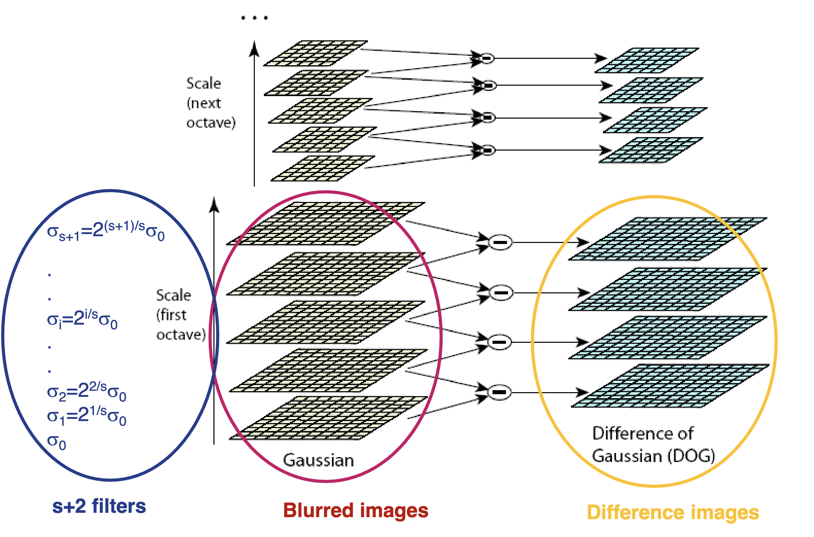

构建高斯金字塔，通常使用 LoG，而使用 DoG 进行近似。对每组 Octave 进行差分（每一level 两两相 substracte），可得 DOG 金字塔。

### 确定 Candidate Keypoint

增加 $\sigma$ 可以提高robustness，但计算成本也很高。实验表明，在每个 octave 采样 3 个 scales 时，重复性最高。
检测 scale 空间中DoG 的 Maxima & Minima。
将每个点与当前图像和上下尺度中的 26 个邻近点进行比较

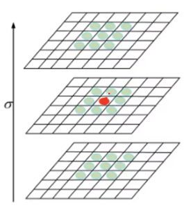

**确定关键点：**关键点是由 DOG 空间局部极值点组成，为寻找极值点，需要比较每一个像素点于其相邻点比较，看是否为极大值。

即找到 DOG 中的极值。

### Step 2: Keypoint Localisation

#### 确定 Candidate

对于每个候选关键点，使用附近数据的插值法来准确确定其位置和比例。这可以通过拟合 DoG Scale space 函数的二次泰勒扩展来实现，该扩展经过 shift，使原点位于样本点处

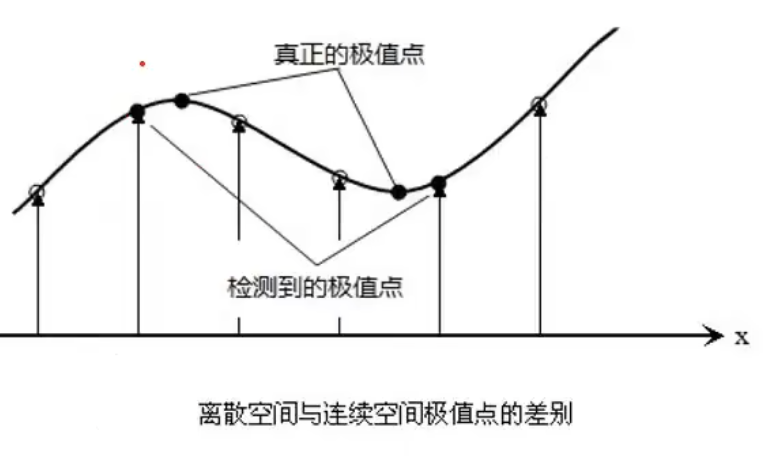

考虑图片是一个离散的空间，则需要对其进行修正。我们需要对三维进行拟合 $\mathbf{x} = [x, y, \sigma]$

如考虑图片DOG 值为函数 $f(x)$
$$
\begin{align*}
D(x)& \approx D(x_0) + D'(x_0)(x-x_0) + \frac{1}{2}D''(x_0)(x-x_0)^2
\\
\frac{d D}{dx} &= D'(x_0) + \frac{1}{2}D''(x_0)\cdot2(x-x_0)\\
&= D'(x_0) + D''(x_0)(x-x_0)
\\
x &= x_0 -\frac{D'(x_0)}{D''(x_0)}
\\
x_{n+1} &= x_n -\frac{D'(x_n)}{D''(x_n)}
\end{align*}
$$
如考虑多元，则可获得：
$$
\begin{align*}
D(\mathbf{x})& \approx D(\mathbf{x}_0) + \nabla D(\mathbf{x})^T(\mathbf{x} -\mathbf{x}_0) + \frac{1}{2}(\mathbf{x}-\mathbf{x}_0)^T\mathbf{H}_D(\mathbf{x}-\mathbf{x}_0)
\\
&=D(\mathbf{x}_0) + \nabla D(\mathbf{x})^T\hat{\mathbf{x}} + \frac{1}{2}\hat{\mathbf{x}}^T\mathbf{H}_D\hat {\mathbf{x}}
\\
\frac{\part D}{\part \mathbf{x}} &= \nabla D(\mathbf{x}) + \mathbf{H}_D\hat{\mathbf{x}} = 0\\
\hat{\mathbf{x}} &= - \nabla D(\mathbf{x})\mathbf{H}_D^{-1}
\end{align*}
$$
极值位置的偏移量 $\hat{\mathbf{x}}$ 是通过求该函数相对于 X 的导数并将其设为 0 来。（牛顿法求极大值）

如果offset $\hat{\mathbf{x}}$ 在任意dimension大于0.5，这意味着极值更接近不同的样本点，并且重复该过程（迭代）。

可以看作一个 IRLS 的过程。通过多次迭代，得到极值点位置。确定备选 Keypoint 的 Localisation。
$$
\hat{\mathbf{x}} = \mathbf{x} - \mathbf{x}_0 = \begin{bmatrix} x-x_0\\y-y_0\\\sigma-\sigma_0 \end{bmatrix}
$$

#### 去除边缘效应 i.e. 筛选结果

检测到的一些关键点位于边缘，或者 contract 不够。在这两种情况下，它们都不如特征有用，应该被消除。

- 如果极值的 DoG 值小于阈值（例如 0.03），则拒绝该关键点
  $$
  |D(\mathbf{x}')| < 0.03
  $$

位于图像边缘的关键点在边缘两侧的 principal curvature 大，而沿边缘的 principal curvature 较小。相反，一个定义明确的 kp 在两个方向上的 principal curvature 都很大。找到这些 principal curvature 相当于求解二阶 Hessian 矩阵的特征值。

如考虑对点 $(x, y)$ 的 Hessian Matrix $\mathbf{H}_{x, y}$，考虑其表示 $x$ 和 $y$ 方向上的曲率，而我们不希望 $x, y$ 曲率差异过大（即边缘情况），因此要算两个方向的曲率。
$$
\mathbf{H}_{x, y} = \begin{bmatrix}
\frac{\part^2 f}{\part x^2} & \frac{\part^2 f}{\part x \part y} \\
\frac{\part^2 f}{\part y \part x} & \frac{\part^2 f}{\part y^2}
\end{bmatrix}
$$
而考虑 Hessain 矩阵特征值正好于两个方向曲率成正比，因此则直接用其特征值 $\lambda_1, \lambda_2$ 当作曲率。

而算矩阵特征值也很麻烦，因此用 $\text{tr} (\mathbf{H}) = \frac{\part^2 f}{\part x^2} +\frac{\part^2 f}{\part y^2}=\lambda_1+\lambda_2$ 与特征值 $\det \mathbf{H} = \lambda_1\lambda_2$

令 $\lambda_1 > \lambda_2$ 且 $\lambda_1 = \gamma \lambda_2 (\gamma > 1)$

而对于如下情况，舍去该点：

1. $\det \mathbf{H}< 0$，即 $\lambda_1, \lambda_2$ 异号，遂差距较大。
2. $\frac{\text{tr}^2 (\mathbf{H})}{\det \mathbf{H}} = \frac{(\lambda_1+\lambda_2)^2}{\lambda_1\lambda_2} = \frac{(\gamma \lambda_2+\lambda_2)^2}{\gamma\lambda_2^2}=\frac{(\gamma + 1)^2}{\gamma}$ 考虑函数几何特征，其为对勾函数，且极值点位于1，而位于 $(1, +\infty)$ 函数单增
   如果期望 $\lambda_1$ 和 $\lambda_2$ 越接近，则期望 $\gamma\to 1$，也就是期望原函数取小值。
   如果人工定义 $\gamma$ 的threshold 为 $\gamma_H$, 则有 $\frac{(\gamma + 1)^2}{\gamma} < \frac{(\gamma_H + 1)^2}{\gamma_H}$ 这样的阈值。
   即如果超过这个阈值（$\gamma_H$ i.e., $\frac{\text{tr}^2 (\mathbf{H})}{\det \mathbf{H}}\geq \frac{(\gamma_H + 1)^2}{\gamma_H}$），则舍去

通过上述操作，获得特征点。

### Step 3: Orientation Estimation / SIFT Descriptor

每个关键点都有位置、比例和方向特征。为每个关键点周围的局部图像窗口计算Descriptor。

考虑在经过上述操作，我们获得的 $[x, y, \sigma]$ 是连续数值，选择与其最近的数值的图像层。并以坐标 $(x, y)$ 为圆心画圆。对此空间进行梯度加权后统计梯度直方图。

#### 基本构思

- 对于 interest point 周围的 16×16 窗口（如下图所示为 8×8）
- 计算边缘方向（每个像素的梯度角减去 90°）
- 丢弃弱边缘（梯度magnitude阈值）
- 创建存活边缘方向直方图 histogram

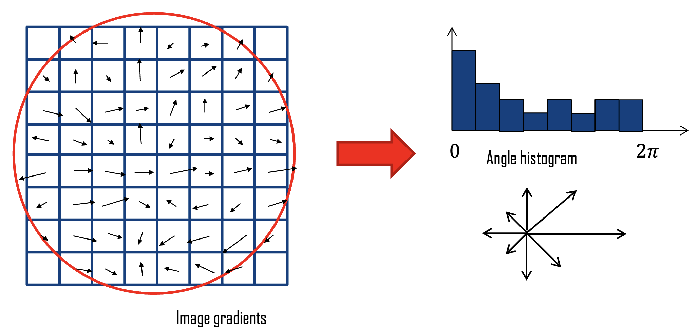

#### 完整思路

- 将 16×16 窗口划分为 4×4 的单元格网格（为简单起见，下图显示了 8×8 窗口和 2×2 网格 
- 计算每个单元格的方向直方图
- 16 个单元格 * 8 个方向 = 128 维描述符

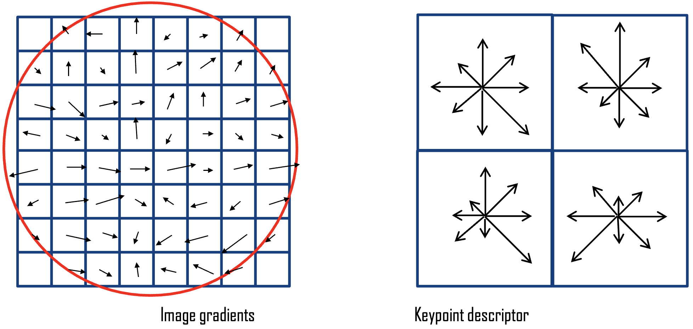

#### Invariance Property

为在下述情况工作：

- **不受强度值变化的影响 Robust to Intensity Value Changes**
  - 使用梯度方向
- **尺度不变 Scale Invariant**
  - 使用 scale space 极值检测来估计尺度 
  - 根据发现点的尺度来调整窗口大小
  - 根据该比例计算高斯平滑后的梯度
- **要与方向无关 Orientation-Invariant**
  - 使用邻域中的 **Dominant Orientation（主要方向）**旋转梯度方向。

### Dominant Orientation

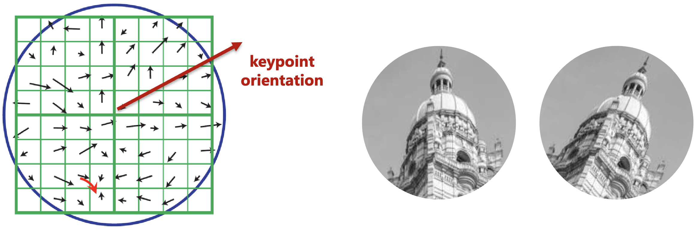

将Magnitude最高的方向定位主方向。第二高Magnitude 如达到主方向的 80%，则称其为副方向。

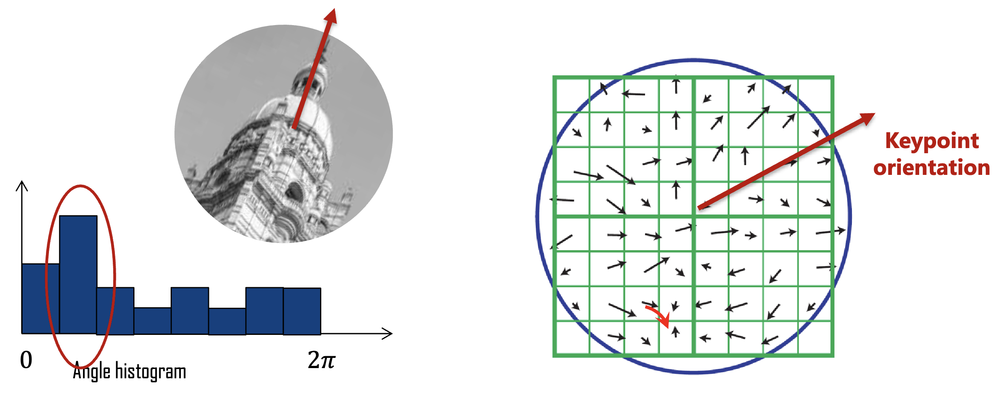

Magnitude $m(x, y)$ 和角度 $\theta(x, y)$ 可以由以下公式计算：
$$
\begin{align}
m(x, y) &=\sqrt{[L(x+1, y)-L(x-1, y)]^2+ [L(x, y+1)-L(x, y-1)]^2}\\
\theta(x, y) &= \text{atan2} \frac{L(x, y+1)-L(x, y-1)}{L(x+1, y)-L(x-1, y)}
\end{align}
$$
至此，我们有关键点的位置 $(x, y)$ 和方向。

### SIFT Descripter's Matching Property

- Robus，可应对Viewpoint 的变化
  - 最多可在平面外旋转约 60 度

- 可处理光照的 significant 变化
- 快速高效，可实时运行
- 其他变体，如 SURF、PCA SIFT、GLOH（梯度位置-方向直方图）

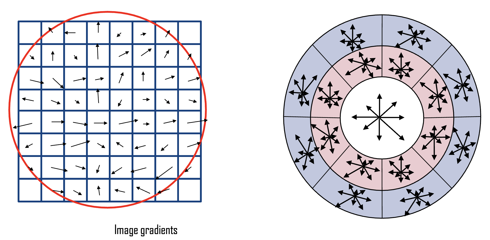

## SURF:  Speeded Up Robust Features

工作原理是对多尺度图像应用 approximate Gaussian second derivative mask，并利用 Hessian 矩阵找到兴趣点

> **为什么 SURF 比 SIFT 更快？**
>
> SURF 使用 Box Filter 近似 SIFT DOG
> 使用 Harr 小波近似后面的Orientation Estimation

> **近似高斯二阶导数掩模**
>
> 我们通常使用离散的高斯mask近似形式。最常见的近似掩模是：
> $$
> \begin{bmatrix}
> 1 & -2 & 1
> \end{bmatrix}
> $$
> $$
> \begin{bmatrix}
> 1 & 0& -2 & 0 & 1
> \end{bmatrix}
> $$

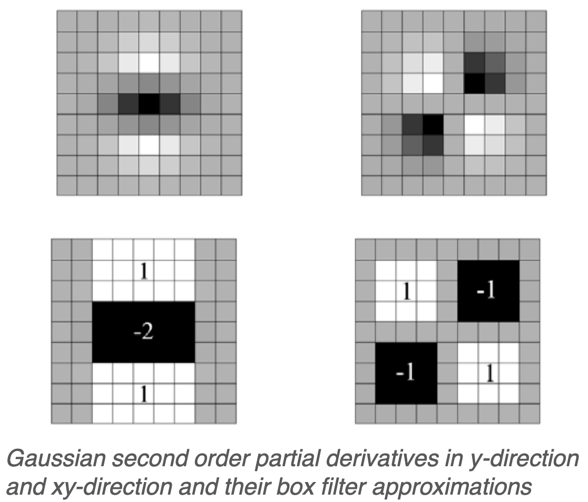

上为高斯核，下面为近似高斯核。
$$
\mathbf{H}_\text{approx} = \begin{bmatrix}
D_{xx} & D_{xy} \\
D_{yx} & D_{yy}
\end{bmatrix}\\
\det \mathbf{H}_\text{approx} = D_{xx}D_{yy} - (0.9 D_{xy})^2
$$

- 由于使用 integral images 进行图像卷积，该方法的速度非常快
- 由于使用的是 integral images，因此可以高速应用任何尺寸的滤波器
- 关键点的检测是根据 3×3×3 阵列中 Hessian 矩阵行列式的局部最大值进行的，这与 LoG 或 DoG 比例空间中的关键点检测类似

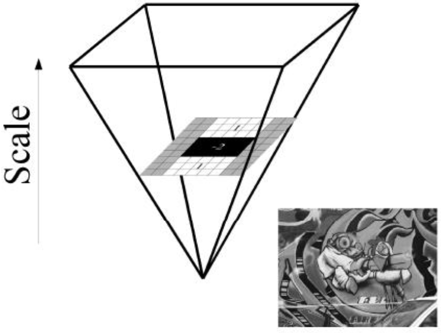

而对于scale ，我们不去做 DoG差分金字塔，而是直接放大 filter
$$
I_\Sigma(x, y) = \sum_{i=0}^{i\leq x}\sum_{j=0}^{j\leq y} I(i, j)
$$
图 $I(x, y)$ 的 Integeral Image $I_\Sigma(x, y)$ 是 $(0, 0) - (x, y)$​ 形成的矩形区域内的像素总和。

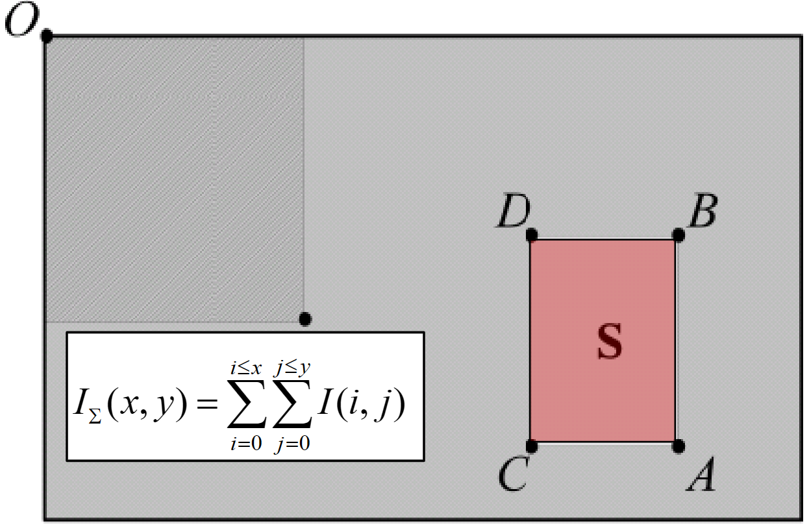

使用积分图像，只需四个数组引用就能计算出任意大小矩形区域的像素总和
$$
S = A-B-C+D
$$

### Descriptor

估算关键点的SURF描述子的步骤：

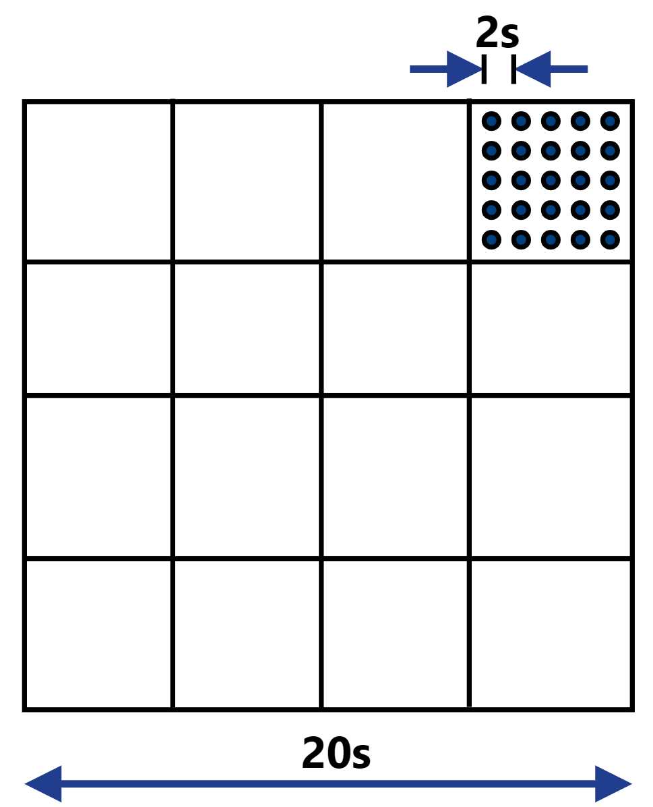

1. 将关键点周围取一个 $20\times scale$ 尺寸的图像窗口，将其拆分成 $4\times 4$ 的子区域

2. 在每个子区域计算计算 Haar wavelet 小波（Haar小波响应）

   * 水平方向响应 $d_x$​，垂直方向响应 $d_y$
   * 在每个子区域中选取5×5个规律间隔的采样点来计算响应

3. 在每个子区域：

   * 在25个采样点(5×5)处计算 $d_x$ 和 $d_y$

   * 对所有25个点求和得到4个值
     $$
     \text{SURF}= (d_x, d_y, |d_x|, |d_y|)
     $$

4. 最终得到一个64维的描述子向量（$4\times 16=64$​）

5. 比 SIFT 快 3 倍

### Shape Context Descriptor

- Shape Context Descriptor通过估计边缘点位置和方向的2D直方图来工作
- 位置信息使用对 **log-polar coordinate system** 被 quantised 为5个区间
- Orientation 被量化为12个区间
- Descriptor 的计算是通过统计每个区间内的点数来完成的
- 对数极坐标分箱的好处是：对近处的点提供更高的精度，对远处的点提供更多的灵活性

## Image Processing with Local Feature

1. **Detection**：寻找一系列 distictive key points

2. **Description**：以向量形式提取每个兴趣点周围的特征描述。
   

3. **Matching**：计算特征向量之间的距离，找到对应关系。
   $$
   d(\mathbf{x}_1, \mathbf{x}_2) < T
   $$

### Feature Descriptor Distance

可以使用以下任意距离来比较两个特征描述符 x 和 y：

Quadratic Distance
$$
D(\mathbf{x}, \mathbf{y}) = \sum^n_{i=1}| x_i - y_i|^2
$$
$x^2$ Distace
$$
D(\mathbf{x}, \mathbf{y}) = \sum^n_{i=i} \frac{(x_i - y_i)^2}{x_i+y_i}
$$
Cosine Similarity
$$
D(\mathbf{x}, \mathbf{y}) = \frac{\mathbf{x}\cdot \mathbf{y}}{||\mathbf{x}|| ||\mathbf{y}||}
$$

### Fearure Matching

#### Fixed Distance Threshold

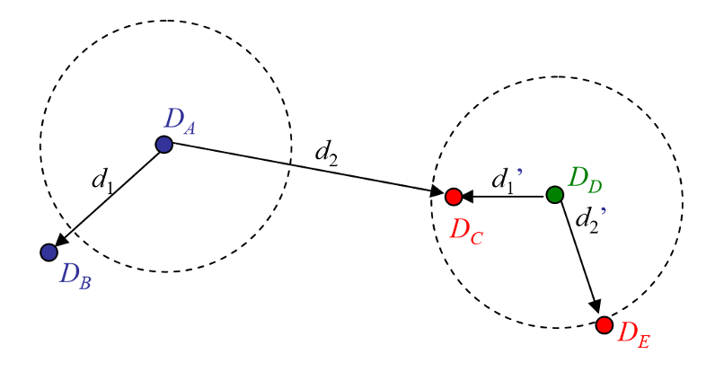

在Fixed Distance Threshold 下（虚线圆圈），描述符 $D_A$ 无法匹配 $D_B$，而 $D_D$ 则无法正确匹配 $D_C$ 和 $D_E$。

- 估计特征空间中 key point 的距离
  例如 128 维 SIFT 描述符之间的欧氏距离
- 最简单的匹配策略是设置一个 Threshold，并返回该阈值范围内其他图像的所有匹配结果。
- 阈值过高会导致返回过多错误的匹配结果（假阳性）
  阈值过低会导致错过过多正确的匹配结果（假阴性）
- 使用固定阈值的问题在于很难设置

#### Nearest Neighbour

使用 NN，描述子 $D_A$ 正确匹配了 $D_B$ ，但是 $D_D$ 错误匹配了 $D_C$。

- 更好的策略是将 keypoint 与其在特征空间中的 Nearest Neighbour 进行匹配。
- 由于某些特征可能无法匹配（例如，由于遮挡），因此仍可使用阈值来减少误报的数量
- 非特征点可能有很多近似匹配点，但其中只有一个是正确的

#### Nearest Neighbour Distance Ratio (NNDR)

使用 NNDR 进行匹配时，描述符会正确地将 $D_A$ 与 $D_B$ 匹配，并正确地拒绝 $D_D$ 的匹配。

估算 Feature Vector 与其 Nearest Neighbour  ($d_1$) 和第二个 Nearest Neighbour ($d_2$) 的距离
$$
\text{NNDR} = \frac{d_1}{d_2} = \frac{|D_A - D_B|}{|D_A - D_C|}
$$

- 如果 $d_1 \approx d_2, \text{NNDR} \approx 1$ ，Match不明确（Ambiguous），应予以 Reject
- $d_1 \ll d_2, \text{NNDR} \to 0$，Match 是正确的

