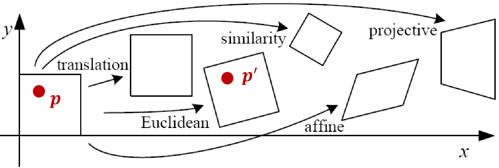
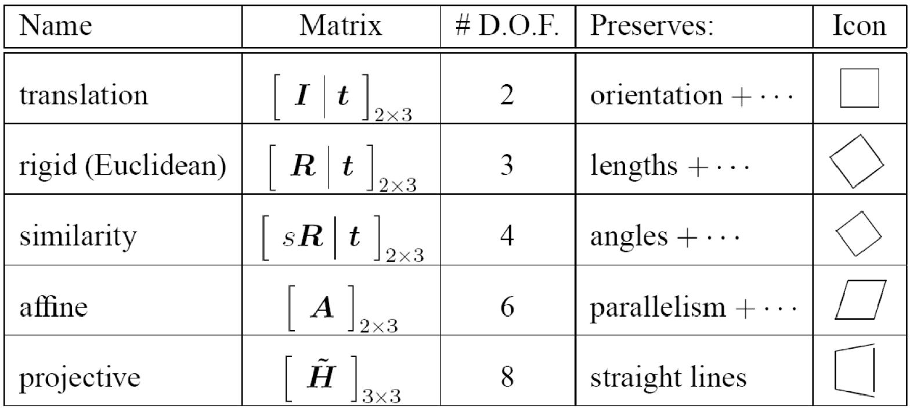
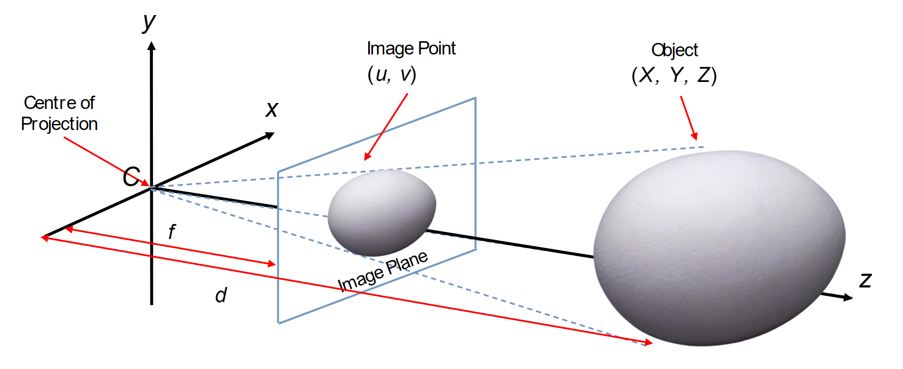
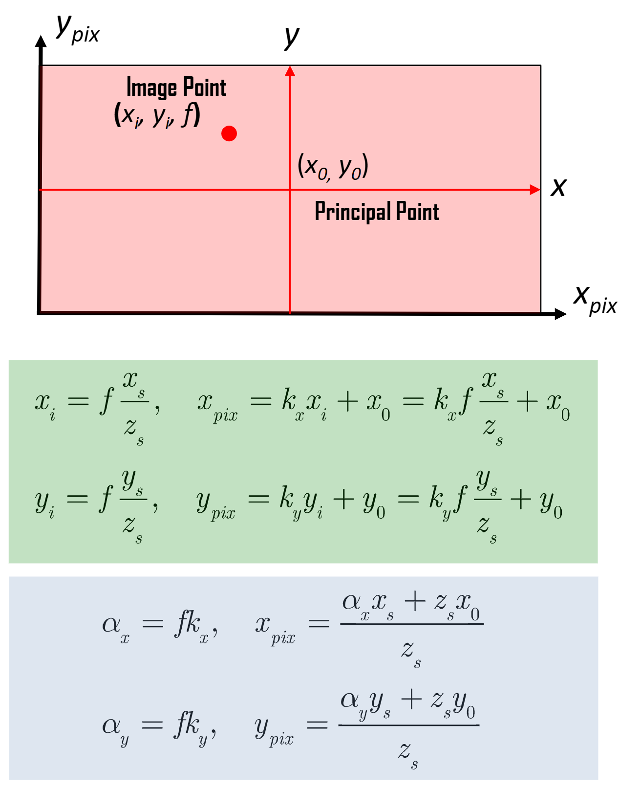
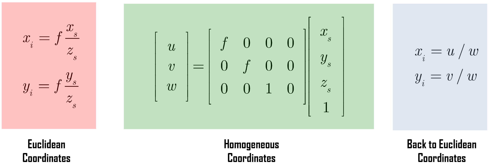

# Lecture 11: Camera Geometry

[TOC]

## Camera Models

摄像机是三维世界和二维图像之间的映射，二维图像由 projection matrix (投影矩阵)表示。

主要的 projection model有

- 透视投影 Perspective Projection
- 正投影 Orthographic Projection

### 2D Planar Transformation

点 $p$ 经过变换 $T$ 可得 $p' = T(p)$。如果变换 对图像上的任意点都是相同的，那么$T$就是一个全局变换。

| 变换                                 |           矩阵            | 自由度 | 保持     |
| ------------------------------------ | :-----------------------: | :----: | -------- |
| 平移变换（Translation）              |  $[I\mid t]_{2\times 3}$  |   2    | 方向性   |
| 欧几里德/刚体变换（Rigid/Euclidean） |  $[R\mid t]_{2\times 3}$  |   3    | 长度     |
| 相似变换（Similarity）               | $[sR\mid t]_{2\times 3}$  |   4    | 角度     |
| 仿射变换（Affine）                   |     $[A]_{2\times 3}$     |   6    | 平行性   |
| 投影变换（Projective）               | $[\tilde{H}]_{3\times 3}$ |   8    | 直线性质 |

### Pinhole Camera Model 针孔相机模型

在针孔相机模型下，空间中坐标为 $(X, Y, Z)$ 的点被映射到图像平面上的点，即连接点 $X$ 和投影中心的线与图像平面的交点。

#### Pixel Coordinates

- 像素坐标的原点通常位于传感器阵列的一个角落(例如左上角或左下角)
- CCD/CMOS像素可能不是正方形的(由于水平/垂直方向上的间距不等)
- 还可能存在倾斜因素和镜头畸变(枕形效应)，这些都会影响3D物体投影到不同的像素坐标上
- 使用普通坐标系比较笨拙，让我们改用 Homogeneous Coordinates齐次坐标系

#### Homogeneous Coordinates

齐次坐标通常用于射影几何

其优点是可以用有限坐标表示包括无穷远点在内的所有点的坐标

对于欧几里得平面中的点 $(x, y)$，其在射影平面中的表示简单地为 $(x, y, 1)$，而对于齐次坐标，我们有 $(u, v, w) = (ax, ay, aw)$，其中 $a\neq 0$，其在欧几里得平面中的等价表示为 $(u/w, v/w)$

使用齐次坐标可以大大简化射影表示

