# Lecture 11: Camera Geometry

[TOC]

## Camera Models

> 参阅 https://www.cnblogs.com/ymzcch12/p/18244362

摄像机是三维世界和二维图像之间的映射，二维图像由 projection matrix (投影矩阵)表示。

主要的 projection model有

- 透视投影 Perspective Projection
- 正投影 Orthographic Projection

### 2D Planar Transformation

点 $p$ 经过变换 $T$ 可得 $p' = T(p)$。如果变换 对图像上的任意点都是相同的，那么$T$就是一个全局变换。

| 变换                                 |           矩阵            | 自由度 | 保持     |
| ------------------------------------ | :-----------------------: | :----: | -------- |
| 平移变换（Translation）              |  $[I\mid t]_{2\times 3}$  |   2    | 方向性   |
| 欧几里德/刚体变换（Rigid/Euclidean） |  $[R\mid t]_{2\times 3}$  |   3    | 长度     |
| 相似变换（Similarity）               | $[sR\mid t]_{2\times 3}$  |   4    | 角度     |
| 仿射变换（Affine）                   |     $[A]_{2\times 3}$     |   6    | 平行性   |
| 投影变换（Projective）               | $[\tilde{H}]_{3\times 3}$ |   8    | 直线性质 |

### Pinhole Camera Model 针孔相机模型

在针孔相机模型下，空间中坐标为 $(X, Y, Z)$ 的点被映射到图像平面上的点，即连接点 $X$ 和投影中心的线与图像平面的交点。

> 这里假设深度为 $d$
>
> 如考虑像素点在 $(x_1, y_1, d_1)$ 其位于深度 $d_2$ 的像素点为 $(x_2, y_2, d_2)$
>
> 根据小孔原理，我们知晓
> $$
> \begin{align*}
> \frac{x_1}{d_1} &= \frac{x_2}{d_2}\\
> x_1 &= x_2\frac{d_1}{d_2}
> \end{align*}
> $$

#### Pixel Coordinates

$(x_{pix}, y_{pix})$ 是像素坐标系, $(x, y)$ 是图像平面坐标系

从3D空间点到2D图像平面的投影：
$$
\begin{cases}
x_i = x_s(f/z_s)\\
y_i = y_s(f/z_s)
\end{cases}
\longleftrightarrow
\begin{cases}
x_i = f(x_s/z_s)\\
y_i = f(y_s/z_s)
\end{cases}
$$
从图像坐标到像素坐标的转换：
$$
\begin{cases}
x_{pix} = k_x\cdot x_i + x_0\\
y_{pix} = k_y\cdot y_i + y_0
\end{cases}
\longleftrightarrow
\begin{cases}
x_{pix} = k_x f \frac{x_s}{z_s} + x_0\\
y_{pix} = k_y f \frac{y_s}{z_s} + y_0
\end{cases}
$$
$k_x$ 和 $k_y$ 是比例系数

> 我们可以认为 $x_{pix}$ 是相对位置

引入 $\alpha$ 参数简化表达：
$$
\begin{cases}
\alpha_x = f \cdot k_x\\
\alpha_y = f\cdot k_y
\end{cases}
\longrightarrow
\begin{cases}
x_{pix} = \alpha_x \frac{x_s}{z_s} + x_0\\
y_{pix} = \alpha_y \frac{y_s}{z_s} + y_0
\end{cases}
\longleftrightarrow
\begin{cases}
x_{pix} = \frac{\alpha_x x_s + z_s x_0}{z_s}\\
y_{pix} = \frac{\alpha_y y_s + z_s y_0}{z_s}
\end{cases}
$$

- 像素坐标的原点通常位于传感器阵列的一个角落(例如左上角或左下角)
- CCD/CMOS像素可能不是正方形的(由于水平/垂直方向上的间距不等)
- 还可能存在倾斜因素和镜头畸变(枕形效应)，这些都会影响3D物体投影到不同的像素坐标上
- 使用普通坐标系比较笨拙，让我们改用 Homogeneous Coordinates齐次坐标系

> CCD/CMOS传感器的像素可能不是正方形的
> 可能存在镜头畸变（如枕形畸变）
> 建议使用齐次坐标来简化计算

#### Homogeneous Coordinates

齐次坐标通常用于射影几何

其优点是可以用有限坐标表示包括无穷远点在内的所有点的坐标

对于欧几里得平面中的点 $(x, y)$，其在射影平面中的表示简单地为 $(x, y, 1)$，而对于齐次坐标，我们有 $(u, v, w) = (ax, ay, aw)$，其中 $a\neq 0$，其在欧几里得平面中的等价表示为 $(u/w, v/w)$

使用齐次坐标可以大大简化射影表示

$$
\underbrace{
\begin{cases}
u = f x_s \\
v = f y_s \\
w = 1 z_s
\end{cases}
\leftrightarrow
\begin{cases}
u = f x_s \\
v = f y_s \\
w = z_s
\end{cases}
}_\text{Homogeneous Coordinates}

\longleftrightarrow

\underbrace{
\begin{cases}
x_i = u / w\\
y_i = v / w
\end{cases}
\leftrightarrow
\begin{cases}
x_i = f(x_s/z_s)\\
y_i = f(y_s/z_s)
\end{cases}
}_\text{Eucilidean Coordinates}
$$
如上我们可以用齐次方程表示相对位置 $(x_i, y_i)$

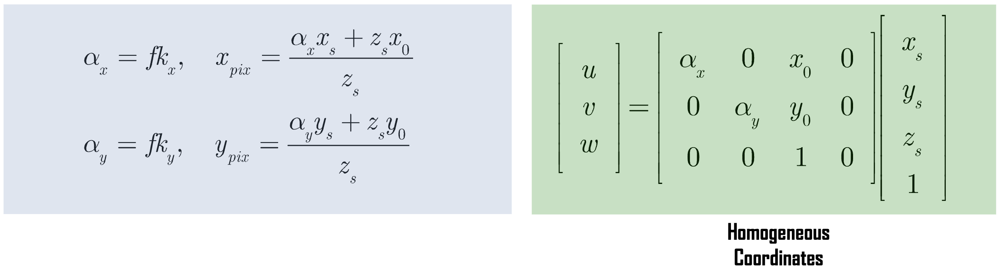

而对于 General Projection可以用上式表达：
$$
\underbrace{
\begin{cases}
u = \alpha_x x_s + x_0z_s \\
v = \alpha_y y_s + y_0z_s \\
w = z_s
\end{cases}
}_\text{Homogeneous Coordinates}

\longleftrightarrow

\underbrace{
\begin{cases}
x_{pix} = u / w\\
y_{pix} = v / w
\end{cases}
\leftrightarrow
\begin{cases}
x_{pix} = \frac{\alpha_x x_s + z_s x_0}{z_s} & \alpha_x = f \cdot k_x\\
y_{pix} = \frac{\alpha_y y_s + z_s y_0}{z_s} & \alpha_y = f \cdot k_y
\end{cases}
}_\text{Eucilidean Coordinates}
$$
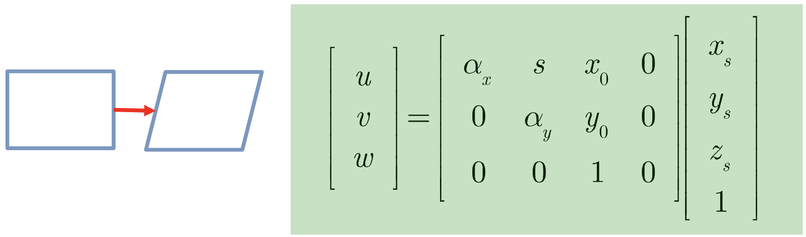

对于一个 Horizontal Skew，考虑其系数矩阵有 5 个变量 $\alpha_x, s, x_0, \alpha_y, y_0$，因此其有 5 个 DoF

我们可以将上述系数矩阵进行简写：
$$
\begin{bmatrix}
\alpha_x & s & x_0 & 0\\
0 & \alpha_y & y_0 & 0\\
0 & 0 & 1 & 0
\end{bmatrix}
=
\underbrace{
\begin{bmatrix}
\alpha_x & s & x_0\\
0 & \alpha_y & y_0\\
0 & 0 & 1
\end{bmatrix}
}_{\mathbf{K}}
\underbrace{
\begin{bmatrix}
1 & 0 & 0 & 0\\
0 & 1 & 0 & 0\\
0 & 0 & 1 & 0
\end{bmatrix}
}_{[\mathbf{I} \mid \mathbf{0} ]}
= \mathbf{K}[\mathbf{I} \mid \mathbf{0} ]
$$
$\mathbf{K}$ 是 **calibration matrix（校准矩阵**），其是 $3\times 3$ 的上三角矩阵。表示相机的内部参数。

## Camera Transformation Matrix CTM

### Inner Product

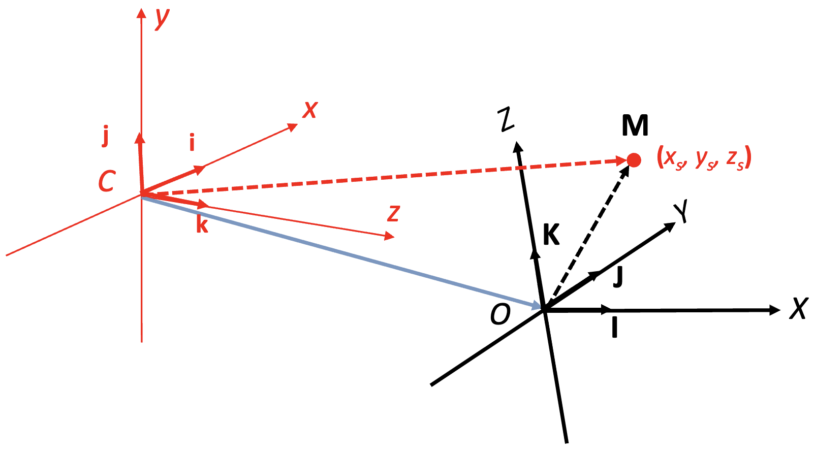

**World Coordinate System** 用单位向量 $I、J、K$ 表示(右侧黑色坐标轴)
**Camera Coordinate System** 用单位向量 $i、j、k$ 表示(左侧红色坐标轴)
$C$ 点表示相机的光心位置

需要将3D空间中任意点 $M (x_s, y_s, z_s)$ 从 World Coordinate 转换到 Camera Coordinate
这种变换考虑了**相机的位置（position）和方向（orientation）和相机的姿态（pose）**

可以用矩阵运算统一表示旋转和平移变换

- 首先需要考虑相机相对于世界坐标系的旋转
- 然后考虑相机中心 $C$ 点相对于世界坐标系原点 $O$ 的平移
- 这两种变换可以组合成一个 $4\times 4$ 的变换矩阵

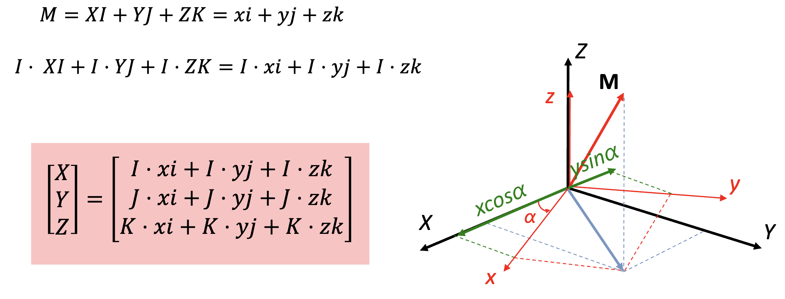

为建立两个系统的映射：
$$
M =
\underbrace{XI + YJ + ZK}_\text{World Coordinate}
= 
\underbrace{xi + yi + zk}_\text{Camera Coordinate}
$$
两种表示描述的是同一个向量，只是从不同的参考系来看

通过与基向量做内积，我们可以获得向量在该方向上的分量，例如对于方向 $I$ 上的分量：
$$
I\cdot XI + I\cdot YJ + I\cdot ZK =I\cdot xi + I\cdot yi + I\cdot zk
$$
而对于将 Camera Coordinate 转化为 World Coordinate只需要
$$
\begin{bmatrix}
X\\ Y\\Z
\end{bmatrix}
=
\begin{bmatrix}
I\cdot xi + I\cdot yj + I\cdot zk\\
J\cdot xi + J\cdot yj + J\cdot zk\\
K\cdot xi + K\cdot yj + K\cdot zk
\end{bmatrix}
$$

### Inner Product for Rotation

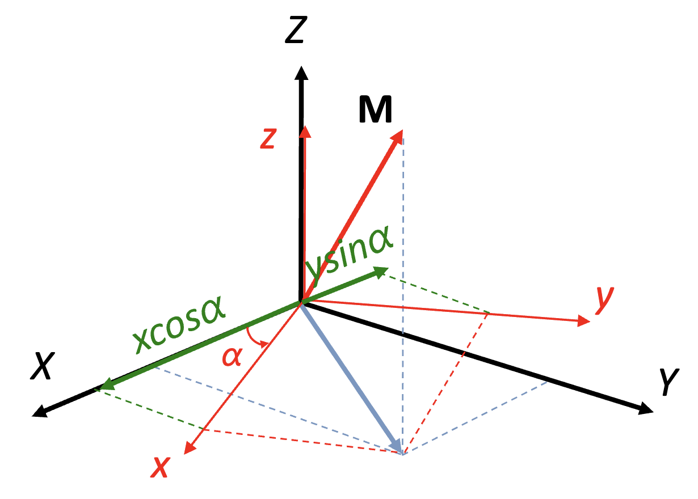

如果考虑于 XY 平面进行的 $\alpha$ 旋转，即：
$$
R = \begin{bmatrix}
\cos \alpha & -\sin \alpha & 0\\
\sin \alpha & \cos \alpha & 0\\
0 & 0 & 1
\end{bmatrix}
$$
通过旋转可以获得新的坐标为
$$
\begin{bmatrix}
\cos \alpha & -\sin \alpha & 0\\
\sin \alpha & \cos \alpha & 0\\
0 & 0 & 1
\end{bmatrix}
\begin{bmatrix}
x\\y\\z
\end{bmatrix}
=
\begin{bmatrix}
x\cos \alpha - y\sin\alpha\\
x \sin \alpha + y\cos \alpha\\
z
\end{bmatrix}
$$

### Camera Projection Matrix

$$
\overrightarrow{CM} = \underbrace{\overrightarrow{CO}}_\text{坐标变换} +\overrightarrow{OM} = \mathbf{t} + \overrightarrow{OM}
$$

$$
\begin{bmatrix}
x_s\\y_s\\z_s
\end{bmatrix}
=
\begin{bmatrix}
i\cdot XI + i \cdot YJ + i \cdot ZK\\
j\cdot XI + j \cdot YJ + j \cdot ZK\\
k\cdot XI + k \cdot YJ + k \cdot ZK\\
\end{bmatrix}
+
\begin{bmatrix}
t_x\\t_y\\t_z
\end{bmatrix}
=
\underbrace{
\begin{bmatrix}
i\cdot I & i \cdot J & i \cdot K\\
j\cdot I & j \cdot J & j \cdot K\\ 
k\cdot I & k \cdot J & k \cdot K\\ 
\end{bmatrix}
}_\text{用于对齐世界坐标与相机坐标的旋转矩阵 R}
\begin{bmatrix}
X\\Y\\Z
\end{bmatrix}
+
\begin{bmatrix}
t_x\\t_y\\t_z
\end{bmatrix}
$$

$$
\begin{align}
\begin{bmatrix}
i\cdot I & i \cdot J & i \cdot K\\
j\cdot I & j \cdot J & j \cdot K\\ 
k\cdot I & k \cdot J & k \cdot K\\ 
\end{bmatrix}
\begin{bmatrix}
X\\Y\\Z
\end{bmatrix}
+
\begin{bmatrix}
t_x\\t_y\\t_z
\end{bmatrix}

&= \mathbf{R}_{3\times 3}\begin{bmatrix}
X\\Y\\Z
\end{bmatrix} + \mathbf{t}_{3\times 1}
\\&=
\begin{bmatrix}
\mathbf{R} & \mathbf{t}\\
\end{bmatrix}_{3\times 4}
\begin{bmatrix}
X\\Y\\Z\\1
\end{bmatrix}

\\
&=
\begin{bmatrix}
\mathbf{R} & \mathbf{t}\\
\mathbf{0} & 1\\
\end{bmatrix}_{4\times 4}
\begin{bmatrix}
X\\Y\\Z\\1
\end{bmatrix}

\end{align}
$$

> 从运算的角度来看，3×4 矩阵就足够完成原始的变换操作。但是添加第四行 [0 1] 有几个重要原因：
>
> 1. 可逆性：4×4 矩阵是可逆的，而 3×4 矩阵不是
> 2. 矩阵连接：当需要连续进行多个变换时，4×4 矩阵可以直接相乘
> 3. 保持齐次性：确保输出向量的第四个分量保持为 1
> 4. 代数完备性：形成了完整的齐次变换群

如考虑calibration matrix $\mathbf{K}$，在齐次坐标系和相机坐标系：
$$
\begin{bmatrix}
u\\v\\w
\end{bmatrix}
= \mathbf{K}
[\mathbf{I} \mid \mathbf{0}]
\begin{bmatrix}
x_s\\y_s\\z_s\\1
\end{bmatrix}
$$
考虑相机坐标系和世界坐标系：
$$
\begin{bmatrix}
x_s\\y_s\\z_s\\1
\end{bmatrix}
=
\begin{bmatrix}
\mathbf{R} & \mathbf{t}\\
\mathbf{0} & \mathbf{1}\\
\end{bmatrix}
\begin{bmatrix}
X\\Y\\Z\\1
\end{bmatrix}
$$
即
$$
\begin{align}
\begin{bmatrix}
u\\v\\w
\end{bmatrix}

&= \mathbf{K}
[\mathbf{I} \mid \mathbf{0}]
\begin{bmatrix}
\mathbf{R} & \mathbf{t}\\
\mathbf{0} & \mathbf{1}\\
\end{bmatrix}
\begin{bmatrix}
X\\Y\\Z\\1
\end{bmatrix}
\\

&=
\underbrace{
\mathbf{K}
[\mathbf{R} \mid \mathbf{t}]
}_\mathbf{P}
\begin{bmatrix}
X\\Y\\Z\\1
\end{bmatrix}

\end{align}
$$
我们称呼 $P$ 为 **Camera Projection Matrix**

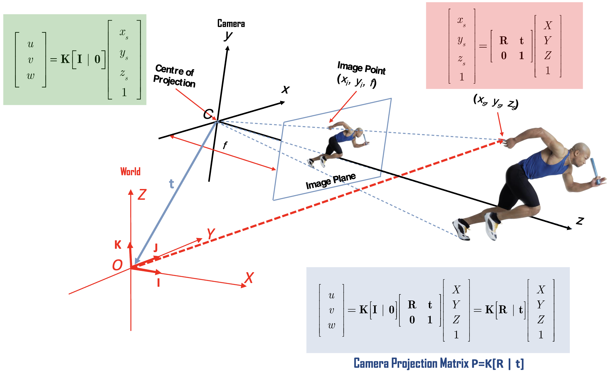

#### Property of Camera Projection Matrix $\mathbf{P}$

Camera Projection Matrix $P$ 定义了如何将3D世界中的点投影到2D图像平面（Homogeneous坐标系），而 $P$ 矩阵的组成（11 DoF）：

- Calibration $\mathbf{K}_{3\times 3}$: 5 DoF（其为 $3\times 3$ 的上三角矩阵，右下角为 1，因此有 5DoF）
- Rotation $\mathbf{R}_{3\times 3}$: 3 DoF （$\alpha_x, \alpha_y, \alpha_z$）
- $\mathbf{t}_{3\times 1}$: 3 DoF （$\Delta x, \Delta y, \Delta z$）

因此  $\mathbf{P}_{4\times 3} = [\mathbf{R}_{3\times 3}\mid \mathbf{t}_{3\times 1}]$ 并不是方阵，因此无普通的逆矩阵。我们可以用 pseudo-inverse（Moore–Penrose inverse）：
$$
\mathbf{P}^+_{4\times 3} = \underbrace{\mathbf{P}^T}_{4\times 3}\underbrace{(\overbrace{\mathbf{P}\mathbf{P}^T}^{(3\times 4)\times (4\times 3)})^{-1}}_{3\times 3}
$$
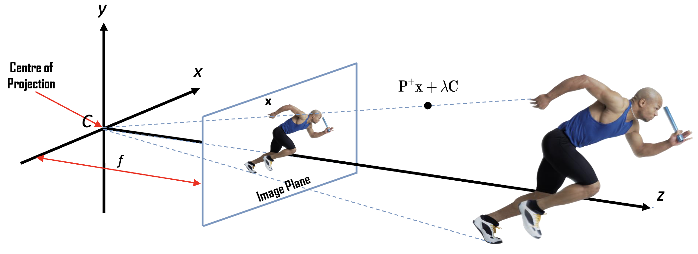

> 考虑齐次系统的特性，$X = [u, v, w, z]$ ，$\lambda X = [\lambda u, \lambda v, \lambda w, \lambda z]$ 对任意非零的 $\lambda$ 都表示同一个点

如果 $x$ 是3D点 $X$ 在图像平面上的投影，则 $x = PX$ 定义了从投影中心 $C$ 到点 $X$ 的射线

射线上任意点 $P^+ x + \lambda C$ 都会投影到图像平面上相同的位置

- $C$ 是投影中心（相机光心）（从原点到投影中心的向量）
- $\lambda$ 是任意标量参数

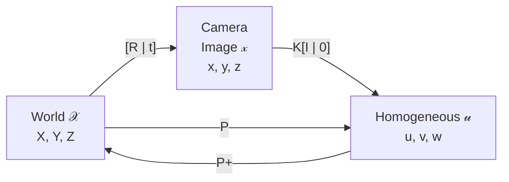

### Property of Perspective Projection

1. 对于平行线：

- 在3D空间中的平行线投影到2D平面后不一定平行（parallel）
- 除非这些线与图像平面平行，否则它们会在图像平面上相交于一个点，这个点称为 vanishing point / point at infinity

2. 对于角度：

- Perspective Projection 不保持角度
- 在现实中相等的角度，在投影后可能会显得不同

3. 对于距离的影响：

- 距离在投影过程中不会被保持
- 物体的投影大小与其到相机的距离成反比
- 在图片中可以看到，相同大小的地砖在远处看起来变小了

4. 其他重要特性：

- 3D中的直线投影到2D后仍然是直线
- 物体的表观大小随着距离增加而减小
- 这种投影方式能够很好地模拟人眼看世界的方式，所以照片看起来非常自然

这种透视效果在摄影、绘画和建筑设计中都非常重要，因为它能够真实地表现出空间的深度感。

## Orthographic Projection / 正投影

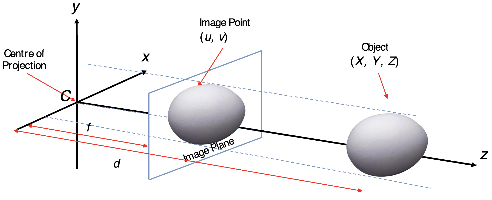

当对远离相机的物体进行成像时，深度的细微差异会变得不那么明显。在这种情况下，相机模型中的透视效果可以忽略不计。在正交相机模型中，只需将世界点平行于光轴平移，直到它落在图像平面上，即可找到世界点的图像。

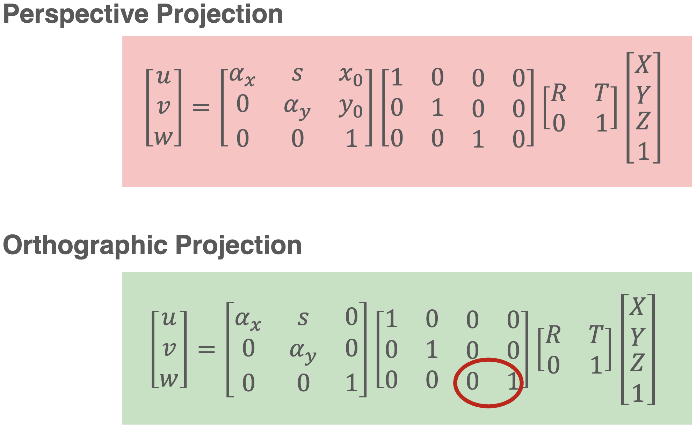

Perspective Projection
$$
\begin{bmatrix}
\alpha_x & s & x_0\\
0 & \alpha_y & y_0\\
0 & 0 & 1
\end{bmatrix}
\begin{bmatrix}
1 & 0 & 0 & 0\\
0 & 1 & 0 & 0\\
0 & 0 & 1 & 0
\end{bmatrix}
=
\begin{bmatrix}
\alpha_x & s & x_0 & 0\\
0 & \alpha_y & y_0 & 0\\
0 & 0 & 1 & 0
\end{bmatrix}
$$

$$
\begin{bmatrix}
\alpha_x & s & x_0 & 0\\
0 & \alpha_y & y_0 & 0\\
0 & 0 & 1 & 0
\end{bmatrix}
\begin{bmatrix}
&  &&  t_x\\
 & \mathbf{R} &  & t_y\\
 &  &&  t_z\\
0 & 0 & 0 & 1
\end{bmatrix}
$$
$$
\begin{bmatrix}
1 & 0 & 0 & 0\\
0 & 1 & 0 & 0\\
0 & 0 & 1 & 0
\end{bmatrix}
\begin{bmatrix}
\mathbf{R}_1& \vert  & |&  t_x\\
| & \mathbf{R}_2 &  |& t_y\\
| & | &\mathbf{R}_3&  t_z\\
0 & 0 & 0 & 1
\end{bmatrix}
=
\begin{bmatrix}
\mathbf{R}_1& |  & | & t_x\\
 | & \mathbf{R}_2 &  | & t_y\\
 | & | &\mathbf{R}_3&   t_z\\
\end{bmatrix}
$$

Orthographic Projection

$$
\begin{bmatrix}
\alpha_x & s & x_0\\
0 & \alpha_y & y_0\\
0 & 0 & 1
\end{bmatrix}
\begin{bmatrix}
1 & 0 & 0 & 0\\
0 & 1 & 0 & 0\\
0 & 0 & 0 & 1
\end{bmatrix}
=
\begin{bmatrix}
\alpha_x & s & 0 &x_0\\
0 & \alpha_y & 0 & y_0\\
0 & 0 & 0 & 1
\end{bmatrix}
$$

$$
\begin{bmatrix}
1 & 0 & 0 & 0\\
0 & 1 & 0 & 0\\
0 & 0 & 0 & 1
\end{bmatrix}
\begin{bmatrix}
\mathbf{R}_1& \vert  & |&  t_x\\
| & \mathbf{R}_2 &  |& t_y\\
| & | &\mathbf{R}_3&  t_z\\
0 & 0 & 0 & 1
\end{bmatrix}
=
\begin{bmatrix}
\mathbf{R}_1& | & 0 & t_x\\
| & \mathbf{R}_2 &  0& t_y\\
| &  | &0&   1\\
\end{bmatrix}
$$

- 平行线投射到平行线
- 图像大小不随物体与相机的距离而变化

### Weak Perspective Projection 弱透视投影

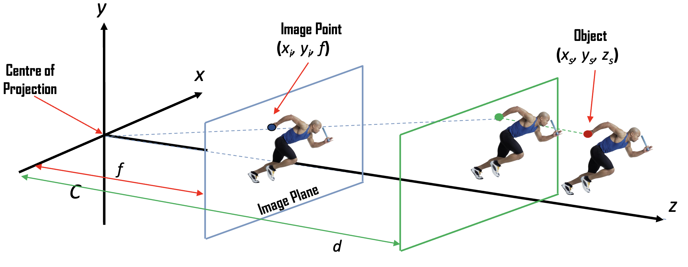

弱透视投影是一种简化的相机投影模型，它包含两个主要步骤：

1. **正交投影（Orthographic Projection）**：

- 首先将3D物体正交投影到距离相机中心距离为 $d$ 的平面上($Z = d$平面)
- 这一步会保持物体的平行性和相对大小

2. **透视投影（Perspective Projection）**：

- 然后从该平面进行透视投影到图像平面
- 焦距为 $f$，决定了最终图像的缩放比例

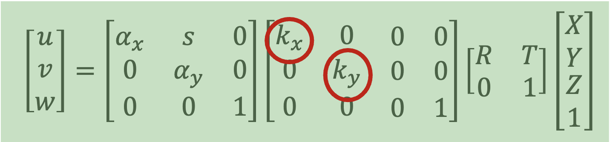

关键特点：

- 投影矩阵中标记的 $k_x$ 和 $k_y$ 是缩放因子，它们与焦距 $f$ 和物体距离 $d$ 有关
- 这种投影方式在物体较小且距离相机较远时效果最好
- 相比完整的透视投影，计算更简单，但准确度略低

适用条件：

- 物体尺寸相对于到相机的距离要小得多
- 物体深度变化不大
- 物体位于光轴附近

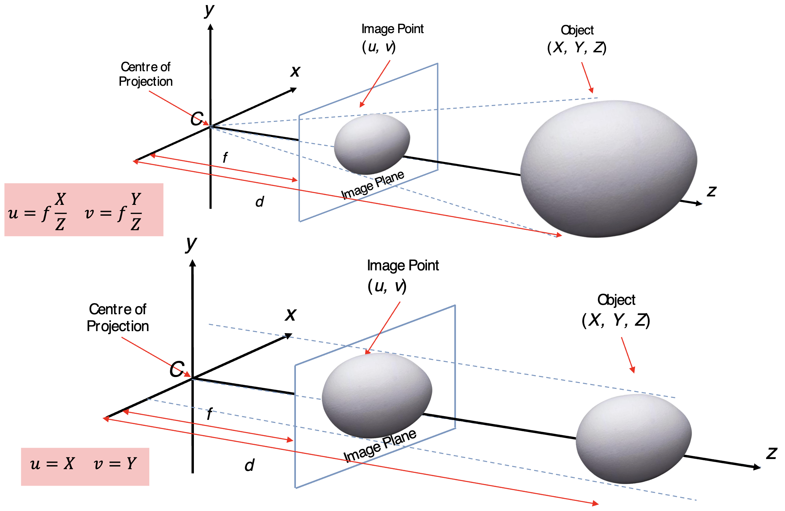

## Radial Distortion 径向畸变

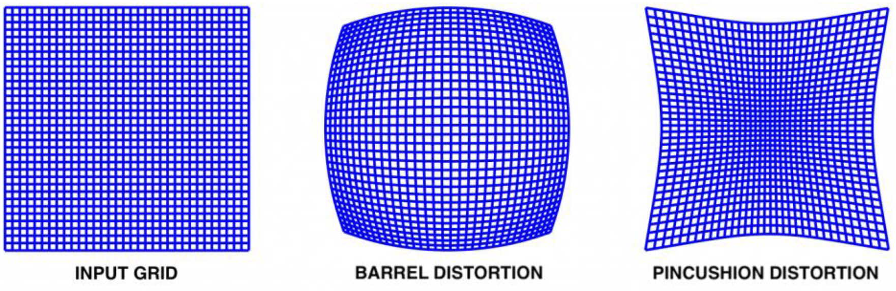

1. **输入网格（Input Grid）**：理想状态下未经畸变的图像
2. **桶形畸变（Barrel Distortion）**：
- 网格向外凸出，呈现类似桶状的形状
- 图像中心区域被放大，边缘区域被压缩
- 常见于广角镜头中

3. **枕形畸变（Pincushion Distortion）**：
- 网格向内凹陷，呈现类似枕头的形状
- 图像边缘区域被放大，中心区域被压缩
- 常见于长焦镜头中

畸变程度与光线通过镜头边缘的距离成正比，越靠近镜头边缘，畸变越明显

最简单的畸变模型使用低阶 polynomial 近似。

distorted point after radial distortion：
$$
x_d = x_n(1+k_1r^2 + k^2r^4)\\
y_d = y_n(1+k_1r^2 + k^2r^4)\\
\text{where } r = \sqrt{x_n^2 + y_n^2}
$$
$[x_n, y_n]$ 是归一化的理想图像坐标，由针孔相机模型得到：
$$
x_d = \frac{X}{Z}\qquad y_d=\frac{Y}{Z}
$$

> 透视投影会导致远处的物体看起来更小，近处的物体看起来更大
>
> 通过除以 $Z$（归一化），我们得到的是物体在标准化平面上的投影坐标
>
> 这个标准化平面通常被称为"归一化图像平面"，位于相机坐标系中 $Z=1$ 的位置

$k_1, k_2$ 是径向畸变系数

经过径向扭曲步骤后，最终像素坐标可以计算如下：
$$
u_d = fx_d + u_o
\\
v_d = fy_d + v_o
$$
$f$ 是焦距 focal length, $(u_0, v_0)$ 是主点坐标

这个模型能够处理桶形畸变(k < 0)和枕形畸变(k > 0)两种常见的径向畸变情况。它通过低阶多项式来近似描述镜头的非线性畸变效果。

k1, k2 < 0：产生桶形畸变（向外凸） k1, k2 > 0：产生枕形畸变（向内凹）

<svg xmlns="http://www.w3.org/2000/svg" viewBox="0 0 800 400">     <!-- Background -->     <rect width="800" height="400" fill="white"/>          <!-- Title -->     <text x="400" y="40" text-anchor="middle" font-size="24" font-weight="bold">畸变模拟过程</text>          <!-- Process Flow -->     <g transform="translate(100,180)">         <!-- Stage 1: Ideal coordinates -->         <rect x="0" y="-60" width="120" height="120" fill="#e6f3ff" stroke="#2060ff" stroke-width="2" rx="5"/>         <text x="60" y="-30" text-anchor="middle" font-size="16" fill="#2060ff">理想坐标</text>         <text x="60" y="0" text-anchor="middle" font-size="14">[xn, yn]</text>         <text x="60" y="20" text-anchor="middle" font-size="14">无畸变</text>                  <!-- Arrow 1 -->         <g transform="translate(140,0)">             <line x1="0" y1="0" x2="80" y2="0" stroke="#666" stroke-width="2" marker-end="url(#arrow)"/>             <text x="40" y="-15" text-anchor="middle" font-size="14">应用畸变系数</text>             <text x="40" y="25" text-anchor="middle" font-size="14">1 + k₁r² + k₂r⁴</text>         </g>                  <!-- Stage 2: Distorted normalized coordinates -->         <g transform="translate(240,0)">             <rect x="0" y="-60" width="120" height="120" fill="#fff0f0" stroke="#ff2060" stroke-width="2" rx="5"/>             <text x="60" y="-30" text-anchor="middle" font-size="16" fill="#ff2060">畸变坐标</text>             <text x="60" y="0" text-anchor="middle" font-size="14">[xd, yd]</text>             <text x="60" y="20" text-anchor="middle" font-size="14">归一化空间</text>         </g>                  <!-- Arrow 2 -->         <g transform="translate(380,0)">             <line x1="0" y1="0" x2="80" y2="0" stroke="#666" stroke-width="2" marker-end="url(#arrow)"/>             <text x="40" y="-15" text-anchor="middle" font-size="14">应用相机参数</text>             <text x="40" y="25" text-anchor="middle" font-size="14">f, (u₀, v₀)</text>         </g>                  <!-- Stage 3: Final pixel coordinates -->         <g transform="translate(480,0)">             <rect x="0" y="-60" width="120" height="120" fill="#f0fff0" stroke="#20a060" stroke-width="2" rx="5"/>             <text x="60" y="-30" text-anchor="middle" font-size="16" fill="#20a060">像素坐标</text>             <text x="60" y="0" text-anchor="middle" font-size="14">[ud, vd]</text>             <text x="60" y="20" text-anchor="middle" font-size="14">图像空间</text>         </g>     </g>          <!-- Effect visualization -->     <g transform="translate(400,320)">         <!-- Example point movement -->         <circle cx="-50" cy="0" r="4" fill="#2060ff"/>         <path d="M-50,0 Q-25,-20 0,0" stroke="#666" stroke-width="1" stroke-dasharray="4" fill="none"/>         <circle cx="0" cy="0" r="4" fill="#ff2060"/>         <path d="M0,0 Q25,-10 50,0" stroke="#666" stroke-width="1" stroke-dasharray="4" fill="none"/>         <circle cx="50" cy="0" r="4" fill="#20a060"/>                  <text x="-50" y="20" text-anchor="middle" font-size="12">理想点</text>         <text x="0" y="20" text-anchor="middle" font-size="12">畸变点</text>         <text x="50" y="20" text-anchor="middle" font-size="12">像素点</text>     </g>          <!-- Arrow marker definition -->     <defs>         <marker id="arrow" markerWidth="10" markerHeight="10" refX="9" refY="3" orient="auto" markerUnits="strokeWidth">             <path d="M0,0 L0,6 L9,3 z" fill="#666"/>         </marker>     </defs> </svg>

## Camera Calibration

相机校准是确定相机内参数(intrinsic parameters)的过程，这对于计算机视觉应用非常重要。

Instrinsic Parameters 包含 Principle Point. Focal Length, Scaling Factors for Pixels, Skew Factor & Distortion Factors
$$
\mathbf{K}=\begin{bmatrix}
\alpha_x & s & x_0 & 0\\
0 & \alpha_y & y_0 & 0\\
0 & 0 & 1 & 0
\end{bmatrix}
$$
$\alpha_x, \alpha_y$ 像素的缩放系数（focal length）
$s$：倾斜因子(skew factor)，一般接近0
$(x_0, y_0)$: 主点坐标，即光轴与图像平面的交点

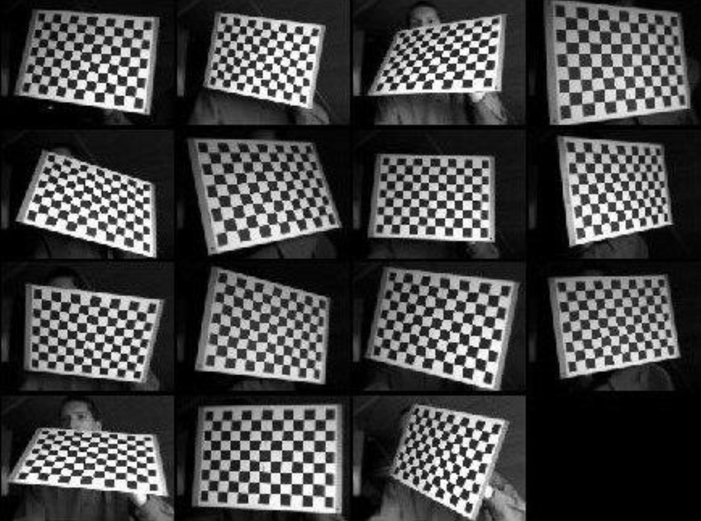

通常使用棋盘格图案（2D Checker Board）作为标定板，因为：

- 棋盘格有规则的黑白方格
- 方格的角点容易精确检测
- 角点之间的实际距离是已知的
