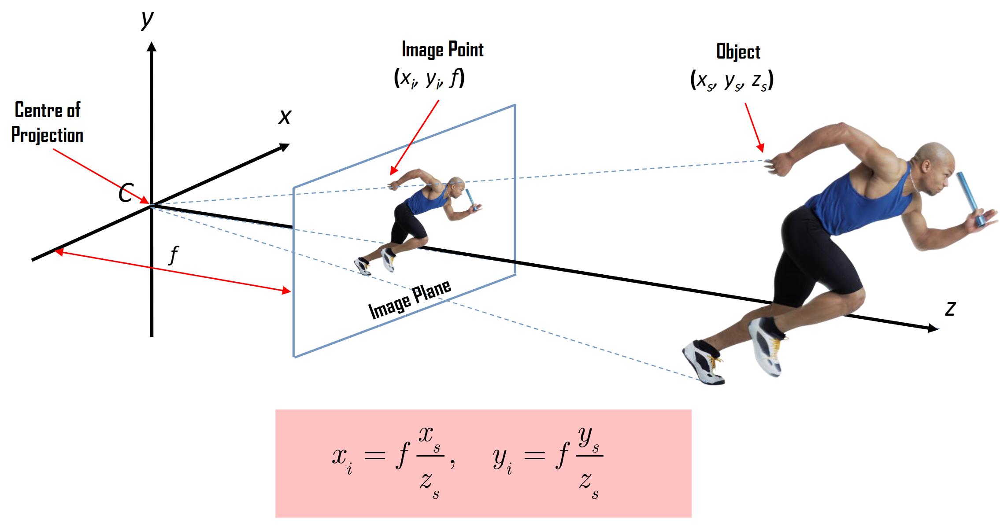

# Lecture 11: Camera Geometry

[TOC]

## Camera Models

摄像机是三维世界和二维图像之间的映射，二维图像由 projection matrix (投影矩阵)表示。

主要的 projection model有

- 透视投影 Perspective Projection
- 正投影 Orthographic Projection

### 2D Planar Transformation

点 $p$ 经过变换 $T$ 可得 $p' = T(p)$。如果变换 对图像上的任意点都是相同的，那么$T$就是一个全局变换。

| 变换                                 |           矩阵            | 自由度 | 保持     |
| ------------------------------------ | :-----------------------: | :----: | -------- |
| 平移变换（Translation）              |  $[I\mid t]_{2\times 3}$  |   2    | 方向性   |
| 欧几里德/刚体变换（Rigid/Euclidean） |  $[R\mid t]_{2\times 3}$  |   3    | 长度     |
| 相似变换（Similarity）               | $[sR\mid t]_{2\times 3}$  |   4    | 角度     |
| 仿射变换（Affine）                   |     $[A]_{2\times 3}$     |   6    | 平行性   |
| 投影变换（Projective）               | $[\tilde{H}]_{3\times 3}$ |   8    | 直线性质 |

### Pinhole Camera Model 针孔相机模型

在针孔相机模型下，空间中坐标为 $(X, Y, Z)$ 的点被映射到图像平面上的点，即连接点 $X$ 和投影中心的线与图像平面的交点。

> 这里假设深度为 $d$
>
> 如考虑像素点在 $(x_1, y_1, d_1)$ 其位于深度 $d_2$ 的像素点为 $(x_2, y_2, d_2)$
>
> 根据小孔原理，我们知晓
> $$
> \begin{align*}
> \frac{x_1}{d_1} &= \frac{x_2}{d_2}\\
> x_1 &= x_2\frac{d_1}{d_2}
> \end{align*}
> $$

#### Pixel Coordinates

$(x_{pix}, y_{pix})$ 是像素坐标系, $(x, y)$ 是图像平面坐标系

从3D空间点到2D图像平面的投影：
$$
\begin{cases}
x_i = x_s(f/z_s)\\
y_i = y_s(f/z_s)
\end{cases}
\longleftrightarrow
\begin{cases}
x_i = f(x_s/z_s)\\
y_i = f(y_s/z_s)
\end{cases}
$$
从图像坐标到像素坐标的转换：
$$
\begin{cases}
x_{pix} = k_x\cdot x_i + x_0\\
y_{pix} = k_y\cdot y_i + y_0
\end{cases}
\longleftrightarrow
\begin{cases}
x_{pix} = k_x f \frac{x_s}{z_s} + x_0\\
y_{pix} = k_y f \frac{y_s}{z_s} + y_0
\end{cases}
$$
$k_x$ 和 $k_y$ 是比例系数

> 我们可以认为 $x_{pix}$ 是相对位置

引入 $\alpha$ 参数简化表达：
$$
\begin{cases}
\alpha_x = f \cdot k_x\\
\alpha_y = f\cdot k_y
\end{cases}
\longrightarrow
\begin{cases}
x_{pix} = \alpha_x \frac{x_s}{z_s} + x_0\\
y_{pix} = \alpha_y \frac{y_s}{z_s} + y_0
\end{cases}
\longleftrightarrow
\begin{cases}
x_{pix} = \frac{\alpha_x x_s + z_s x_0}{z_s}\\
y_{pix} = \frac{\alpha_y y_s + z_s y_0}{z_s}
\end{cases}
$$

- 像素坐标的原点通常位于传感器阵列的一个角落(例如左上角或左下角)
- CCD/CMOS像素可能不是正方形的(由于水平/垂直方向上的间距不等)
- 还可能存在倾斜因素和镜头畸变(枕形效应)，这些都会影响3D物体投影到不同的像素坐标上
- 使用普通坐标系比较笨拙，让我们改用 Homogeneous Coordinates齐次坐标系

> CCD/CMOS传感器的像素可能不是正方形的
> 可能存在镜头畸变（如枕形畸变）
> 建议使用齐次坐标来简化计算

#### Homogeneous Coordinates

齐次坐标通常用于射影几何

其优点是可以用有限坐标表示包括无穷远点在内的所有点的坐标

对于欧几里得平面中的点 $(x, y)$，其在射影平面中的表示简单地为 $(x, y, 1)$，而对于齐次坐标，我们有 $(u, v, w) = (ax, ay, aw)$，其中 $a\neq 0$，其在欧几里得平面中的等价表示为 $(u/w, v/w)$

使用齐次坐标可以大大简化射影表示

$$
\underbrace{
\begin{cases}
u = f x_s \\
v = f y_s \\
w = 1 z_s
\end{cases}
\leftrightarrow
\begin{cases}
u = f x_s \\
v = f y_s \\
w = z_s
\end{cases}
}_\text{Homogeneous Coordinates}

\longleftrightarrow

\underbrace{
\begin{cases}
x_i = u / w\\
y_i = v / w
\end{cases}
\leftrightarrow
\begin{cases}
x_i = f(x_s/z_s)\\
y_i = f(y_s/z_s)
\end{cases}
}_\text{Eucilidean Coordinates}
$$
如上我们可以用齐次方程表示相对位置 $(x_i, y_i)$

而对于 General Projection可以用上式表达：
$$
\underbrace{
\begin{cases}
u = \alpha_x x_s + x_0z_s \\
v = \alpha_y y_s + y_0z_s \\
w = z_s
\end{cases}
}_\text{Homogeneous Coordinates}

\longleftrightarrow

\underbrace{
\begin{cases}
x_{pix} = u / w\\
y_{pix} = v / w
\end{cases}
\leftrightarrow
\begin{cases}
x_{pix} = \frac{\alpha_x x_s + z_s x_0}{z_s} & \alpha_x = f \cdot k_x\\
y_{pix} = \frac{\alpha_y y_s + z_s y_0}{z_s} & \alpha_y = f \cdot k_y
\end{cases}
}_\text{Eucilidean Coordinates}
$$

对于一个 Horizontal Skew，考虑其系数矩阵有 5 个变量 $\alpha_x, s, x_0, \alpha_y, y_0$，因此其有 5 个 DoF

我们可以将上述系数矩阵进行简写：
$$
\begin{bmatrix}
\alpha_x & s & x_0 & \alpha_y, y_0
\end{bmatrix}
$$
