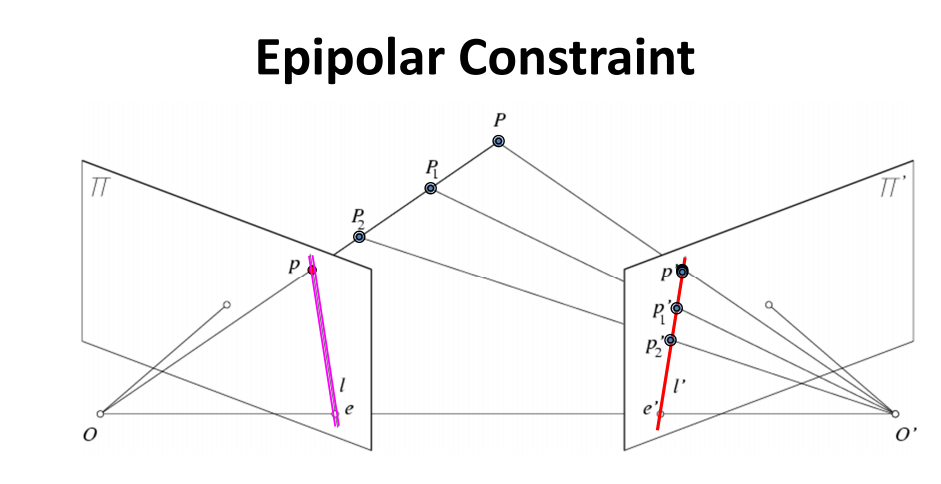

# Lecture 12: Computational Stereo I

> 参阅 https://www.cnblogs.com/xiejb2430/p/16894157.html
>
> 参阅 https://zhuanlan.zhihu.com/p/33458436

当我们在左图中找到一个特征点时，我们需要在右图中找到对应的特征点，之后（希望）我们可以反向投影这两条射线并找到它们的交点（即3D点所在位置）

但是，我们应该在哪里寻找对应的特征点呢？有很多点需要考虑，如何定义搜索空间？是整张图像，还是对应图像坐标的邻近区域？当两个视角相差很大且有较大平移时会发生什么？

双目视觉中的一个核心问题：特征匹配和三维重建。

## Epipolar Geometry 对极几何

> 参阅 https://harrymei.github.io/2018/06/18/%E5%AF%B9%E6%9E%81%E5%87%A0%E4%BD%95%E7%9A%84%E7%90%86%E8%A7%A3/

Epipolar 几何是两个视角之间的内在投影几何关系。

- 它仅取决于固有相机参数及其相对姿势。
- Foundamental Matrix $F$ 是此固有几何的代数表示

1. 有两个相机视角(View 1和View 2)
2. $C$ 和 $C'$ 分别是两个相机的光心
3. 点 $x$ 是被观察的空间点
4. $e$ 和e'是 **Epipole（对极点）**，即一个相机中心在另一个相机成像平面上的投影点
5. 蓝线表示**基线(Baseline)**，连接两个相机光心
6. 图中的黑线显示了**Epipolar Line（对极线）**，这是与点 $x$ 对应的

图中还用不同颜色(黄、红、绿)显示了三条射线，展示了从不同视角观察同一点时的几何关系。这种几何关系对于计算机视觉中的立体视觉和三维重建非常重要。

### Epipoloar Constraint

如上图所示，假定相机参数已知，那么对于空间中P点，它将和两个相机的中心点O1和O2，唯一确定对极几何的几何关系，极点、极线、极平面都将确定，而对极约束描叙的就是：**在平面1上成像为p的所有空间点，其必定投影在平面2的极线上，反之亦然。**

这种几何关系的关键在于：

- 空间中的一个点、两个相机的光心以及这个点在两个图像平面上的投影都位于同一平面上（对极平面）
- 这种约束可以帮助在两幅图像之间建立对应关系，是三维重建的基础

1. 两个视角之间的 Epipolar Geometry 本质上是以基线为轴的平面束与图像平面的交线的几何关系
2. 因此,对于一个图像平面上的特征点(比如在左侧图像上),如何计算在另一个图像平面(右侧图像)上对应的对极线?
3. 从概念上讲，给定一个特征点 $x$,如果已知相机的相对位置和方向,投影平面必须经过 $C$、$C'$和$x$ 点,因此可以很容易地确定
4. 投影平面 $\pi$ 与另一幅图像的交线定义了对极线

该图展示了对极几何的基本概念:

- $C$ 和 $C'$ 是两个相机的**光心(Camera Centers)**
- $e$ 和 $e'$ 是**对极点(Epipoles)**
- $\pi_1, \pi_2, \pi_3$ 表示不同的**极平面(Epipolar Planes)**
- 红色、绿色和蓝色的线表示这些 **Epipolar Planes** 与图像平面的交线,即**对极线(Epipolar Lines)**

## Fundamental Matrix

**极点(Epipole)**: e'是相机中心C在第二个视图平面上的投影
**极线(Epipolar Line)**: l'是x点可能对应点的集合在第二视图上形成的线
**背投射射线(Back-projected ray)**: 从相机中心 $C$ 通过特征点 $x$的射线

$X(\lambda) = P^+x+\lambda C$ 表示从 $C$ 到 $x$ 的背投射射线上的任意点。参阅Lecture 11。

对于两个已知投射到 $C'$ 的点 $e'$ 和 $x'$，其拥有到 $C'$ 的映射矩阵 $P'$
$$
\begin{align}
x' &= P'(X(\lambda)) = P'P^+x\\
e' &= P'C
\end{align}
$$
两点在 $C'$ 中的空间被定义为 $l'$ （epipolar line）
$$
l' = \underbrace{e' \times (P'P^+)}_{F}x
$$

> **Cross Product**
>
> 从几何角度，向量 $a \times b$ 会获得 $ab$ 平面的法向量
>
> $[\mathbf{a}_\times]$ 表示向量 $\mathbf{a}$ 的斜对称矩阵（skew-symmetric matrix）形式
> $$
> \mathbf{a} \times \mathbf{b} = [\mathbf{a}]_\times \mathbf{b}
> = [\mathbf{b}]_\times^T \mathbf{a}\\
> [\mathbf{a}]_\times = \begin{bmatrix}
> 0 & -a_z & a_y\\
> a_z & 0 & -a_x\\
> -a_y & a_x & 0
> \end{bmatrix}
> $$

$$
F = e'\times(P'P^+)
$$

它封装了两个视图之间的对应关系

- 它编码了两个视图之间的几何关系
- 对于第一视图中的点$x$，$Fx$ 给出第二视图中的对应极线
- 它不依赖于场景结构，只依赖于相机的相对位置和内部参数
- 这是计算机视觉中进行立体匹配和3D重建的基础

如果点 $x'$ 在极对线 $l'$ 上，则有 $x' \cdot l' = x'^TFx=0$

Fundamental Matrix 满足一些条件：

对于两幅图像中任意一对对应点 $\mathbf{x} \leftrightarrow \mathbf{x}'$，都有：
$$
\mathbf{x}'^T \mathbf{F}\mathbf{x} = 0
$$
考虑 $x$ 和 $x'$ 是相对应的，因此 $x'$ 在epipolar line $l' = \mathbf{Fx}$ 上，即
$$
\mathbf{x}'^T\cdot (\mathbf{Fx}) \quad \text{or}\quad \mathbf{x}'^T \mathbf{Fx} =0
$$
反之，如果图像点满足上述条件，则由这些点定义的射线是共面（co-planar）的，这是点对应的必要条件。

### 定义

$$
F = \begin{bmatrix}
a & b & \alpha a + \beta b \\
c & d & \alpha c + \beta d\\
e & f & \alpha e + \beta f
\end{bmatrix}
$$

7DoF (3x3 - 1(homogeneous) - 1(rank2))

如果 $F$ 是相机对 $(P, P')$ 的基础矩阵：

- 那么 $F^T$ 就是相机对 $(P', P)$ 的基础矩阵
- 对于第二幅图像中的点 $x'$，$l=F^T x'$表示其对极线

考虑**Epipolar Constraint**：对于除极点 $e$ 外的任意点 $x$，对极线 $l'=Fx$ 包含对应的极点$e'$，则有
$$
\forall x. e'^T Fx = 0\\
\therefore e'^TF = 0 \quad \text{or} \quad F^Te' - 0\\
\text{Similarly } Fe =0
$$
由于 $F$ 表示从第一个相机到第二个相机的基础矩阵，而 $F^T$ 表示从第二个相机到第一个相机的基础矩阵，所以两个相机之间存在对称的几何关系：

- 如果 $e'$ 是第二幅图像中的极点($F^T e' = 0$)
- 那么 $e$ 必须是第一幅图像中的极点($Fe = 0$)

### Example

左相机坐标系被设为与世界坐标系重合，如考虑
$$
P=K[I\mid 0], P' = K'[R\mid t]\\
P^+ = \begin{bmatrix}K^{-1}\\0\end{bmatrix},
C = \begin{bmatrix}0\\1\end{bmatrix}
$$
则基础矩阵：
$$
\begin{align}
F &= e' \times (P'P^+)\\
&= [P'C]_\times P'P^+\\
&=[K't]_\times K'RK^{-1}
\end{align}
$$

> **数学推导**
>
> 考虑 $e'$ 是左相机中心 $C$ 在右相机成像平面上的投影，即 $e' = P'C$
>
> 将其展开：
> $$
> \begin{align}
> P'C &=K'[R\mid t]C\\
> &=(K'[R\mid t])\begin{bmatrix} 0\\1 \end{bmatrix}
> \end{align}
> $$
> 考虑列向量特性，其本质意思为选择最后一列，即：
> $$
> \begin{align}
> P'C &=K'[R\mid t]C=K't
> \end{align}
> $$
> 即
> $$
> \begin{align}
> F &= e' \times (P'P^+)\\
> &= [P'C]_\times P'P^+
> \\
> &= [K't]_\times P'P^+
> \end{align}
> $$
> 将 $P', P^+$ 展开
> $$
> \begin{align}
> P'P^+ &= (K'[R\mid t])\begin{bmatrix}K^{-1}\\0\end{bmatrix}
> \\ &= K'RK^{-1}
> \end{align}
> $$

## Essential Matrix

对于 Calibration 矩阵 $K$，当其已知时我们可以进行如下步骤将像素坐标转换为归一化坐标。
$$
\hat{\mathbf{x}} = \mathbf{K}^{-1}\mathbf{x} \longrightarrow \hat{\mathbf{x}} = [\mathbf{R}\mid \mathbf{t}] \mathbf{X}
$$

这个转换实际上移除了所有内部标定参数，得到了归一化相机矩阵。可以表示为：
$$
\mathbf{P} = [\mathbf{I}\mid\mathbf{0}], \quad \mathbf{P'} = [\mathbf{R}\mid\mathbf{t}]
$$

本质矩阵 $\mathbf{E}$ 定义为：
$$
\mathbf{E} = [\mathbf{t}]_{\times}\mathbf{R}
$$
本质矩阵的定义方程是：
$$
\hat{\mathbf{x}}'^T\mathbf{E}\hat{\mathbf{x}} = 0
$$
这个方程描述了对极几何约束。

> 考虑点 $x = PX=[I\mid 0]X, x' = P'X= [R \mid t] X$
>
> 空间点 $X$，它的两个投影点 $x$ 和 $x'$，以及两个相机中心，必须共面（这就是对极平面），可以用 向量的混合积（三重积）表示：
> $$
> (x'×(Rx+t))⋅(Rx+t)=0
> $$
>
> > 考虑 $X, C_1, C_2$，如令 $C_1 = \mathbf{0}, C_2 = \mathbf{t}$
> >
> > $(X - C_1)$：从第一个相机中心到空间点 $X$
> >
> > $(X - C_2)$：从第二个相机中心到空间点 $X$
> >
> > $(C_2 - C_1)$：即平移向量 $t$
> >
> > 这三个向量应该共面，即
> > $$
> > (C_2 - C_1)[(X - C_1)\times (X - C_2)] = 0
> > $$
> > $X$在 $C_1$ 坐标系中可以表示为 $\lambda x$（$\lambda$是深度，考虑 $C=0$，因此无需+C）
> > $X$在 $C_2$ 坐标系中可以表示为 $\lambda' Rx'+t$（$\lambda$是深度）
> >
> > 带入：
> > $$
> > \begin{align}
> > (C_2 - C_1)[(X - C_1)\times (X - C_2)] &= 0\\
> > t\cdot [(\lambda x - 0)\times (\lambda' Rx'+t-t)] &= 0\\
> > t\cdot [\lambda x\times (\lambda' Rx')] &= 0\\
> > t\cdot [\lambda\lambda'  (x\times Rx')] &= 0\\
> > \lambda\lambda'[ t\cdot (x\times Rx')] &= 0\\
> > \end{align}
> > $$
> >
> > > 三重积的循环性质： $ a\cdot(b\times c) = b\cdot(c\times a) = c\cdot(a\times b)$
> >
> > $$
> > \begin{align}
> > (C_2 - C_1)[(X - C_1)\times (X - C_2)] &= 0\\
> > \lambda\lambda'[ t\cdot (x\times Rx')] &= 0\\
> > \lambda\lambda'[ x\cdot ( Rx'\times t)] &= 0\\
> > \end{align}
> > $$
> >
> > > 叉乘的反交换性：$a\times b = -b\times a$
> >
> > $$
> > \begin{align}
> > (C_2 - C_1)[(X - C_1)\times (X - C_2)] &= 0\\
> > \lambda\lambda'[ x\cdot ( Rx' \times t)] &= 0\\
> > -\lambda\lambda'[ x\cdot (t\times Rx')] &= 0\\
> > \lambda\lambda'[ x\cdot ([t]_\times Rx')] &= 0\\
> > x\cdot ([t]_\times Rx') &= 0\\
> > x^T [t]_\times Rx' &= 0\\
> > x'^T \underbrace{([t]_\times R)}_{\mathbf{E}}x &= 0
> > \end{align}
> > $$
>
> $$
> \mathbf{E} = [\mathbf{t}]_\times \mathbf{R}
> $$