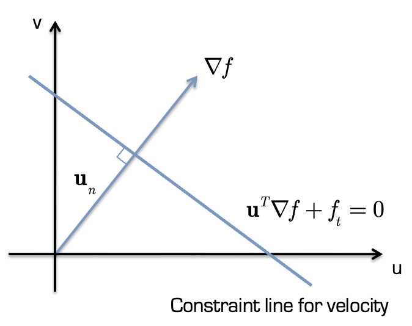
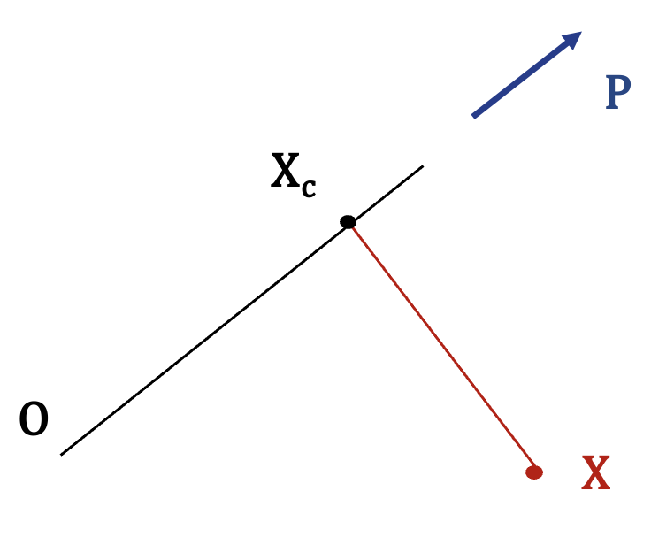

# Lecture 15: Motion and Optical Flow

[TOC]

Motion 添加了新的 time dimension

## Optical Flow

假设 Pixel 的 Intensity 表示为 $f(x, y, t)$，考虑其在经过一小段时间后为
$$
\begin{align*}
f(x, y, t) &\longrightarrow f(x + \Delta x, y + \Delta y, t + \Delta t)
\\
&\longrightarrow f(x + dx, y + dy, t + dt)
\end{align*}
$$
使用泰勒展开对齐进行展开
$$
\begin{align*}
f(x + dx, y + dy, t + dt)
&= f(x, y, t)
+ \left(\frac{\part f}{\part x}\right)dx
+ \left(\frac{\part f}{\part y}\right)dy
+ \left(\frac{\part f}{\part t}\right)dt
+\cdots
\end{align*}
$$
如果该点相对于摄像机和照明（Illumination）而言足够小，那么该点的照明函数应该不会发生变化，因此：
$$
f(x + dx, y + dy, t + dt) = f(x, y, t)
$$
即
$$
\left(\frac{\part f}{\part x}\right)dx
+ \left(\frac{\part f}{\part y}\right)dy
+ \left(\frac{\part f}{\part t}\right)dt = 0
$$
使用齐次方程，即
$$
u = dx/ dt\qquad v = dy/dt\\
\left(\frac{\part f}{\part x}\right)u
+ \left(\frac{\part f}{\part y}\right)v
+ \left(\frac{\part f}{\part t}\right) = 0
$$
这就是 **Optical Flow Equation 光流方程**

可以用 Prewitt 算子等直接测量出点点 $\part f / \part x, \part f / \part y$

光流为图像上的每个点分配一个运动矢量，该矢量表示该点在图像上的移动速度

需要注意的是，计算光流的基本假设并不总是有效的。

在光源和摄像机位置固定的情况下，旋转球体不会显示任何像素强度变化，而相对于移动光源静止的球体则会显示强度变化。

同样，相对于静止光源的平移也会产生强度变化。我们假定光源是静止的，并考虑刚性物体相对于固定摄像机位置的运动情况 

### 求解 Optical Flow Equation

可以直接根据图像中每个像素的图像变化来测量三个偏导数。

对于光流方程，我们只有一个方程，但有两个未知数，因此它只是一个约束方程，约束速度位于空间中的一条直线上

如果用向量形式表示，则有
$$
\mathbf{u} = \begin{bmatrix}
u\\ v
\end{bmatrix} \qquad f_t = \frac{\part f}{\part t}\\
\nabla f = \begin{bmatrix}
\frac{\part f}{\part x} & \frac{\part f}{\part y}
\end{bmatrix}^T\\
\therefore \mathbf{u}\nabla f + f_t = 0
$$

#### Norm $u_n$

$$
\begin{align*}
\mathbf{u}\nabla f + f_t &= 0\\
\mathbf{u}{\nabla f} &= -f_t
\end{align*}
$$
其法向量速度 $\mathbf{u}_n$ 与梯度方向平行，即 $\mathbf{u}_n = k \nabla f$，带入方程：
$$
\begin{align*}
\mathbf{u}_n{\nabla f} &= -f_t \\
k\nabla f^T\nabla f & = -f_t\\
k &= -\frac{f_t}{||\nabla f||^2}\\
\end{align*}
$$
带入回 $\mathbf{u}_n = k \nabla f$，有
$$
\begin{align*}
\mathbf{u}_n &= k \nabla f\\
\mathbf{u}_n &= \frac{-f_t}{||\nabla f||}\frac{\nabla f}{||\nabla f||}
\end{align*}
$$

> 也可以思考如下过程
>
> 思考如下，$\mathbf{u}_n$ 垂直于等亮度线，即其$\mathbf{u}_n \parallel \nabla f$，即
> $$
> \mathbf{u}_n = k \nabla f
> $$
> 亦可写作
> $$
> \mathbf{u}_n \perp \begin{bmatrix}
> -f_y\\f_x
> \end{bmatrix}
> \longrightarrow
> \mathbf{u}_n^T \begin{bmatrix}
> -f_y\\f_x
> \end{bmatrix} = 0\\
> $$
> 
>
> $\mathbf{u}_n$ 垂直于等亮度线，方向与梯度平行，满足：$$-u_n\cdot f_y + v_n\cdot f_x = 0$$ （垂直条件），因此可以获得
> $$
> u_n = v_n\frac{f_x}{f_y}
> $$
> 将这个表达式代入光流约束方程：
> $$
> \begin{align*}
> u_n\cdot f_x + v_n\cdot f_y + f_t &= 0\\
> \left(v_n\frac{f_x}{f_y}\right)\cdot f_x + v_n\cdot f_y + f_t &= 0\\
> v_n\frac{f_x^2}{f_y} + v_n\cdot f_y + f_t &= 0
> \\
> v_n\left(\frac{f_x^2}{f_y} + f_y\right) &= -f_t\\
> v_n &= -f_t\cdot\frac{f_y}{f_x^2 + f_y^2}
> \end{align*}
> $$
> 同理可以解出 u：
> $$
> u_n = -f_t\cdot\frac{f_x}{f_x^2 + f_y^2}
> $$
> 因此，Un 可以表示为：
> $$
> \mathbf{u_n} = -f_t\frac{\nabla f}{\|\nabla f\|^2}
> $$
> 这就与我们之前看到的形式等价：
> $$\mathbf{u_n} = \frac{-f_t}{\|\nabla f\|}\frac{\nabla f}{\|\nabla f\|}$$
>
> 这个推导过程的几何意义是：
> 1. 我们知道真实运动必须在约束线上
> 2. Un 是约束线上离原点最近的点
> 3. Un 方向与梯度方向平行
> 4. Un 的大小由时间导数和空间梯度共同决定
>

考虑约束线为 $\mathbf{u}^T\nabla f + f_t = 0$，其斜率为 $\begin{bmatrix}
-f_y\\f_x
\end{bmatrix}$，约束线上任何一点都是满足光流方程的可能解，而 $\mathbf{u}_n \perp $，因此Un 是约束线上离原点最近的点。

#### Area Based Regression

如果相邻的两个像素属于以相同速度运动的同一物体，会发生：
$$
\begin{bmatrix}
f_x(x_1, y_1, t) & f_y(x_1, y_1, t) \\
f_x(x_2, y_2, t) & f_y(x_2, y_2, t)
\end{bmatrix}
\begin{bmatrix}
u\\v
\end{bmatrix}
+
\begin{bmatrix}
f_t(x_1, y_1, t)\\
f_t(x_2, y_2, t)
\end{bmatrix}
=
\begin{bmatrix}
0\\0
\end{bmatrix}
$$

从几何学角度看，这限制了 Solution Space，如果这两条线相交，我们就有了一个解

两条线的交点代表同时满足两个约束方程的速度向量 $(u,v)$
两条线相交时，意味着我们找到了一个唯一的速度解，这个解同时满足两个相邻像素点的运动约束

实践中我们使用 Least Square 根据局部邻域来估计速度（类似于我们在for Lucas-Kanade tracker中的做法）
$$
\min E(u, v) = \sum_{x, y} g(x, y)(uf_x+vf_y + f_t)^2
$$
其中 $g(x, y)$ 是 Neighbourhood Function
$$
\begin{cases}
\frac{\part E}{\part u} = 0
\\
\frac{\part E}{\part v} = 0
\end{cases}
\longrightarrow
\begin{cases}
\sum_{x, y}2g(x, y)(uf_x^2+vf_xf_y + f_xf_t) = 0
\\
\sum_{x, y} 2g(x, y)(uf_xf_y+vf_y^2 + f_yf_t) = 0
\end{cases}
$$
即
$$
\begin{bmatrix}
 \sum_{x, y} g(x, y)f_x^2
&\sum_{x, y} g(x, y)f_xf_y
\\
 \sum_{x, y} g(x, y)f_xf_y
&\sum_{x, y} g(x, y)f_y^2
\end{bmatrix}
\begin{bmatrix}
u \\ v
\end{bmatrix}
+

\begin{bmatrix}
 \sum_{x, y} g(x, y)f_xf_t
\\
 \sum_{x, y} g(x, y)f_yf_t
\end{bmatrix}
= 0
$$

#### Global Technique

GT 更长用。我们假设每个像素点的 velocity 都有一个测量值 $(u_i, v_i)$，那么我们就可以用以下方法估算出每个像素点 $p_i$的误差平方：
$$
R(p_i) = \left[
\frac{\part f}{\part x} u_i +
\frac{\part f}{\part y} v_i +
\frac{\part f}{\part t}
\right]^2
$$
我们还可以在像素 $p_i$ 处加入一个与平滑度有关的项：

$$
S(p_i) = \left[
\left(\frac{\part u}{\part x}\right) +
\left(\frac{\part u}{\part y}\right) +
\left(\frac{\part v}{\part x}\right) +
\left(\frac{\part v}{\part y}\right)
\right]^2
$$
这两个项合并为一个误差方程：
$$
E^2(p_i) = R(p_i) + \lambda S(p_i)
$$
这可以用微积分的变化来解决

### Aperture Problem / 孔径问题

通过分析投影图像，我们观察到的可见运动区域是有限的，这是由摄像机的光圈或用于运动分析的算法决定的。这种算法一般只检查像素的有限邻域，从而得出结论。

> 回想一下在火车上等待发车时的情形，从窗口向外看，以为自己的火车开动了，但实际上是旁边轨道上的火车在动。光圈问题是由动态场景中的有限视角造成的。

孔径问题指的是当观测窗口非常小时，运动估计会非常 ambiguous。为了克服这一问题，可以使用全局技术来计算光流。Object Corner 可以帮助计算正确的二维运动。

### FoE: Focos of Expansion

> **Gestalt law of common fate**: stimuli moving with a common velocity can be grouped together
> 以共同速度运动的刺激物可以归为一类

当人在一个由静态物体组成的世界中移动时，投射在视网膜上的视觉世界似乎在流逝(flow pass)。在给定的平移运动方向和注视方向上，世界似乎从一个特定的视网膜点流出。

事实上，在给定的平移运动方向和注视方向上，世界似乎是从一个特定的视网膜点（即扩展焦点（FOE））流出的。

每个运动和注视方向都会产生一个独特的 FOE，如果运动与视网膜（图像）平面平行，那么 FOE 可能是无穷远处的一个点。

> 当人或物体向某个方向移动时，周围环境中的视觉特征似乎从视野中的一个固定点向外辐射。
> 该固定点就是 **FOE**，它是观察者运动方向的延长线上视线与背景的交点。
> 例如，驾驶时，FOE 通常位于道路的远端，表示驾驶的目标方向。
>
> **运动流** 是视野中的物体因为观察者的运动而产生的视网膜图像的动态变化。
> FOE 是运动流的中心点，静止不动，而周围的物体流动的速度和方向提供了关于观察者速度和运动方向的信息。

**FOE 是运动方向！**

它是投影图像上的一个点，在这个点上，物体看起来像是来自于这个点 - 空间中三维速度相同的所有物体看起来都来自于同一个点 - 即 “扩展焦点（FoE）”。

定义运动物体的速度分量（注意这里的 u、v、w 是速度）：
$$
u = \frac{\Delta x}{\Delta t} \qquad
v = \frac{\Delta y}{\Delta t} \qquad
w = \frac{\Delta z}{\Delta t}
$$

以及场景中某一点在摄像机图像平面上的透视投影：
$$
x' = f\frac{x}{z} \qquad y'=f\frac{y}{z}
$$
为简单起见，选择焦距 $f=1$

考虑点 $(x_i, y_i, z_i)$ 使用常量 velocity，经过interval $t$ 后，移动到
$$
x' = \frac{x_i + ut}{z_i + wt} \qquad
y' = \frac{y_i + vt}{z_i + wt}
$$
 为了找到运动明显来自的点，我们让 $t\to \infty$ 消去，得到
$$
x' = \frac{u}{w} \qquad
y' = \frac{v}{w}
$$
其为 FoE：无论物体在哪里，都是以恒定速度运动的定点
如果观察者改变方向（或世界上的物体改变方向），FoE 也会随之改变。

直线前进时，FoE在前方
向左转时，FoE会向右移动
向右转时，FoE会向左移动

### Time to Adjacency Equation / 相邻时间 

假设我们测量图像中从 FoE 到移动图像点的距离，并将其称为 $D(t)$
如果将图像中的速度写成 $V(t)$，我们就可以得到：
$$
\frac{D(t)}{V(t)} = \frac{z(t)}{w(t)}
$$
等式右边计算的是移动点将穿过图像平面的时间，因为 $w$ 是朝向图像平面的速度，而z是到图像平面的距离

这个方程的重要性在于，现在可以直接在图像序列中计算 collision 检测，而不需要先进行3D重建然后再计算 collision

> 假设你正在开车，前方有一个物体（比如另一辆车）正在移动。现在，这个方程试图解决的问题是：我们需要知道这个物体什么时候会和我们相遇（或发生碰撞）
>
> $D(t)$：在图像中看到的距离
>
> - 就像你透过车窗或摄像头看到前方物体有多远
> - 这是二维图像上的距离，不是实际的物理距离
>
> $V(t)$：在图像中观察到的速度
>
> - 就像你看到对面车辆在视野中移动的快慢
>
> $z(t)$：实际的物理距离
>
> - 就是物体离你真实的距离
>
> $w(t)$：物体接近你的实际速度
>
> - 物体正面朝你移动的速度

#### Proof

考虑图像坐标（f=0）
$$
x' = \frac{x_i + ut}{z_i + wt} \qquad
y' = \frac{y_i + vt}{z_i + wt}
$$
图像 velocity $(u' v')$则为
$$
\begin{align*}
u' = \frac{dx'}{dt} = \frac{d}{dt} \frac{x_i + ut}{z_i + wt}=
\frac{u(z_i + wt) - w(x_i+ut)}{(z_i+wt)^2} = \frac{uz_i -wx_i}{(z_i+wt)^2}
\\
v' = \frac{dy'}{dt} = \frac{d}{dt} \frac{y_i + vt}{z_i + wt}=
\frac{v(z_i + wt) - w(y_i+vt)}{(z_i+wt)^2} = \frac{vz_i -wx_i}{(z_i+wt)^2}
\end{align*}
$$
距离向量 $(d_x, d_y)$ 为 $(x', y') - FoE$
$$
\begin{align*}
d_x = \frac{x_i + ut}{z_i + wt} - \frac{u}{w}
= \frac{wx_i - uz_i}{w(z_i + wt)}
\\
d_y = \frac{y_i + vt}{z_i + wt} - \frac{v}{w}
= \frac{wy_i - vz_i}{w(z_i + wt)}
\end{align*}
$$
因此有
$$
\frac{D(t)}{V(t)} = \frac{|| (d_x, d_y)||}{||(u', v')||}
= \frac{z_i + wt}{w} = \frac{z(t)}{w(t)}
$$

#### Depth Recovery from Time to Adjacency

可以计算两个点的相对深度。如果已知
$$
\frac{D_1(t)}{V_1(t)} = \frac{z_1(t)}{w_1(t)} 
\qquad
\frac{D_2(t)}{V_2(t)} = \frac{z_2(t)}{w_2(t)}
$$
则有：
$$
\frac{D_1(t)V_2(t)}{D_2(t)V_1(t)} = \frac{z_1(t)w_2(t)}{z_2(t)w_1(t)}
$$
由于物体上的每一点在三维空间中都以相同的速度运动（$w_1(t)=w_2(t)$），因此：
$$
\begin{align*}
\frac{D_1(t)V_2(t)}{D_2(t)V_1(t)} &= \frac{z_1(t)}{z_2(t)}
\\
z_2(t) &= \frac{z_1(t)D_2(t)V_1(t)}{D_1(t)V_2(t)}
\end{align*}
$$
如果相对深度被计算，那么 $x, y$ 也可以计算
$$
\begin{cases}
z(t) = w(t)D(t)/ V(t) \\
x(t) = x'(t)z(t)\\
y(t) = y'(t)z(t)\\
\end{cases}
$$
因此，如果已知物体上的一个点，就可以重建其他点。
然而，这并不能产生实用的算法，因为在光栅图像中无法足够精确地测量 $D(t)/V(t)$ 的比率。

在上述推导中，我们假设可以利用光流计算物体的**视像速度 Image Velocity**。

光流计算（注意孔径问题，尽可能使用全局方法）
通过图像平面内的聚类提取所有目标区
计算相邻时间，规划导航路径以避开障碍物

## Collision Detection

假设相机有一个运动向量 $(-u, -v, -w)$，固定的世界坐标点将具有速度 $(u, v, w)$。

> 如果相机以速度(-u, -v, -w)运动
>
> 则从相机的角度看，场景中的固定点似乎以速度(u, v, w)运动

点 $(X_i, Y_i, Z_i)$ 的 FoE 是 $[\frac{fu}{w}, \frac{fv}{w}]$

> FOE的位置直接反映了相机的运动方向

虽然这个点出现在图像中，但真正的解释是：成像系统的投影中心实际上是朝向该点移动的。 投影中心的位置向量P表示为：
$$
P = \begin{bmatrix}
\frac{fu}{w}\\\frac{fv}{w}\\f
\end{bmatrix}
$$
在时间$t$内移动的距离可以建模为（即相机位置）：
$$
X_c = atP = fat\left[\frac{u}{w}, \frac{v}{w}, 1\right]
$$

- a是某个比例系数
- t是时间
- f是焦距
- u,v,w是速度分量

最小距离点处，位置差向量与运动方向垂直

要计算摄像机到世界点 $X=(X，Y，Z)$的最近距离，我们只需指定矢量 $X_c - X$垂直于 $P$，这样就可以：
$$
\begin{align*}
(X_c, X) \cdot P &= 0\\
(atP -X) \cdot P &= 0\\
atP \cdot P &= X\cdot P\\
t = \frac{X\cdot P}{aP\cdot P} &\qquad X_c = \frac{P(X\cdot P)}{P\cdot P}
\end{align*}
$$

最小距离
$$
d^2_\text{min} = \left[ \frac{P(X\cdot P)}{P\cdot P} - X\right]^2 = (X\cdot X) - \frac{(X\cdot P)^2}{P\cdot P}
$$

当 P 沿着 X 对齐时，上述距离自然为零。虽然 P 可以从图像数据中获得，但只有从其他信息中估算出深度 Z，才能从图像数据中推导出 X。事实上，如果已知摄像机通过空间的速度 w)，就可以通过时间-相位分析获得这一信息。
