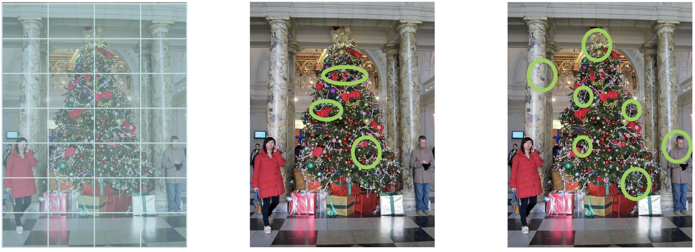

# Lecture 16: Object Recognition

[TOC]

## Challenges

**物体内部的可变性 Variability within objects**

- 视点变化（摄像机位置）
- 照明 Illumination
- 遮挡 Occlusions
- 摄像机内部参数
- 比例 Scale
- 变形 Deformation

**类内可变性 Variability within class**

- 上一张幻灯片中的狗的例子
- 类太多 

## Texture Recognition

纹理是由重复的基本元素（或**纹理子 textons**）构成的。
对于随机纹理来说，Textons 的特性并不重要，重要的是它们的**空间排列方式(spatial arrangement)**

### BoW

得出的结果是单词直方图 Histogram
可以根据直方图进行分类
对于上一张幻灯片中的示例，可以将文件分为以下几类：

1. 鸟类
2. 农场
3. 食谱

该方法已成功应用于电子邮件过滤：是垃圾邮件还是有害的？

### BoW for Image Classification

1. 提取特征

2. 学习 “visual vocabulary”（即 "字典）
3. 使用视觉词汇quantise特征
4. 用 “visual words ”的频率表示图像

### Step 1: Feature Detection & Representation

在上一讲中，您已经了解了如何提取角落或 SIFT 特征。
其他方法包括

- Regular grid 规则网格—使用规则网格划分图像
- 兴趣点检测器
- 随机取样
- Segmentation-based patches

### Step 2: Learning the Visual Vocabulary

为获得 Visual Vocabulary histogram，每一个 descriptor 需要被转化为 ‘word’

定义 “词 ”的一种方法是使用聚类算法，如 k-means

这就是视觉词汇。每个最终聚类中心点都是特征空间中的一个 “词”。

集群中心定义的每个 “词 ”也称为一个**codevector**
整个visual vocabulary (i.e. the set of ‘words’)）也称为 **codebook**
codebook可以在单独的训练集上学习 
codebook用于 quantise features：vector quantiser获取一个 feature vector，并将其映射到 codebook 中最接近的 codevector 的索引中。
如何选择 Vovabulary Size？

- 太小: Visual Word 不能代表所有斑块
- 过大：导致overfit 过度拟合和 quantisation artifacts量化伪影

### Step 3: Classification

现在我们已经有了不同类别图像的特征包(bag-of-features)表示,如何学习一个模型来区分它们?

有两种机器学习方法:

- 判别式方法 / Discriminative methods
  - 学习一个决策规则(分类器)将图像的特征包表示分配给不同的类别
  - 例如NN、kNN、SVM、AdaBoost等方法
- 生成式学习方法 / Generative learning methods
  - 对给定类别下特征包的概率进行建模
  - 例如 Naïve Bayes classifier 或Hierarchical Bayesian模型

