# Lecture 17: Texture and Region-based Segmentation

[TOC]

分割的目的是将图像划分为具有相似属性的区域或类别。理想情况下，同一类别中的像素具有相似的属性并且相互连接，而不同类别中的相邻像素具有不同的属性

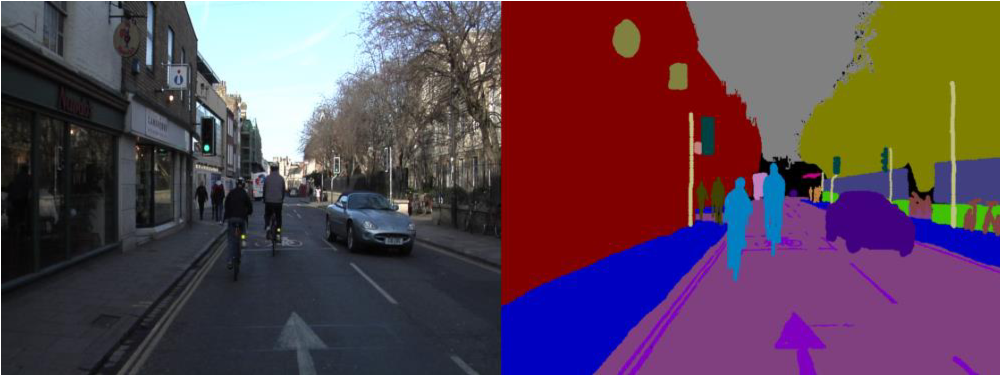

- Edge-based Technique 定位特定区域的boundaries
- Pixel-based Techniques 使用像素强度值的相似性
- Region-based Techniques 扩展特定种子点周围的分割区域以形成连通区域

然后根据需要分析和修改提取的信息以形成属于图像中对象的封闭区域。

## Segmentation by Histogram

Histogram: 图像中具有特定灰度值的像素出现的频率(次数)。这些频率被分配到"柱"中，对于8位图像来说，会有256个 bins。（即 $2^8 = 256$)

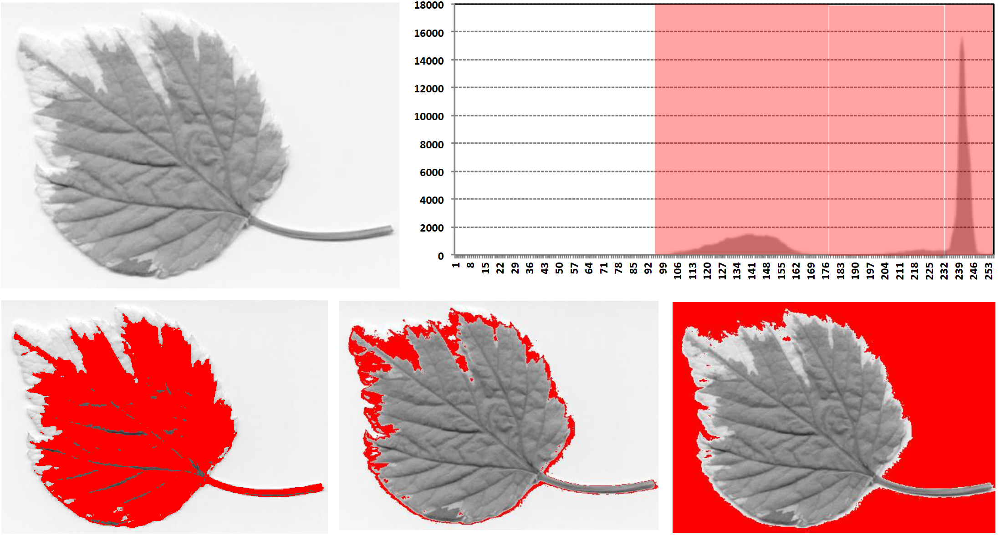

噪声会影响直方图的分布，通常会导致直方图变得更"宽"(产生broadening effect效应)

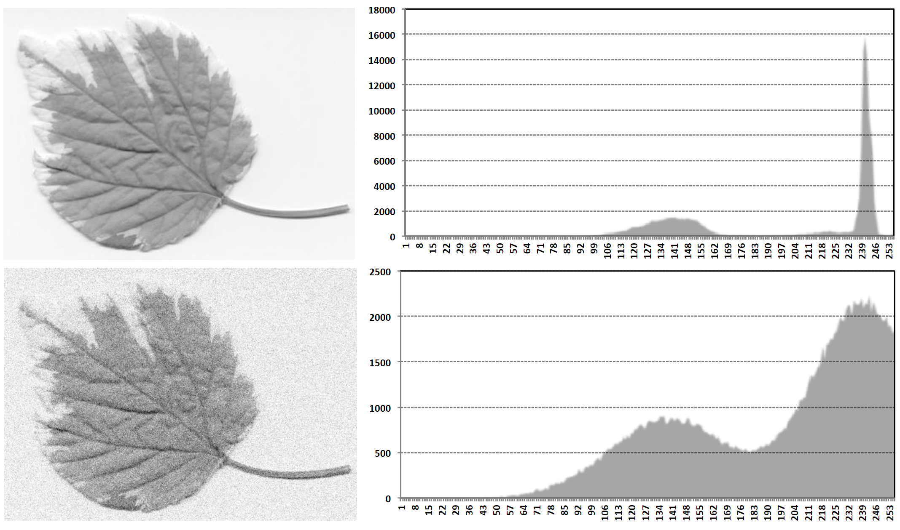

原始图像的直方图显示了较为清晰的峰值分布

添加噪声后的图像直方图变得更加分散，峰值减少，分布更宽，这正好说明了噪声对直方图的"扩展效应"

**Effect of Lighting 照明的影响：**这会产生背景偏差场 Background Bias Field（可以是 Additive 也可以是multiplicative，从而扭曲分布并使简单的阈值处理变得困难）。

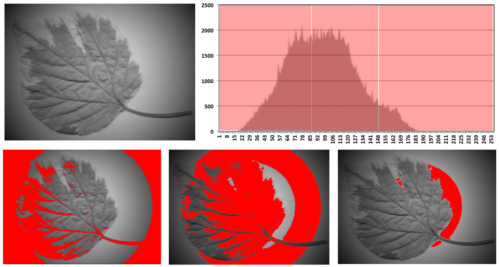

## Region-based Image Segmentation

- 这些技术通过检查像素的局部邻域来寻找像素组之间的关系。

- 实现这一目标的一种常见技术是**区域生长法(region growing)**，或称**区域合并法(region merging)**。

- 首先手动或自动选择一个 **Seed Point**。

- 逐个评估相邻像素，如果它们满足**均匀性测试(uniformity test)**的条件，就将其添加到生长区域中。

- 如果某个像素未通过测试，则将其标记为边缘。

- 性能取决于所使用的均匀性测试：可能会导致不相连区域的合并。

- 该方法可以分割具有相同属性的区域，并生成连通区域。

### Region Merging

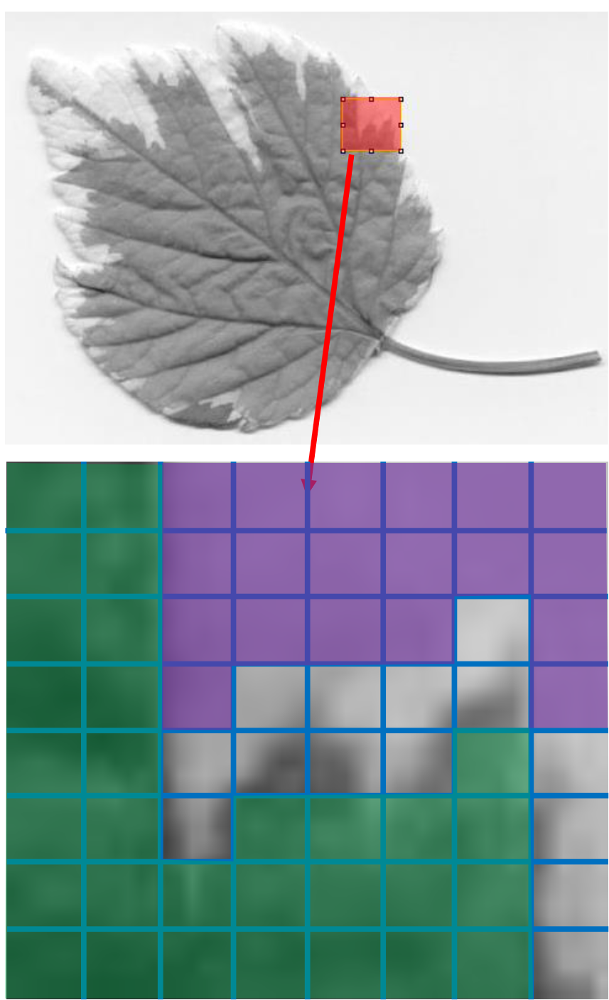

合并必须从一个 uniform seed region 开始。在寻找合适的seed region方面已有一些研究工作。
一种方法是将图像分割成2x2或4x4的块并检查每一个块。另一种方法是将图像分成条带，然后进一步细分这些条带。在最坏的情况下，Seed 可能只是单个像素。一旦找到 Seed，就将其邻域进行合并，**直到没有更多的相邻区域符合 Uniformity criterion**。在这一点上，该区域从图像中提取出来，然后使用另一个种子来合并另一个区域。

这种方法存在一些必须注意的缺点。这个过程本质上是Sequential ，如果分割需要精细的细节，那么计算时间会很长。此外，由于在大多数情况下，两个区域的合并会改变所测量属性的值，因此最终区域将取决于在邻域中采用的 **search strategy**  以及所选择的种子。

### Region Splitting

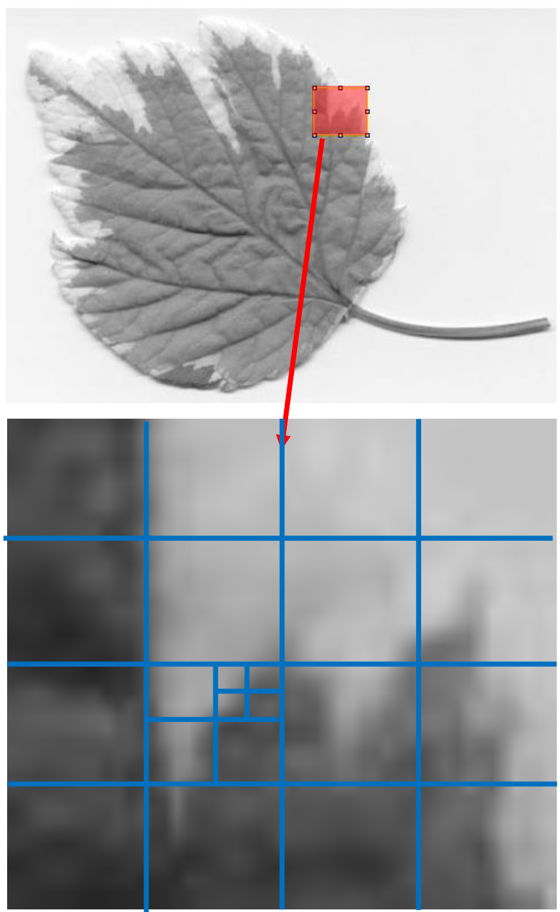

从整个图像开始，将其不断划分直到每个子区域都变得 uniform。停止分割过程的通常 criteria 是：**当新分割的一对区域（split pair）的属性与原始区域的属性差异不超过某个阈值时。**

这个算法的主要问题在于难以决定在哪里进行分割。早期的算法使用一些 regular decomposition，对某些类别来说这些方法是令人满意的；然而，在大多数情况下，分割被用作分割/合并算法的第一阶段。

### Split and Merge

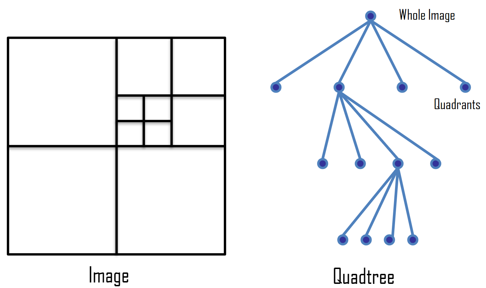

1. 区域分割会产生许多小的**同质区域 homogeneous areas**，但相邻区域可能相似并应该被合并。

2. 各种算法结合了这两个过程：
   - 通过两种技术来细化边界。随着边界变得更准确，细节也随之增加
   - 或者先分割图像以找到大的种子区域，然后进行合并（通常通过规则分解）

3. 四叉树是分割和合并算法中使用的一个重要数据结构

在图形学中，四叉树用于区域分割算法（Warnock算法）中，该算法从代表整个图像的根节点开始，递归地将图像分解到叶节点，每个叶节点代表一个连贯的区域，这些区域可以直接渲染，无需进行进一步的隐藏线消除计算。四叉树在视觉处理中也有相同的应用。

分割与合并算法。该算法通过两个互补的过程工作：
1. 分割过程：将图像分解成较小的区域
2. 合并过程：将相似的相邻区域重新组合

四叉树数据结构在这个过程中扮演着关键角色，它提供了一种层次化的方式来组织和管理图像的分割区域。每个节点可以进一步分割成四个子区域，直到达到所需的细节级别或满足特定的终止条件。这种方法在计算机图形学和计算机视觉中都有重要应用，特别是在图像渲染和场景理解方面。

#### Quadtrees

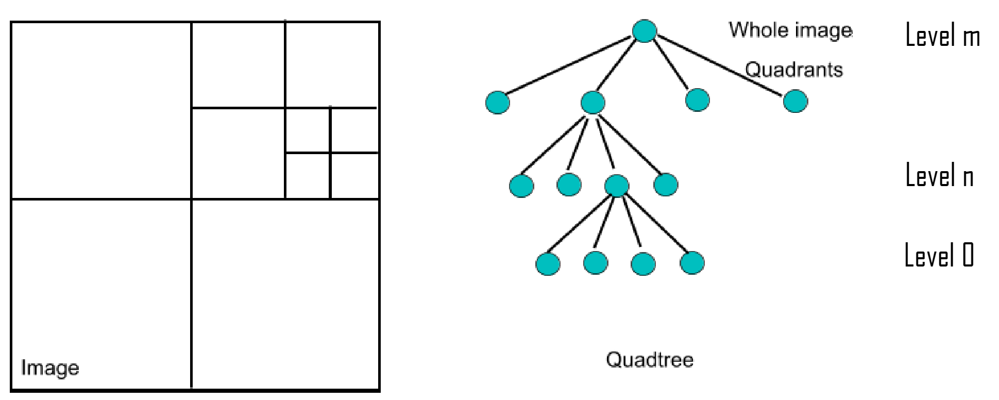

- 图像被分割成四个区域，这些区域由四叉树中的节点表示。每个区域都会检查其均匀性。如果该区域是均匀的，则对应的节点不需要进行进一步处理。如果该区域不均匀，则会进一步分割成四个区域。

- 对于分辨率为 $2^m \times 2^m$ 的图像，四叉树有 $m+1$ 层，且总共有 $(2^{2(m+1)}-1 )/ 3$个节点

- 第 $0$ 层 ：每个节点对应一个像素
- 第 $m$ 层：根节点（整个图像）
- 第 $n$ 层：每个节点对应边长为 $2^n$ 像素的区域

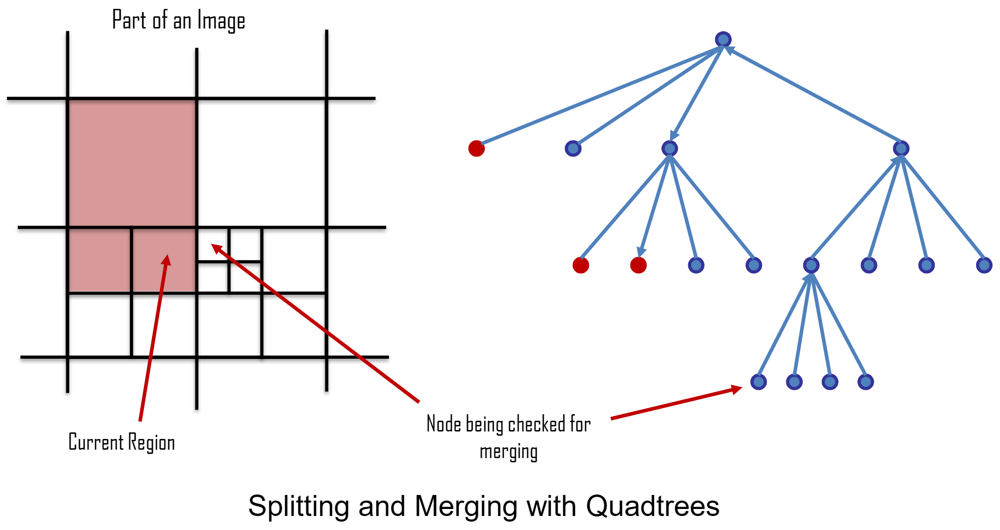

四叉树对图像实施了一种规则分解方式。为了完成分割过程，这必须要跟随一个合并阶段。因此，寻找给定节点的相邻邻居这个问题已经被深入研究。这是一个树搜索问题，并且已经发表了一些高效的算法。

#### Quadtree Splitting & Merging Algorithm

1. 定义 Initial Segmentation into regions、homogeneity criterion 和金字塔数据结构。

2. 如果金字塔数据结构中的区域 $R$ not homogeneous，将其分割成四个子区域
   如果具有相同父节点的四个区域可以合并成 single homogeneous region，则将它们合并。
   如果没有区域可以继续分割或合并，则转到步骤(3)。

3. 如果有任意两个相邻区域$R_i$、$R_j$（即使它们在不同的金字塔层级或没有相同的父节点）可以合并成一个均匀区域，则将它们合并。

4. 如果需要消除小尺寸区域，则将小区域与最相似的相邻区域合并。

这个算法描述了一个完整的图像分割过程，结合了自顶向下的分割和自底向上的合并策略：

1. 初始化阶段：
   - 设置初始分割方案
   - 定义如何判断区域是否均匀的标准
   - 建立金字塔形式的数据结构来存储分层信息

2. 基本处理阶段：
   - 对不均匀区域进行四分割
   - 尝试合并同一父节点下的相似区域
   - 这是一个迭代过程，直到无法继续分割或合并

3. 跨层级合并阶段：
   - 寻找任意相邻的均匀区域对
   - 不受层级限制
   - 不要求有相同的父节点
   - 只要满足均匀性标准就可以合并

4. 优化阶段：
   - 处理过度分割导致的小区域问题
   - 基于相似度将小区域合并到邻近区域
   - 确保最终分割结果的区域大小适当

### Uniformity Criteria

我们可以使用什么 Criteria 来定义分割和合并的阈值？如何定义uniformity？

三种方法的评估：
1. 均值（Mean）：无法提供均匀性信息 ❌
   
2. 最小值/最大值（Min/Max）
   - 在图像质量好的情况下有效
   - 但随机噪声可能导致错误结果 ❌

3. **方差（Variance）**：是衡量数据集与均值接近程度的统计度量 ✓

> 单独的均值无法为我们提供实际应用中所必需的均匀性度量。我们需要使用某种统计度量，而方差被证明是一个方便且易于计算的特性。因此，在四叉树的每个节点中，我们都会存储该子树中像素的均值和方差。

子树中像素的均值表示为：
$$
\mu = \frac{1}{n}\sum f(x,y)
其中f(x,y)表示像素值，n为像素总数
$$
Variance 定义为：
$$
v = \frac{1}{n}\sum(f(x,y)-\mu)^2 = \frac{1}{n}\sum f(x,y)^2 - \mu^2
$$

解释：
1. 为什么需要均匀性标准：
   - 用于决定是否需要继续分割区域
   - 判断相邻区域是否可以合并
   - 确保分割结果的质量

2. 各种标准的比较：
   - 均值：虽然简单，但不能反映数据分布的离散程度
   - 最小值/最大值：容易受噪声影响
   - 方差：既能反映数据分布特征，又相对稳定

3. 方差的优势：
   - 能够有效衡量区域内像素值的一致性
   - 计算简单高效
   - 对噪声具有一定的鲁棒性
   - 可以方便地在四叉树结构中更新和维护

4. 实际应用：
   - 在四叉树的每个节点存储均值和方差
   - 通过比较方差与预设阈值来决定分割或合并
   - 方差小说明区域均匀，方差大说明区域不均匀

#### Fischer‘s Criterion

基于均值和方差的分析假设用于分割的特征呈正态分布

使用 Fischer‘s Criterion 来区分具有不同 mean 和 std d的相邻区域：
$$
\frac{|\mu_1 - \mu_2|}{\sqrt{v_1^2 + v_2^2}} > \lambda
$$

- 其中 $\lambda$是一个阈值

- 如果两个区域的均值有很好的分离度且方差较低，那么我们可以区分它们。然而，如果方差变高而均值差异小，就无法将它们分开。

> 对于两个均匀的region，其 variance 会很小 也就是分母很小
> 而不关联的，则由高mean差值

解释：

1. 基本假设：
   - 图像特征（如像素强度）遵循正态分布
   - 这个假设使得均值和方差的统计分析有效

2. 费舍尔判别准则：
   - 分子 $$|\mu_1 - \mu_2|$$ 表示两个区域均值的绝对差
   - 分母 $$\sqrt{v_1^2 + v_2^2}$$ 表示两个区域方差的综合影响
   - λ是一个用户定义的阈值，用于控制分割的敏感度

3. 判别原理：
   - 比值越大，说明两个区域越容易区分
   - 均值差异大会增加区分度
   - 方差大会降低区分度

4. 实际应用场景：
   好的情况：
   - 均值差异大（高对比度）
   - 方差小（区域内部一致性高）
   - 这种情况下容易进行区分

   困难情况：
   - 均值差异小（低对比度）
   - 方差大（区域内部变化大）
   - 这种情况下难以可靠分割

5. 优势：
   - 提供了一个数学上严谨的判别标准
   - 同时考虑了区域间的差异和区域内的变化
   - 可以通过调整阈值λ来控制分割的粒度

6. 局限性：
   - 依赖于正态分布假设
   - 在高噪声或纹理复杂的图像中可能效果不佳
   - 需要合理选择阈值λ

这个准则为图像分割提供了一个量化的判断依据，帮助我们在考虑区域间差异和区域内变化的基础上做出分割决策。

## Colour Space

颜色提供了一个重要的属性，我们可以基于它来进行图像分割，在某些情况下它比灰度值具有优势。在实际系统中，颜色通常使用 tri-stimulus 模型来表示，每个像素使用3个字节 - RGB来指定。我们可以选择在这些颜色平面中的某一个上执行分割。但这种方法的应用较为有限，更合适的方法是使用不同的颜色空间，在这种空间中相同的信息以一种更适合分割方法的方式来表示。

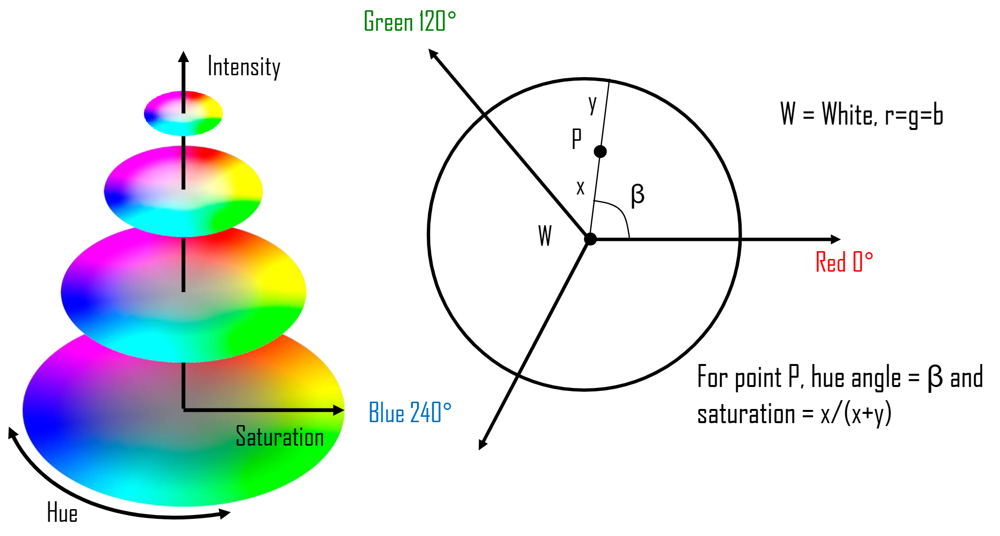

Saturation 是纯色的比例。由于色相 Hue 用0-2π范围内的角度表示，而饱和度在0-1范围内，我们可以在单位圆上表示RGB空间中的每个点。圆心是白色，圆周是完全饱和的纯色。

### Hue 色相

使用 Hue 进行分割比使用强度具有几个直接的优势

阴影：只改变强度，不改变色相
镜面反射：只改变饱和度，不改变色相
饱和度，就像r、g、b平面一样，可能在特定应用中有帮助

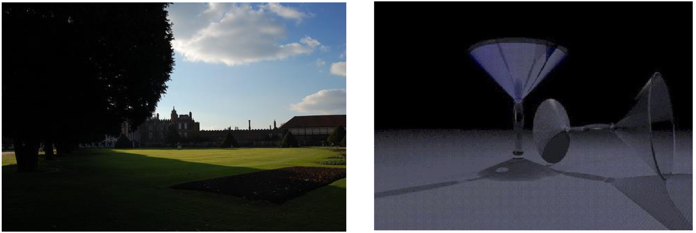

- 左图：一个户外场景，显示了树木阴影和建筑剪影
- 右图：玻璃杯的照片，展示了镜面反射效果

这些图片用来说明色相在处理阴影和反射时的优势，因为这些现象只会影响图像的强度或饱和度，而不会改变物体的基本色相。

## Textures

1. 确定纹理区域特征的一般方法是使用 **region histogram 区域直方图**
2. 在比较两个纹理区域的直方图时，必须对它们进行归一化处理
3. 一种可能的匹配技术是使用直方图分离的欧氏距离
4. 这种方法无法区分具有相同像素强度分布的图案
5. 那么，我们能否识别重复的空间模式呢？

**共生矩阵（Co-occurrence matrices）**：

- 测量在某个特定分离距离下，一对像素具有特定强度值对的出现次数
- 矩阵大小 = 图像中的灰度级数量，且是针对特定方向和特定距离来计算的

解释说明：
1. 直方图方法虽然简单，但有局限性。它只能反映图像中像素值的统计分布，无法体现像素之间的空间关系。

2. 共生矩阵则更进一步，它不仅考虑了像素值，还考虑了像素的空间关系：
   - 它统计在特定距离和方向上，像素对的灰度值组合出现的频率
   - 例如，可以统计相距为1个像素、水平方向上的所有像素对的灰度值关系
   - 这样就能捕获到纹理的空间特征，而不仅仅是强度分布

3. 共生矩阵的优势：
   - 可以区分具有相同像素分布但纹理模式不同的图像
   - 能够表达纹理的方向性特征
   - 可以通过改变距离和方向参数来分析不同尺度的纹理特征。

### Co-occurrence Matrices

图片拥有 4 个灰度值，则其 co-occurrence matrices 会由 4x4 的size。
$$
\begin{matrix}
0 & 0 & 1 & 1\\
0 & 0 & 1 & 1\\
0 & 2 & 2 & 2\\
2 & 2 & 3 & 3
\end{matrix}
\quad
\longrightarrow
\quad
\begin{matrix}
4 & 2 & 1 & 0\\
2 & 4 & 0 & 0\\
1 & 0 & 6 & 1\\
0 & 0 & 1 & 2
\end{matrix}
$$
左侧为纹理图像，右侧为co-occurrence matrix

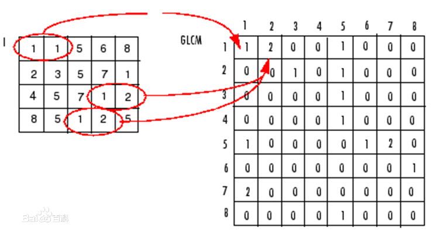

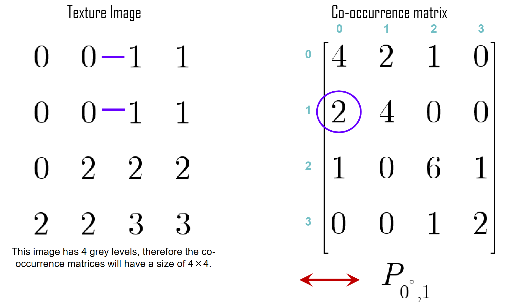

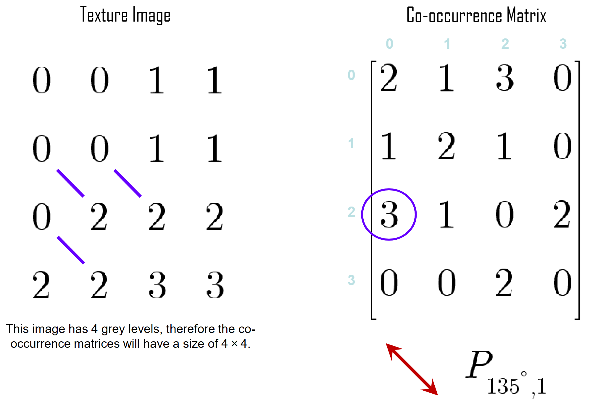

我们通常会把矩阵 normalise 以变成概率。

non-normalised frequencies of co-occurrence 作为角度和距离的函数，可以形式化表示为：
$$
P_{0°,d}(a,b) = \left|\left\{
    (k,l),(m,n) \in (M \times N) \times (M \times N):
    
    k-m=0, |l-n|=d, f(k,l)=a, f(m,n)=b
\right\}\right|
$$

> 这个公式的各部分含义：
>
> 1. $$P_{0°,d}(a,b)$$ - 表示在0°方向（水平），距离为d时，灰度值为a和b的像素对出现的频率
>
> 2. 集合表示：
>    - $$(k,l),(m,n) \in (M \times N) \times (M \times N)$$ - 两个像素点的坐标都在M×N的图像范围内
>    - $$k-m=0$$ - 表示两个像素在同一行
>    - $$|l-n|=d$$ - 表示两个像素的水平距离为d
>    - $$f(k,l)=a, f(m,n)=b$$ - 表示两个像素点的灰度值分别为a和b
>
> 3. 竖线符号 $$\left|\{\cdots\}\right|$$ 表示计算集合中元素的个数
>
> 这个公式完整地定义了如何在0°方向上计算共生矩阵中的每个元素值。对于90°和对角线方向，只需要修改坐标关系的约束条件（即k-m=0和|l-n|=d这部分）即可得到相应的公式。

类似的方程可以推导出90°和对角线方向的表达式

实际考虑因素：
- 将图像量化为少量灰度级别，通常不超过64级
- 将距离限制在小于4个像素
- 将方向限制为四个方向（水平、垂直和两个对角线方向）
  - 因此，对于任意大小的纹理窗口，我们会得到16个64×64的矩阵

这里的16个矩阵是这样得到的：4个方向 × 4种距离 = 16种组合，每个矩阵的大小是64×64（因为使用64个灰度级别）。

方向扩展：

- 类似的公式可以用于90°（垂直方向）和对角线方向
- 这些不同方向的计算原理相同，只是坐标关系的约束条件不同

3. 实际应用考虑因素：

a) 灰度级量化：
- 将图像量化为较少的灰度级别，通常不超过64级
- 这样做可以减少计算复杂度和存储空间
- 64级灰度已足够表达大多数纹理特征

b) 距离限制：
- 将像素对之间的距离限制在4个像素以内
- 这是因为较远距离的像素关系对纹理特征的贡献较小
- 可以显著减少计算量

c) 方向限制：
- 只考虑四个主要方向：
  - 水平（0°）
  - 垂直（90°）
  - 两个对角方向（45°和135°）
- 这四个方向足以捕获大多数纹理的方向性特征

最终结果：

- 对于任意大小的纹理窗口，我们会得到16个64×64的矩阵：
  - 4个方向 × 4种距离 = 16种组合
  - 每个矩阵的大小是64×64（因为有64个灰度级）

实际意义：
1. 数据压缩：通过限制灰度级、距离和方向，大大减少了计算和存储需求
2. 特征提取：这16个矩阵提供了丰富的纹理特征信息
3. 实用性：这种简化后的表示方法在实际应用中仍然非常有效
4. 计算效率：通过这些限制，使得纹理分析在计算上更加可行和高效

这种方法提供了一个实用的平衡点，在保持足够的纹理特征信息的同时，也考虑到了计算效率和存储需求。

我来帮您翻译并解释这段关于纹理匹配(Texture Matching)的内容：

### Texture Matching

1. 我们必须对共生矩阵进行归一化，使其中的元素成为共生概率，从而使其独立于窗口大小。

2. 匹配可以通过提取矩阵的若干个特征属性来进行。

3. 例如，能量（或角二阶矩。这是一个图像同质性的度量 - 图像越均匀，该值越大）。

能量的计算公式：
$$
Energy = \sum_{a,b} P^2_{\varphi,d}(a,b)
$$
其中：
- $P_{\varphi,d}(a,b)$ 表示在方向φ和距离d下，灰度值a和b共生的概率
- 求和是对矩阵中所有元素进行的

如果我们考虑16个64×64矩阵的能量来形成一个特征向量（16维），那么可以通过欧几里得距离或曼哈顿距离来度量包含纹理的两个窗口之间的差异。

> 这种方法主要用于纹理分析和匹配
> 共生矩阵(Co-occurrence Matrix)是描述图像纹理特征的重要工具
> 归一化处理确保了分析结果不受图像大小的影响
> 能量特征是反映纹理均匀性的重要指标
> 较大的能量值表示纹理分布更加均匀
> 通过计算16个不同参数下的能量值，可以得到一个更全面的纹理特征描述
> 使用欧氏距离或曼哈顿距离可以量化两个纹理区域的相似程度

$$
Entropy = -\sum_{a,b} P_{\varphi,d}(a,b) \log(P_{\phi,d}(a,b))
$$

- 熵测量纹理的随机性或复杂性
- 值越大表示纹理越复杂或随机
- 值越小表示纹理越规则或可预测

$$
Contrast = \sum_{a,b} (a-b)^2 P_{\varphi,d}(a,b)
$$

- 测量局部灰度级变化的强度
- 反映图像中明暗对比的程度
- 值越大表示纹理对比度越强

$$
Homogeneity = \sum_{a,b} \frac{P_{\varphi,d}(a,b)}{1+|a-b|}
$$

- 测量图像的局部均匀性
- 反映纹理的平滑程度
- 值越大表示纹理越均匀

> 共生矩阵在特定应用中表现良好，但有其局限性，它们无法很好地处理：
>
> 1. 随机性纹理(stochastic textures)
> 2. 纹理的颗粒度(granularity)与像素大小不匹配的情况"

这三个特征是从共生矩阵中提取的重要统计特征
每个特征都从不同角度描述了纹理的特性：

- 熵关注纹理的复杂度
- 对比度关注灰度差异
- 同质性关注局部一致性

共生矩阵方法的局限性主要体现在：
- 对随机纹理的描述能力有限
- 当纹理的自然尺度与像素尺度不匹配时效果不佳
- 需要合适的采样尺度才能获得好的结果

### Model Based Methods

使用 Analytical Model of the Texture

MRFs（Markov Random Fields）：任何像素的灰度值都被建模为其邻域像素灰度值的线性组合加上一个附加噪声项
$$
f(i,j) = \sum_{k,l} f(i-k,j-l)h(k,l) + n(i,j)
$$
其中：
- $f(i,j)$ 表示位置(i,j)处的灰度值
- $h(k,l)$ 是模型参数（权重）
- $n(i,j)$ 是噪声项
- 求和是对$(i,j)$像素的邻域像素进行的

> 求和计算是在像素(i,j)的指定邻域像素集合上进行的。权重h(k,l)是该模型的参数，通过最小均方法从纹理图像中计算得出。这些估计的参数随后与已知纹理类别的参数进行比较，以确定所分析的特定纹理属于哪个类别。

1. MRF模型的优势：
   - 能够捕捉纹理的局部空间依赖关系
   - 提供了纹理的数学描述
   - 适合处理随机纹理

2. 工作流程：
   - 首先定义邻域系统
   - 计算模型参数（权重）
   - 使用最小均方法优化参数
   - 进行纹理分类

3. 实际应用：
   - 纹理分割
   - 纹理分类
   - 图像复原
   - 材料表面检测

4. 特点：
   - 相比统计方法更有理论基础
   - 可以处理随机纹理
   - 参数具有物理意义
   - 计算复杂度较高

### Fractal Dimension 分形维

1. 当形成纹理的模式具有**"不同尺度的自相似性、self-similarity at different scales"**特征时，可以使用 **Fractal-based** 的方法。
2. 如果一个集合可以被分解为 $N$ 个经过因子 $r$ 缩放的、不重叠的自身副本，则称该集合具有自相似性(self-similarity)。
3. 这样的纹理可以用其分形维度 $D$来表征。

详细解释：

1. 自相似性(Self-similarity)：
   - 这是分形的核心特征
   - 意味着物体在不同尺度下看起来相似
   - 整体和局部具有相似的结构特征
   - 这种特征在自然界中很常见（如树叶、海岸线、云朵等）

2. 分形理论在纹理分析中的应用：
   - 适用于具有自相似特征的纹理
   - 可以描述自然界中的不规则纹理
   - 提供了一种数学化的描述方法
   - 特别适合分析具有多尺度特征的纹理

3. 分形维度D的意义：
   - 是衡量纹理复杂度的重要指标
   - 反映了纹理的自相似程度
   - 可以用来区分不同类型的纹理
   - 通常是一个非整数值

应用示例：
- 自然景观纹理分析
- 材料表面粗糙度分析
- 医学图像分析（如组织纹理）
- 地理信息系统中的地形分析

优势：
- 能够处理具有多尺度特征的复杂纹理
- 提供了纹理复杂度的定量描述
- 适合分析自然界中的不规则纹理
- 理论基础扎实

限制：
- 仅适用于具有自相似特征的纹理
- 计算复杂度可能较高
- 对于非分形纹理效果有限

这种方法在处理具有自相似特征的自然纹理时特别有效，为纹理分析提供了一种独特的数学工具。

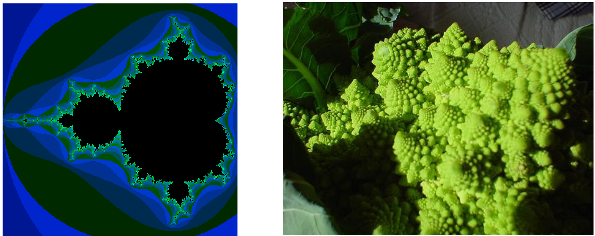

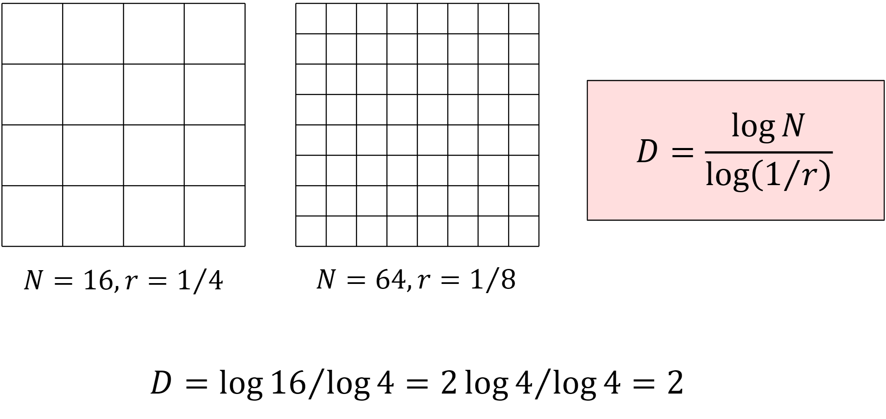

如果一个集合可以被分解为 $N$ 个经过因子 $r$ 缩放的、不重叠的自身副本，则称该集合具有自相似性(self-similarity)。

一个正方形可以被分解成N个自相似的小块，每个小块的缩放因子为r。

图示解释：
1. 左图：
   - N = 16 (4×4格子)
   - r = 1/4 (每个小块的边长是原始正方形的1/4)

2. 右图：
   - N = 64 (8×8格子)
   - r = 1/8 (每个小块的边长是原始正方形的1/8)

对于左图案例：
$$D = \frac{\log 16}{\log 4} = \frac{2\log 4}{\log 4} = 2$$

这个结果的意义：
1. D = 2 表示这是一个二维平面对象，这与我们的直觉相符，因为正方形是二维图形

重要概念解释：
1. 自相似性：
   - 每个小块都是整体的缩小版
   - 缩放比例是均匀的
   - 分割后的小块互不重叠

2. 分形维度D的特点：
   - 反映了物体在空间中的填充程度
   - **对于规则几何体，D等于其欧几里得维度**
   - **对于分形对象，D通常是非整数**

3. 计算原理：
   - N反映了自相似单元的数量
   - r反映了缩放比例
   - 两者的对数比反映了维度

#### Sierpinski Triangle

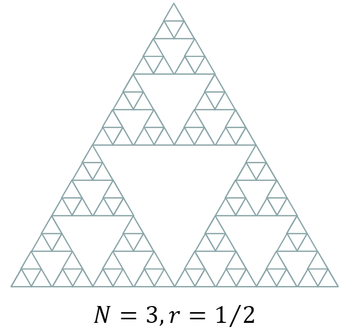
$$
D = \log 3 / \log 2 = 1.58
$$
分形维度是纹理特征的一个有用特征，尽管从图像中估计 D 非常困难，因为自然纹理并不严格遵循上述假设的确定性分形重复模型，而是存在统计变化。