# Lecture 7: Interest Point Detection

> 将关注图片 Sequence

## Feature Detection

Feature: 一张图片 interesting 的部分

Local Feature:

- Locality 
- Generalisable
- Abundant
- Efficiency

Typr of Features

- Edge
- Corners
- Blobs
- Ridges

## Harris Detector

> 参阅 https://www.zhihu.com/question/484256180/answer/2286352823
>
> 参阅 https://www.bilibili.com/video/BV1AMsNegE2S

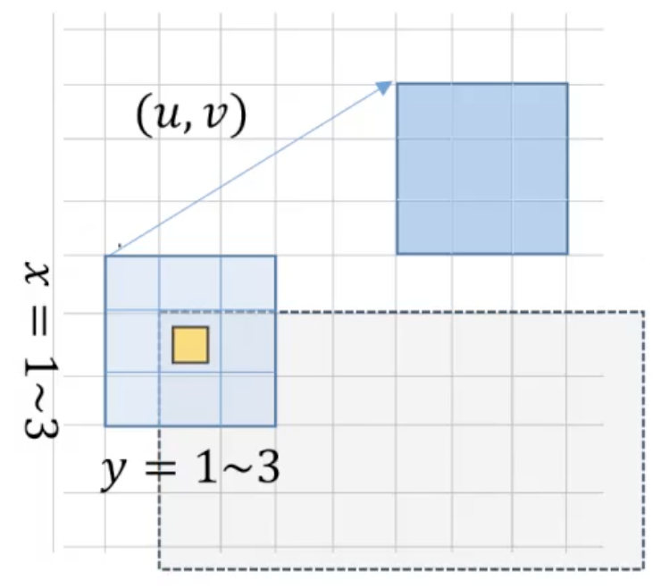

如果我们假设窗口为 $W$, 则有 Intensity Change：
$$
\varepsilon(u,v) = \sum_{x, y\in W} \underbrace{w(x, y)}_\text{weight} \left[ \underbrace{I(x+u, y+v)}_\text{shifted intensity} - \underbrace{I(x, y)}_\text{intensity} \right]^2
$$
> **权重矩阵**
>
> 这里的权重 $w(x, y)$ 表示位于点 $(x, y)$ 时，周边的所有权重。可以令 $w(x, y)$ 为高斯矩阵，则其更关注中心，而关心周围少。
> 如令 $w(x), y=1$，则可以将 Intensity Change 改写为
> $$
> \varepsilon(u,v) = \sum_{x, y\in W} \left[ \underbrace{I(x+u, y+v)}_\text{shifted intensity} - \underbrace{I(x, y)}_\text{intensity} \right]^2
> $$
> 即，学院所用描述。

如使用 Taylor Series 进行展开，则有

> **Taylor Series**
> $$
> f(x) = \sum^\infty_{n=0}\frac{f^{(n)}(x_0)}{n!}(x-x_0)^n
> $$

$$
\begin{align}
I(x+u, y+v) 
&= \underbrace{I(x, y)}_{I^{(0)}} + \underbrace{\left[\frac{\part I}{\part x}u + \frac{\part I}{\part y}v \right]}_{I^{(1)}} + \cdots
\\ &\approx I(x, y) + \frac{\part I}{\part x}u + \frac{\part I}{\part y}v
\\
\varepsilon(u,v)
&= \sum_{x, y} \left[ I(x+u, y+v) - I(x, y) \right]^2
\\&\approx  \sum_{x, y} \left[ I(x, y) + \frac{\part I}{\part x}u + \frac{\part I}{\part y}v - I(x, y)) \right]^2
\\&=  \sum_{x, y} \left[ \frac{\part I}{\part x}u + \frac{\part I}{\part y}v \right]^2
\end{align}
$$
如果定义 $I_x = \frac{\part I}{\part x}, I_y = \frac{\part I}{\part y}$，则有：
$$
\begin{align}
\varepsilon(u,v)
  &= \sum_{x, y} \left( I(x+u, y+v) - I(x, y) \right)^2
\\&\approx \sum_{x, y} \left( \frac{\part I}{\part x}u + \frac{\part I}{\part y}v \right)^2
\\&= \sum_{x, y} \left( I_xu +I_yv \right)^2
\\&= \sum_{x, y} \left(\left[ u, v \right]\left[ I_x, I_y \right]^T\right)^2
\\&= \sum_{x, y} \left(\left[ u, v \right]\left[ I_x, I_y \right]^T\left[ I_x, I_y \right]\left[ u, v \right]^T\right)
\\&= \sum_{x, y} \left(\left[ u, v \right]
\begin{bmatrix}
I_{x}^2 &I_{x}I_y\\
I_{y}I_x & I_{y}^2
\end{bmatrix}
\begin{bmatrix}
u\\
v
\end{bmatrix}
\right)
\\&= \sum_{x, y} \left(\left[ u, v \right]
\begin{bmatrix}
I_{xx} &I_{xy}\\
I_{yx} & I_{yy}
\end{bmatrix}
\begin{bmatrix}
u\\
v
\end{bmatrix}
\right)
\end{align}
$$

> **图像的梯度**
>
> 而对于图像，$I_x, I_y$ 就是图像的梯度，可以用 Sobel 等直接扫出来。

> **Hessian Matrix**
>
> 我们可以把
> $$
> \begin{bmatrix}
> I_{xx} &I_{xy}\\
> I_{xy} & I_{yy}
> \end{bmatrix}
> $$
> 看作一个 Hessian Matrix。

如令
$$
\begin{cases}
\mathbf{d} = \sum_{x, y \in W}\begin{bmatrix}u \\v\end{bmatrix}\\
\mathbf{M} = \sum_{x, y \in W}\begin{bmatrix}
I_{x}^2 &I_{x}I_y\\
I_{y}I_x & I_{y}^2
\end{bmatrix}
= \begin{bmatrix}
A & C\\
C & B
\end{bmatrix}
\end{cases}
$$
则有
$$
\begin{align}
\varepsilon(u,v)
  &= \sum_{x, y} \left( I(x+u, y+v) - I(x, y) \right)^2
\\&\approx \sum_{x, y} \left(\left[ u, v \right]
\begin{bmatrix}
I_{xx} &I_{xy}\\
I_{yx} & I_{yy}
\end{bmatrix}
\begin{bmatrix}
u\\
v
\end{bmatrix}
\right)\\
  &= \mathbf{d}^T\mathbf{M}\mathbf{d}
\end{align}
$$

>**对称矩阵的数学特性**
>
>考虑 $\mathbf{M}$ 是一个对称矩阵（Symmetric Metrix），其拥有：
>$$
>\begin{align}
>\mathbf{M}^T=\mathbf{M}
>\end{align}
>$$
>所有特征值都是实数
>
>不同特征值对应的特征向量相互正交
>
>且可被**正交对角化**，即存在**正交矩阵** $P$ 使得
>$$
>P^{-1}\mathbf{M}P=P^{T}\mathbf{M}P=\Lambda
>$$
>其中 $\Lambda$ 是由特征值构成的对角矩阵。
>
>其行列式被定义为
>$$
>\det \mathbf{M} = \det \begin{bmatrix}
>A & C\\
>C & B
>\end{bmatrix}
>= AB-CC
>$$
>
>
>**特征值**
>$$
>\begin{align}
>\mathbf{M}x &=\lambda x\\
>\mathbf{M}x-\lambda x&=0\\
>(\mathbf{M} - \lambda I)x&=0\\
>\left(
>\begin{bmatrix}
>A & C\\
>C & B
>\end{bmatrix} -
>\begin{bmatrix}
>\lambda & 0\\
>0 & \lambda
>\end{bmatrix}
>\right)x &= 0\\
>\begin{bmatrix}
>A-\lambda & C\\
>C & B-\lambda
>\end{bmatrix} x &= 0\\
>\end{align}
>$$
>为让齐次方程组有非 0 解，其系数矩阵必须是奇异的（不可逆），即行列式为 0：
>$$
>\begin{align}
>\mathbf{M}x &=\lambda x\\
>\mathbf{M}x-\lambda x&=0\\
>\begin{bmatrix}
>A-\lambda & C\\
>C & B-\lambda
>\end{bmatrix} x &= 0\\
>\left |
>\begin{matrix}
>A-\lambda & C\\
>C & B-\lambda
>\end{matrix}
>\right | &= 0\\
>(A-\lambda)(B-\lambda) - C^2 &= 0
>\end{align}
>$$

> **特征值**
>
> 对于一个方阵 $A$，如非 0 向量满足：
> $$
> A x = \lambda x, \quad \text{where } x, \lambda \neq 0
> $$
> 那么向量 $x$ 为矩阵 $A$ 的一个特征向量，$\lambda$​ 则为其对应的特征值
>
> 左侧，可以看作 $x$ 经过 $A$ 变换投影到 $A$ 的基坐标中
> 右侧，可以将 $\lambda$ 看作在对 $x$​ 进行伸缩变换
>
> 因此特征向量是投影到方阵定义的空间只发生伸缩变化，而不发生旋转变化的向量。
>
> 如果一个 $n$ 阶方阵 $A$ 所有特征值不相等，那么该向量有 $n$ 个相互独立（正交）的特征向量。

> **对角化**
>
> 如果存在可逆矩阵 $P$ 使得 $P^{-1} AP$ 为对角矩阵，则称 $A$ 为可对角化的：
> $$
> P^{-1}AP=\Lambda
> $$
>
> 其中 $\Lambda$ 是由特征值构成的对角矩阵
>
> > 对角矩阵 Diagonal Matrix
> > $$
> > \begin{bmatrix}
> > a_1 & \\
> >     & a_2\\
> >     &     & \ddots \\
> >     &     &        & a_n
> > \end{bmatrix}
> > $$
> > 
>
> $n$ 阶方阵 $A$ 有 $n$ 个互异特征值，则 $A$ 必可对角化。
>
> 充分性：
> $$
> Ax = \lambda x\\
> \text{if } x = P, \lambda=\Lambda \text{, then } AP = \Lambda P, P^{-1} AP =\Lambda
> $$
> 必要性：
> $$
> P^{-1}AP = \Lambda\\AP=\Lambda P
> $$
> 如考虑 $P$ 为特征向量构成的方阵，$\Lambda$ 为特征值构成的对角矩阵。则称呼这个过程为矩阵的特征分解。
>
> 而考虑上述情况
>
> 
>
> 当我们构造特征向量矩阵 P 时,我们通常会选择**标准正交的特征向量组**作为其列向量。也就是说:
>
> - 所有特征向量都被归一化为单位向量
> - 不同特征向量两两正交
>
> ，也拥有性质
> $$
> P^TP = I, P^{-1}=P^T
> $$

但是考虑这里的 $\mathbf{d}$ 是一个二维向量，表示位移量，**因此不是在表达一个正交矩阵。**其结果也因此是一个标量，用矩阵映射来写即：
$$
\begin{align}
\varepsilon(u,v)
  &= \sum_{x, y} \left( I(x+u, y+v) - I(x, y) \right)^2
\\&\approx \sum_{x, y} \left(\left[ u, v \right]
\begin{bmatrix}
I_{xx} &I_{xy}\\
I_{xy} & I_{yy}
\end{bmatrix}
\begin{bmatrix}
u\\
v
\end{bmatrix}
\right)\\
  &= \underbrace{\mathbf{d}^T}_{(1\times 2)}\underbrace{\mathbf{M}}_{ (2\times 2)}\underbrace{\mathbf{d}}_{(2\times 1)}
\end{align}
$$
考虑 $\varepsilon$ 本质上为空间中的 Quadratic Function（$u, v$ 为参数，$\mathbf{M}$ 是系数），因此对于固定窗口时，其可视化为：

> $\mathbf{M}$ 被称为 Second Moment Matrix，决定了函数的形状。

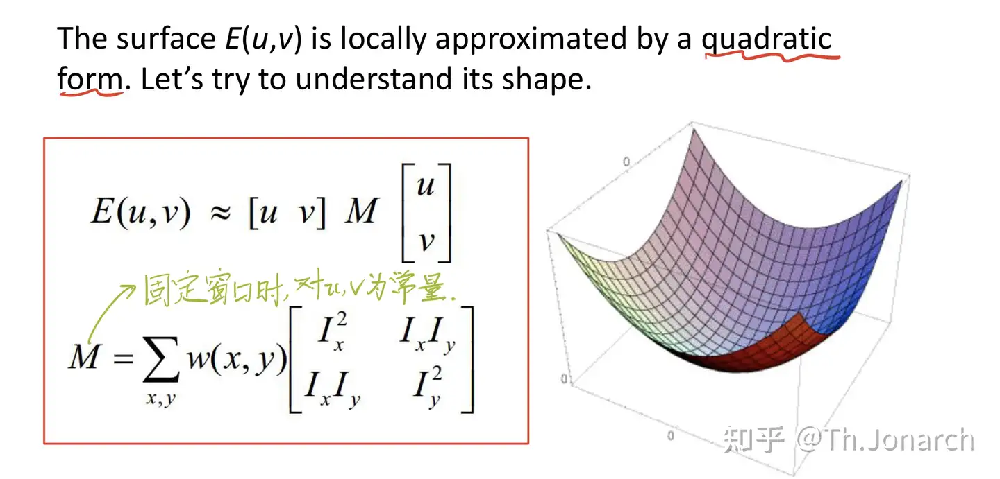

如果我们只考虑轴对齐（主要方向与坐标系的坐标轴(通常是x轴和y轴)平行）情况，即有 $I_x\neq0$ 是 $I_y = 0$
$$
\begin{align}
\mathbf{M} &= \sum_{x, y}
\begin{bmatrix}
I_{xx} &I_{xy}\\
I_{yx} & I_{yy}
\end{bmatrix}
\\
&= \sum_{x, y}
\begin{bmatrix}
I_{xx} & 0\\
0 & I_{yy}
\end{bmatrix}
\\
&=
\begin{bmatrix}
\lambda_1& 0\\
0 & \lambda_2
\end{bmatrix}
\\
\end{align}
$$

> “假设角点区域只在x和y两个相互垂直的方向上有较为明显的变化”之后，如果一个区域是角点区域，那么其梯度方向就会集中在x和y两个垂直的方向上，对于窗口内绝大多数像素点来说，要么y方向的梯度趋近0，要么x方向的梯度趋近0，两个方向的梯度的乘积也就趋近0了。对所有像素点进行累加，因为绝大多数像素点的“两个方向的梯度的乘积趋近0”，M矩阵经累加操作后，[反对角线](https://zhida.zhihu.com/search?content_id=445780596&content_type=Answer&match_order=1&q=反对角线&zhida_source=entity)上的两个值也就趋近于0。

> 实际上考虑 $\mathbf{M}$ 是一个正实数对称矩阵，则可以进行特征值分解：
> $$
> \mathbf{M} = P\Lambda P^T
> $$
> 其中
>
> - $P$ 是特征矩阵
> - $\Lambda$ 是特征值矩阵
>
> 即
> $$
> \mathbf{M} = P
> \begin{bmatrix}
> \lambda_1 & 0 \\
> 0 & \lambda_2
> \end{bmatrix}
> P^T
> $$
> 

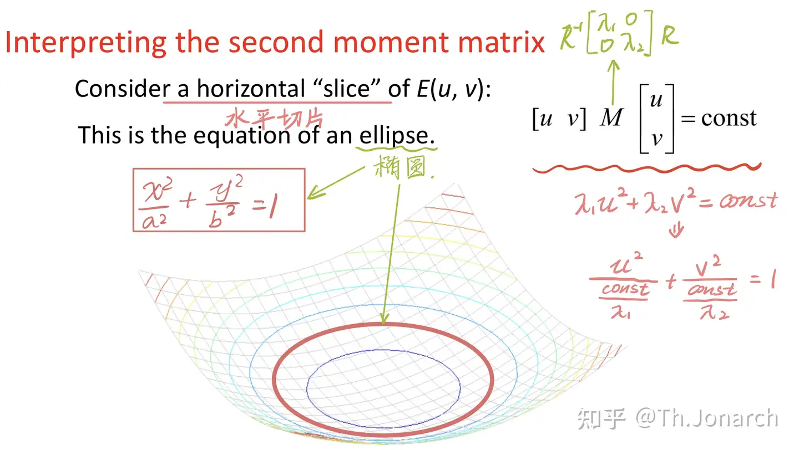

考虑我们将 $\mathbf{M}$ 进行了改写，即：
$$
\begin{align}
[u, v]\mathbf{M}[u, v]^T &= c\\
\lambda_1u^2 + \lambda_2 v^2 &= c\\
\frac{u^2}{{c} /{\lambda_1}} + \frac{v^2}{{c}/{\lambda_2}} &= 1

\end{align}
$$

> **椭圆函数公式**
> $$
> \frac{x^2}{a^2} + \frac{y^2}{b^2} = 1
> $$

为此可得
$$
\begin{cases}
a \propto \lambda_1 ^{-1/2}\\
b \propto \lambda_2 ^{-1/2}
\end{cases}
$$

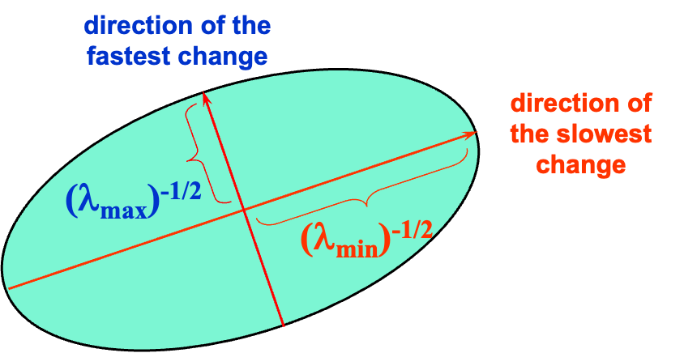

如果考虑 $u, v$ 对应 $x, y$ 所进行的距离相同，即固定 $|u, v|$，则其 $\varepsilon$ 可以被上图表示为一个水平切片（考虑等高线，高为 $\varepsilon$）。

考虑几何，二次型的切片是一个椭圆形，考虑椭圆会有一个长轴和短轴，即 $a, b$。 其表示的意思为在经过 $a, b$ 这么多移动，才能到达 $\varepsilon$ 这么多变动。如果我们考虑 $\varepsilon$ 是 Intensity Change，我们期望找到更高的 Intensity Change （即更好的角点）。则期望 $a, b$ 尽可能移动的少，即这个椭圆切面尽可能的小。

而更小的切面意味着更小的 $a, b$， 即更大的 $\lambda$，也就是更快的 Intensity Change。

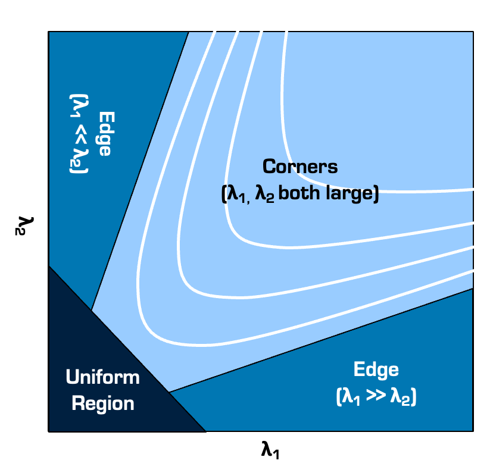

因此我们可以给出基本的 Response 定义：
$$
R=\lambda_x\lambda_y -k (\lambda_x +\lambda_y)^2
$$

> 思考如果 $\lambda_x, \lambda_y$ 都很小，那整体 $R$ 就很小
>
> 如果有一个很小，即我们可以将其中任意一个趋近于0，则整体式子也变小。

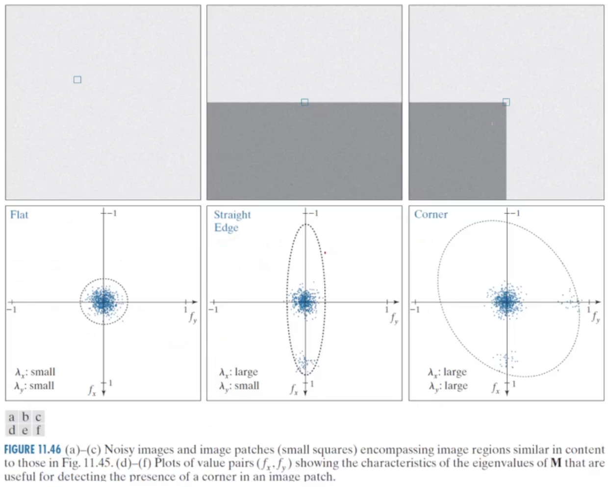

- $\lambda$ 都小：平坦区
- $\lambda$ 一大一小：边缘
- $\lambda$ 都大：角点

考虑求特征值这个运算性能需求比较大，Harris 算法给出指标（Response）为：
$$
\begin{align}
R &= \lambda_x\lambda_y - k(\lambda_x + \lambda_y)^2

\\ &=\det \mathbf{M}- k(\text{tr}^2 \mathbf{M})

\end{align}
$$

- $\det \mathbf{M} = \lambda_1\lambda_2$
- $k$: Empirical Determined Constant $k\in [0.04, 0.06]$ (Harris Coefficient)
- $\text{tr} \mathbf{M} = \lambda_1\lambda_2$, $\text{tr}(\cdot)$ 即矩阵的 trace 运算，对角之和。

我们也称第二个式子为 Harris Corner Response Function。

### Shi-Tomasi Corner Detector

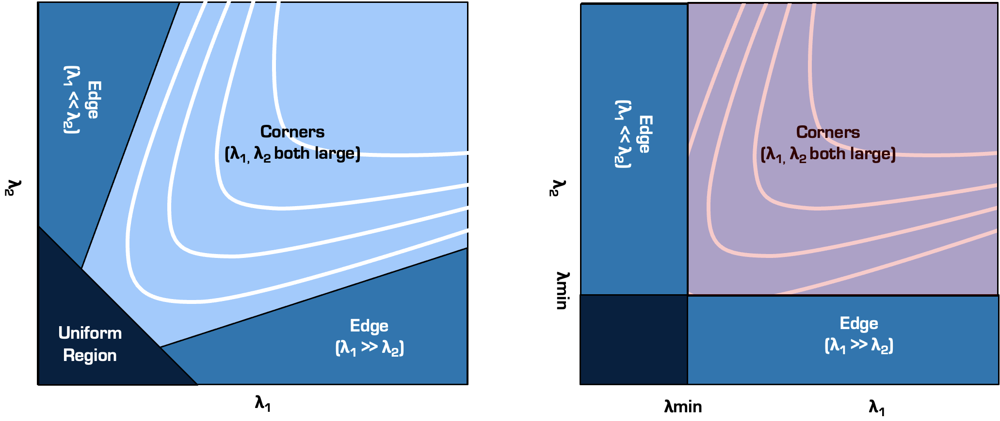

STCD 将 HCD 的反馈函数改写为
$$
R_\text{Harris} =\det \mathbf{M}- k(\text{tr}^2 \mathbf{M})
\to
R_\text{Shi-Tomasi} =\det \mathbf{M}- k(\text{tr}^2 \mathbf{M})
$$

### NMS

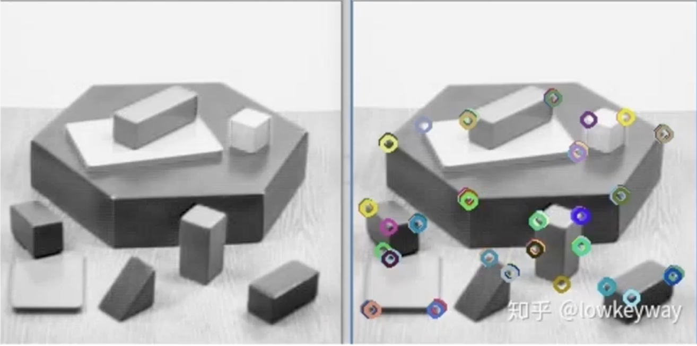

如果 Harris CD 和 STCD 出现多个角点，也可以通过 NMS 进行压制

### Rotate Invariant 旋转

> Harris 对旋转不敏感。

考虑图像旋转 $R$，即
$$
M' = R M R^{T}\\
R = \begin{bmatrix}
\cos \theta & -\sin\theta\\
\sin \theta & \cos \theta
\end{bmatrix}
$$

> **为什么旋转是 $RMR^T$ 而不是 $RM$**
>
> 考虑 $M$ 的定义：
> $$
> \begin{align}
> M &= \sum_{x, y \in W}
> \begin{bmatrix}
> I_{xx} &I_{xy}\\
> I_{yx} & I_{yy}
> \end{bmatrix}
> \\& = \sum_{x, y \in W}
> \begin{bmatrix}
> I_x\\I_g
> \end{bmatrix}
> \begin{bmatrix}
> I_x&I_g
> \end{bmatrix}
> \\& = \sum_{x, y \in W}
> \nabla I
> (\nabla I) ^T
> \end{align}
> $$
> 如考虑旋转 $R$，则其会作用在 $x, y$ 梯度 $\nabla I$ 上，即
> $$
> \begin{align}
> M & = \sum_{x, y \in W}
> \nabla I
> (\nabla I) ^T
> \\
> M' & = \sum_{x, y \in W}
> (R\nabla I)
> (R\nabla I) ^T
> \\ &=  \sum_{x, y \in W}
> R\nabla I
> (R\nabla I^T) R^T
> \\ &=  R\left[\sum_{x, y \in W}
> \nabla I
> (R\nabla I^T) \right] R^T
> \\&= RMR^T
> \end{align}
> $$

如令原矩阵：
$$
Mv = \lambda v
$$
考虑 $M'$ 的向量为 $Rv$，则有
$$
\begin{align}
M'(Rv) &= RMR^T(Rv)\\
&= RM(R^TRv)\\
&= RMv\\
&= R\lambda v\\
&= \lambda(Rv)\\

\end{align}
$$
即 $Rv$ 是新的特征向量。特征值并没有发生改变，而其特征向量发生了旋转。

### Scale Variant 尺度变换

> Harris 对尺度变换敏感

考虑 $M$ 的变形：
$$
\begin{align}
M &= \sum_{x, y \in W}
\begin{bmatrix}
I_{xx} &I_{xy}\\
I_{yx} & I_{yy}
\end{bmatrix}
\\& =
\sum_{x, y \in W}
\begin{bmatrix}
I_{x}^2 &  I_{x}I_y\\
I_{y}I_x &  I_{y}^2
\end{bmatrix}
\end{align}
$$
对于尺寸变换 $\phi$ 来说，坐标被映射为：
$$
(x, y) \mapsto (\phi x, \phi y)
$$
考虑链式法则
$$
I_{x_\text{new}} = \frac{\part I}{\part x_\text{new}}\frac{\partial x_\text{new}}{\partial x} = \frac{1}{\phi} I_x\\
I_{y_\text{new}} = \frac{1}{\phi} I_y
$$
令 $\Phi =\phi^{-2}$因此则有
$$
\begin{align}
M & =
\sum_{x, y \in W}
\begin{bmatrix}
I_{x}^2 &  I_{x}I_y\\
I_{y}I_x &  I_{y}^2
\end{bmatrix}
\\
M' & =
\sum_{x, y \in W}
\begin{bmatrix}
\Phi I_{x}^2 &  \Phi I_{x}I_y\\
\Phi I_{y}I_x & \Phi I_{y}^2
\end{bmatrix}
\\
&=\Phi
\sum_{x, y \in W}
\begin{bmatrix}
I_{x}^2  & I_{x}I_y\\
I_{y}I_x & I_{y}^2
\end{bmatrix}
\end{align}
$$
若考虑响应函数：
$$
\begin{align}
R &=\det \mathbf{M}- k(\text{tr}^2 \mathbf{M})\\
R_{\phi}&= \det (\Phi \mathbf{M})- k(\text{tr}^2 (\Phi \mathbf{M}))\\
&= \Phi^2\det \mathbf{M}- \Phi^2 k(\text{tr}^2  \mathbf{M})\\
R_{\phi} &= \Phi^2 R
\end{align}
$$
这意味着同一个角点在不同尺度下的响应值会发生变化。

## Auto Scale Selection: from Scale Varient to Scale Invarient

> 参阅 https://medium.com/jun94-devpblog/cv-11-scale-invariant-local-feature-extraction-1-auto-scale-selection-265049027bf1

> 自动尺度选择可以应用于单张图片和两张图片的情况：
>
> 单张图片：
>
> - 主要用于特征点检测和尺度估计
> - 帮助找到图像中稳定的特征点及其特征尺度
>
> 两张图片：
>
> - 用于特征匹配
> - 通过在两张图片中分别找到特征点及其尺度
> - 再利用尺度信息进行特征描述和匹配

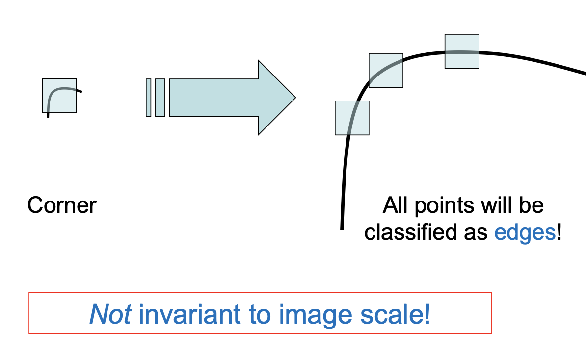

我们已经用数学证明了 Harris Corner Detector 对 Scale 敏感，直观描述为上图。

如果图像被放大，角落也会被放大，以至于角落的尺寸比检测窗口还大，检测器的检测窗口感知到的变成了边缘，而不是角点。因此，检测器无法找到在尺度变化之前能够检测到的角点。

Harris 算子返回角点所在 Interest Point。但是，为了定义兴趣点的特征描述（特征向量表示），并比较图像之间的点，我们需要的不仅仅是一个兴趣点，还需要它周围的区域。

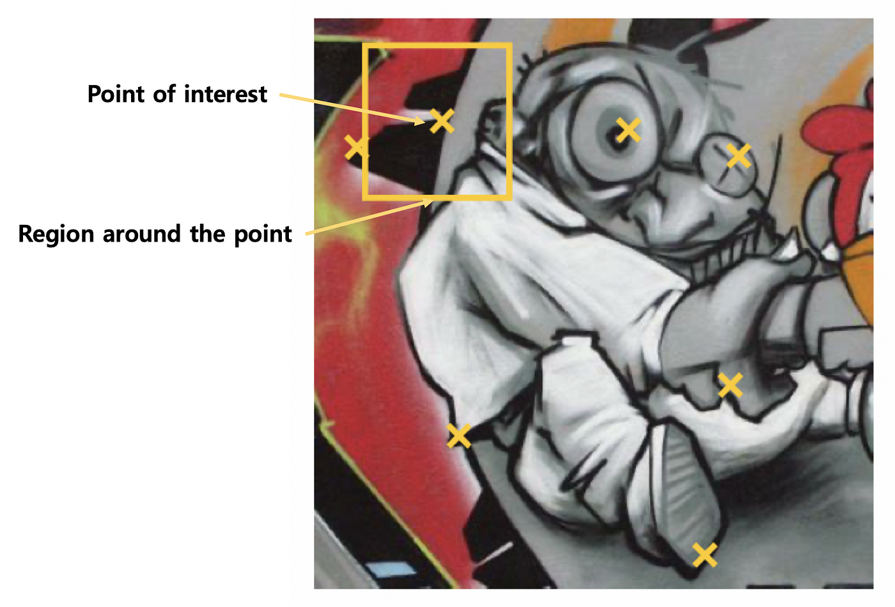

通过使用从兴趣点周围区域提取的特征表示，我们可以比较和测量两个图像区域彼此的相似程度。

现在的问题是，考虑到 Harris 和 Hessian 不是尺度不变的，**如何为兴趣点周围的各个区域选择正确的 Scale？**

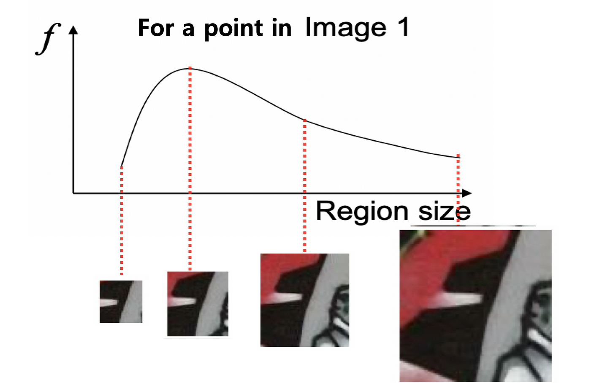

设计一个函数取该点周边区域，*并根据该区域将其响应输出为标量。*此**签名函数输入是点**$(x,y)$周围区域的大小。因此，我们可以将签名函数视为一幅图像中某个点的区域大小（或图像块宽度）的函数。

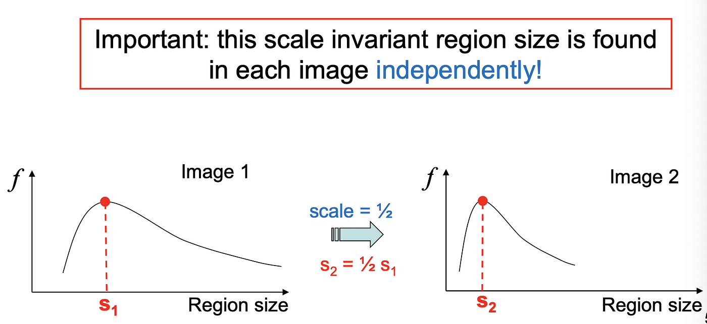

该函数的局部最大值是一个强有力的线索，表明与局部最大值相对应的区域大小应该与图像尺度不变

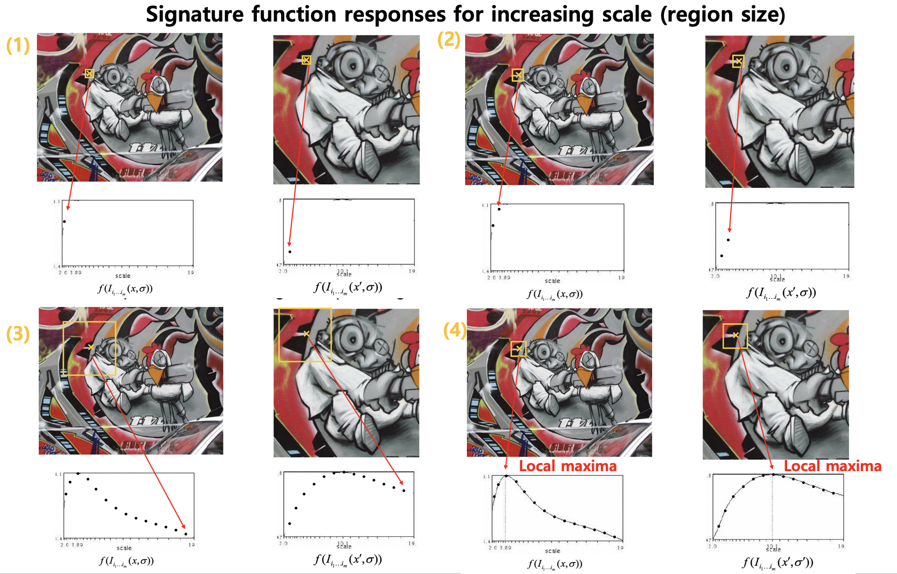

> **注解**
>
> 即在通过一些核，对这个 Interest Windows 进行卷积。进行的卷积应该满足在不同尺度下拥有一个局部最大值。
>
> 如果对 $L, R$ 两个相同区域的图，但是尺度不同都进行对应的卷积，其结果应该为两个拥有 Local Maxima 的图。而这两个 Local Maxima 即对应的相同尺度。
>
> ~~俗称：刻舟求剑（x）~~
>
> 而绝大多数的尺度签名函数也不是通过缩放图片尺度进行卷积，而是通过缩放其核的 $\sigma$ 参数而进行的（即 LoG 和 DoG 其进行的 Smoothing）。

> **工作流程**
>
> 假设图片为 L, R. Harris 角点检测器在 L 上运行后获得了 $(x, y)$ 作为 interest point
>
> 1. 在 $L$ 图像上使用Harris角点检测器检测出兴趣点(x,y)
>
> 2. 在不同尺度 $\sigma$ 下计算该点的特征响应函数 $f(I(x,\sigma))$：
>    每个尺度$\sigma$ 生成一个 $n\times n$ 响应图，从每个响应图中提取 $(x,y)$ 位置的值
>
>    这些值构成了特征响应函数曲线
>
>    - 对 $L$ 图像在点 $(x,y)$ 周围以 $\sigma$ 为尺度提取特征
>
>    - 对 $R$ 图像在对应位置 $(x',y')$ 周围以 $\sigma$ 为尺度提取特征
>
> 3. 绘制响应函数曲线：
>
> - 横轴为尺度 $\sigma$
> - 纵轴为特征响应值
>
> 4. 寻找局部最大值：
>
> - 在响应曲线上找到局部极大值点
> - 对应的 $\sigma$ 值即为该特征点的特征尺度

### Signature Function: LoG

> LoG是二阶微分算子，对尺度变化有归一化响应，具有尺度不变性
> $$
> \begin{align}
> G(x, y) &= e ^{-\frac{x^2+y^2}{2\sigma^2}}
> \\
> \nabla^2 G(x, y)&=
> \frac{\part^2 G(x, y)}{\part x^2} +
> \frac{\part^2 G(x, y)}{\part y^2}
> \\
> &= 
> \left(\frac{x^2 + y^2 - 2\sigma^2}{\sigma^4}  \right)e^{-\frac{x^2+y^2}{2\sigma^2}}
> \end{align}
> $$
> 考虑尺度变化 $k$
> $$
> (x, y) \mapsto (kx, ky)\\I(x, y) = I'(kx, ky)
> $$
> 考虑原始高斯尺度
> $$
> G(x, y) = e ^{-\frac{x^2+y^2}{2\sigma^2}}
> $$
> 有
> $$
> G(x, y \mid \sigma) = G(kx, ky \mid k\sigma)
> $$
> 而对于标准 LoG
> $$
> LoG(x,y\mid\sigma) = \nabla^2 G(x, y)
> = 
> \left(\frac{x^2 + y^2 - 2\sigma^2}{\sigma^4}  \right)e^{-\frac{x^2+y^2}{2\sigma^2}}
> $$
> 随着 $\sigma$ 增大， LoG 会下降。
>
> 如果进行 $\sigma^2$ 进行归一化
> $$
> \begin{align}
> LoG_\text{n}(x,y\mid\sigma) &= \sigma^2 LoG_\text{n}(x,y\mid\sigma)
> \\ &= \sigma^2 \nabla^2 G(x, y)
> \\&= 
> \left(\frac{x^2 + y^2 - 2\sigma^2}{\sigma^2}  \right)e^{-\frac{x^2+y^2}{2\sigma^2}}
> \end{align}
> $$
> 而归一化后的 $LoG$ 对于尺度，可以证明：
> $$
> \begin{align}
> LoG_\text{n}(x,y\mid\sigma) &= LoG_\text{n}(x, y \mid k\sigma)
> \end{align}
> $$
> 保证了同一特征在不同尺度下会得到相同的响应值。

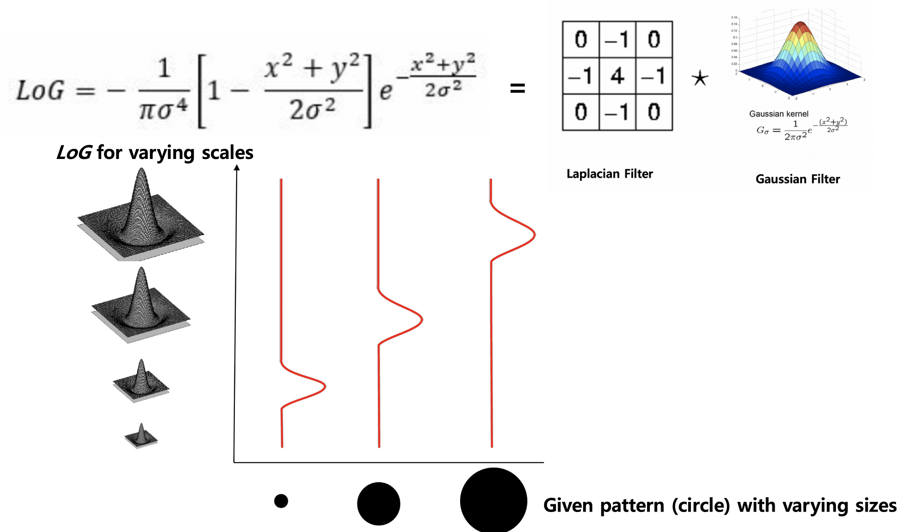

LoG 可以检测输入图像中的“**斑点**”并返回其周围的最高响应。

过滤器具有其设计用于检测的形状，当输入与过滤器的外观相同时，它们会输出最大响应。在*LoG*过滤器的中心周围，我们可以找到一个斑点，这就是*LoG*是斑点检测器的原因

***我们通过应用具有不同尺度 $\sigma$ 的LoG 核来寻找图像中的斑点作为局部特征及其对应的合适尺度。***

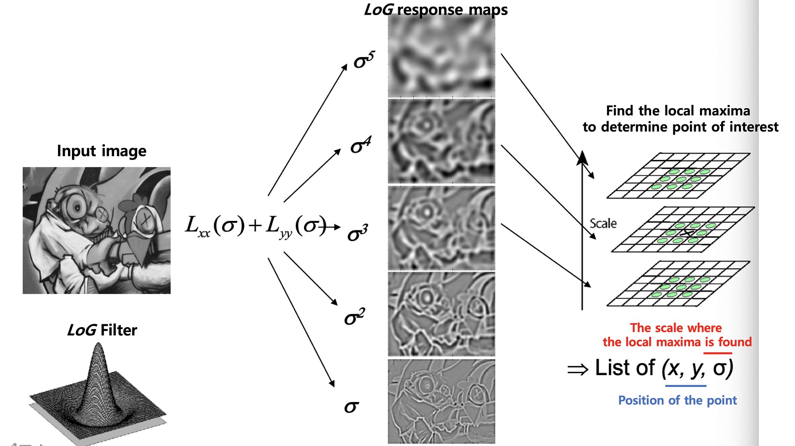

相似的情况也适用于 DoG。

## Extra Material

> 如果我们思考
>$$
> \begin{align}
> \mathbf{M} &= \sum_{x, y} w(x, y)
> \begin{bmatrix}
> I_{xx} &I_{xy}\\
> I_{yx} & I_{yy}
> \end{bmatrix}
> \\
> R &=\det \mathbf{M}- k(\text{tr}^2 \mathbf{M})
> \\
> \det \mathbf{M} &=  w(x, y) \det
> \left|
> \begin{matrix}
> I_{xx} &I_{xy}\\
> I_{yx} & I_{yy}
> \end{matrix}
> \right|
> \\
> &\color{red}{= w (I_{x}^2I_{y}^2 - I_x^2I_y^2) = 0}
> \\
> \color{red}{R} &\color{red}{=0-k (\text{tr}^2 \mathbf{M}) < 0}
> \end{align}
> $$
> 红色部分是有问题的。加权窗口应先与 $\mathbf{I}$ 进行结合。
