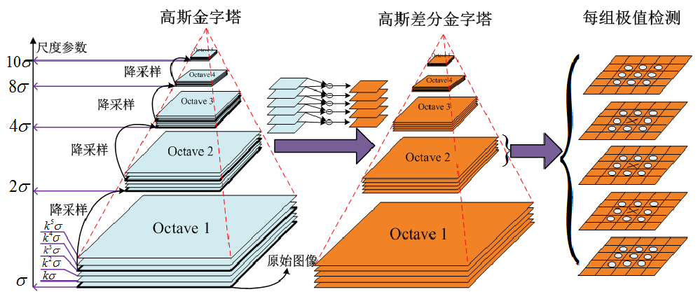

# Lecture 8: SIFT

## Gaussian Pyramid

> 参阅 https://jiangren.work/2019/08/10/%E9%AB%98%E6%96%AF%E9%87%91%E5%AD%97%E5%A1%94%E4%B8%8E%E6%8B%89%E6%99%AE%E6%8B%89%E6%96%AF%E9%87%91%E5%AD%97%E5%A1%94/

高斯金字塔本质上是信号的在不同尺度上的表达，即将同一图片多次进行高斯模糊，并向下采样，产生不同尺度下的多组信号或图片以进行后续的处理。

对于层级 $G_{i+1}$ 的金子塔，有：

1. 对 $G_i$ 进行 Gaussian Smooth
2. 将所有偶数行、列去除
   例如，如果原图像有8行，标号为0,1,2,3,4,5,6,7，则保留1,3,5,7行，去除0,2,4,6行
   

因此得到的新图像长宽都变少 $50%$，即大小为原来的 $1/4$。重复可得到整个金字塔。

## SIFT 尺度不变特征变换

> 参阅 https://www.youtube.com/watch?v=NPcMS49V5hg

### 步骤

1. **Scale-space Extrema Detection**
   使用 DOG 检测有 Interesting Points
2. **Keypoint Localisation**
   确定每个 Candidate Location 的 Location 和 Scale，并根据稳定性选择它们。
3. **Orientation Estimation**
   使用局部图像梯度为每个定位的 Keypint 分配方向(Orientation)。保留每个特征的 theta、scale和 location。
4. **Keypoint Descriptor**
   提取 Keypoint 周围选定尺度的局部图像梯度，并形成不受局部形状变形 (distortion)和光照影响 (illumination)的 representation。

高斯核是唯一可以产生多尺度（依赖 $\sigma$）的核。

一个图片的尺度空间 $L(x, y, \sigma)$，定义原始图像 $I(x,y)$，于一个 2D 高斯函数 $G(x_i, y_i, \sigma)$
$$
G(x_i, y_i, \sigma) = \frac{1}{\pi\sigma^2}e^{-\frac{(x-x_i)^2+(y-y_i)^2}{2\sigma^2}}
$$
那么尺度标签则被定义为
$$
L(x, y, \sigma) = G(x, y, \sigma) * I(x, y)
$$

我们把图片扩大一倍，并构建高斯金字塔。

将图像进行高斯模糊的到的 Octave 0 Level 0 图像设为 **基准图像**，设其尺度为 $\sigma_0$，称之为**基准层尺度**。第 0 组第 1 层尺度为 $k \sigma_0$，第二层尺度为 $k^2\sigma_1$ 以此类推。

Octave 1 Level 0 的图像是由图像倒数第三张图片采样得到，若令 $k=2^{1/s}$，则其

对于 Octave $o$ Level $l$：
$$
\sigma = 2^ok^r\sigma_0\\
\text{where } o = 0, 1, 2, 3,\cdots; r = 0, 1, 2, \cdots, s+2
$$

## Image Processing with Local Feature

1. **Detection**：寻找一系列 distictive key points

2. **Description**：以向量形式提取每个兴趣点周围的特征描述。
   

3. **Matching**：计算特征向量之间的距离，找到对应关系。
   $$
   d(\mathbf{x}_1, \mathbf{x}_2) < T
   $$

### Feature Descriptor Distance

Quadratic Distance
$$
D(\mathbf{x}, \mathbf{y}) = \sum^n_{i=1}| x_i - y_i|^2
$$
$x^2$ Distace
$$
D(\mathbf{x}, \mathbf{y}) = \sum^n_{i=i} \frac{(x_i - y_i)^2}{x_i+y_i}
$$
Cosine Similarity
$$
D(\mathbf{x}, \mathbf{y}) = \frac{\mathbf{x}\cdot \mathbf{y}}{||\mathbf{x}|| ||\mathbf{y}||}
$$

### Fearure Matching

#### Fixed Distance Threshold

在Fixed Distance Threshold 下（虚线圆圈），描述符 $D_A$ 无法匹配 $D_B$，而 $D_D$ 则无法正确匹配 $D_C$ 和 $D_E$。

- 估计特征空间中 key point 的距离
  例如 128 维 SIFT 描述符之间的欧氏距离
- 最简单的匹配策略是设置一个 Threshold，并返回该阈值范围内其他图像的所有匹配结果。
- 阈值过高会导致返回过多错误的匹配结果（假阳性）
  阈值过低会导致错过过多正确的匹配结果（假阴性）
- 使用固定阈值的问题在于很难设置

#### Nearest Neighbour

使用 NN，描述子 $D_A$ 正确匹配了 $D_B$ ，但是 $D_D$ 错误匹配了 $D_C$。

- 更好的策略是将 keypoint 与其在特征空间中的 Nearest Neighbour 进行匹配。
- 由于某些特征可能无法匹配（例如，由于遮挡），因此仍可使用阈值来减少误报的数量
- 非特征点可能有很多近似匹配点，但其中只有一个是正确的

#### Nearest Neighbour Distance Ratio

使用 NNDR 进行匹配时，描述符会正确地将 $D_A$ 与 $D_B$ 匹配，并正确地拒绝 $D_D$ 的匹配。

估算 Feature Vector 与其 Nearest Neighbour  ($d_1$) 和第二个 Nearest Neighbour ($d_2$) 的距离
$$
\text{NNDR} = \frac{d_1}{d_2} = \frac{|D_A - D_B|}{|D_A - D_C|}
$$

- 如果 $d_1 \approx d_2, \text{NNDR} \approx 1$ ，Match不明确（Ambiguous），应予以 Reject
- $d_1 \ll d_2, \text{NNDR} \to 0$，Match 是正确的

