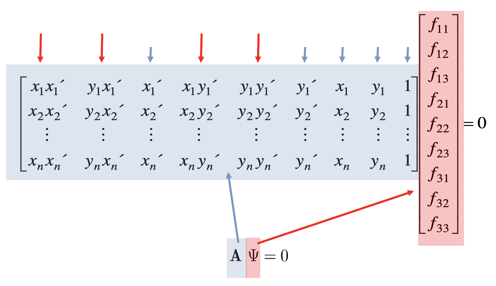

# Lecture 13: Computational Stereo II

## Estimate F

考虑 F 矩阵
$$
x'^T Fx = 0\\
\begin{bmatrix}
x'\\y'\\1
\end{bmatrix}^T
\begin{bmatrix}
f_{11} & f_{12} & f_{13} \\
f_{21} & f_{22} & f_{23} \\
f_{31} & f_{32} & f_{33} \\
\end{bmatrix}
\begin{bmatrix}
x'\\y'\\1
\end{bmatrix} = 0
\\
x'xf_{11}+ x'yf_{12}+x'f_{13} +
y'xf_{21}+ y'yf_{22}+y'f_{23} + 
xf_{31}  +  yf_{31} +  f_{33} = 0
$$
考虑方程原理，我们需要 $N$ 个不等价方程才能解决 $N$ 个未知数，而有 9 个未知数（8 un-recoverable scale, so we need at least 8 point-pairs to recover F）
$$
\underbrace {
\begin{bmatrix}
x_{1}x_{1}' & y_1x_{1}' & x_{1}' & x_{1}y_{1}' & y_{1}'y_{1}' & y_{1}'& x_1 & y_1 & 1 \\
x_{2}x_{2}' & y_1x_{2}' & x_{2}' & x_{2}y_{2}' & y_{2}'y_{2}' & y_{2}'& x_2 & y_2 & 1 \\
x_{3}x_{3}' & y_1x_{3}' & x_{3}' & x_{3}y_{3}' & y_{3}'y_{3}' & y_{3}'& x_3 & y_3 & 1 \\
\vdots & \vdots & \vdots & \vdots & \vdots & \vdots & \vdots & \vdots & \vdots \\
x_{n}x_{n}' & y_1x_{n}' & x_{n}' & x_{n}y_{n}' & y_{n}'y_{n}' & y_{n}'& x_n & y_n & 1 \\
\end{bmatrix}
}_{\mathbf{A}}
\underbrace{
\begin{bmatrix}
f_{11} \\ f_{12} \\ f_{13} \\
f_{21} \\ f_{22} \\ f_{23} \\
f_{31} \\ f_{32} \\ f_{33} \\
\end{bmatrix}
}_\Psi
= 0\\
\mathbf{A}\Psi = 0
$$

求解通常使用最小二乘法（Least Square Method）。最小二乘解F是通过奇异值分解（SVD）得到的矩阵A的最小奇异值所对应的奇异向量（即 $A = UDV'$ 中V的最后一列）。

### Normalisation

我们会发现其中有些值会很大（因为是两个数字相乘，例如$x_1x_2'$，红色箭头），而有些会相对小，因此我们应该考虑使用 Normalisation，否则 Least Square

图像坐标系统可以通过映射转换到[-1,1]的范围内。以1080p视频帧(1920x1080像素)为例

> **仿射变换**（Affine transformation），是指在[几何](https://zh.wikipedia.org/wiki/几何)中，对一个[向量空间](https://zh.wikipedia.org/wiki/向量空间)进行一次[线性变换](https://zh.wikipedia.org/wiki/线性变换)并接上一个[平移](https://zh.wikipedia.org/wiki/平移)，变换为另一个向量空间。即 $[T \mid t]$
>
> 图中左上角的 $\begin{bmatrix} \frac{2}{1920} & 0 \\ 0 & \frac{2}{1080} \end{bmatrix}$ 是将图片映射到 [0, 2] 的区间，而后边跟着的 $\begin{bmatrix} -1\\ -1 \end{bmatrix}$ 则是将图片中心 $(1, 1)$ 平移到 $(0, 0)$。而最后一项则为齐次坐标的组成部分。

将不同分辨率的图像统一到相同的坐标范围内

提高数值计算的稳定性

可以得到更好的最小二乘法拟合结果

